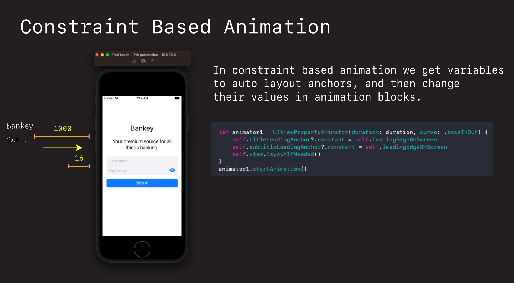

# Overview

## Overview

- What is iOS Animation?
- How does it work?
- How can we use it in our apps

Things to go through:

- [Core Graphics](https://github.com/jrasmusson/swift-arcade/blob/master/Animation/CoreGraphicsIntro/README.md)
- [Core Animation Intro](https://github.com/jrasmusson/swift-arcade/blob/master/Animation/CoreAnimation/Intro/README.md)

Let's know go back to our project and see how we can bright things up by adding some cool Core Animations to our project.

# Animating with constraints

When animating via Auto Layout constraints, we first setup the layout we want to animate `from`, then we modify the constraint in an animation block for where we want to animate `to`.



In this case we are going to add an animation to the login page. We'll start by placing the title and subtitle off screen, and then animate then in after the page as appeared.

## Setting up the constraints

First define some variables to represent the edges of our constraints.

**LoginViewController**

```swift
var password: String? {
    return loginView.passwordTextField.text
}

// animation
var leadingEdgeOnScreen: CGFloat = 16
var leadingEdgeOffScreen: CGFloat = -1000

var titleLeadingAnchor: NSLayoutConstraint?
```

Then modify the `titleLabel` constraints so we start with our title **off screen**.

```swift
// Title
NSLayoutConstraint.activate([
    subtitleLabel.topAnchor.constraint(equalToSystemSpacingBelow: titleLabel.bottomAnchor, multiplier: 3),
    titleLabel.trailingAnchor.constraint(equalTo: loginView.trailingAnchor)
])
    
titleLeadingAnchor = titleLabel.leadingAnchor.constraint(equalTo: view.leadingAnchor, constant: leadingEdgeOffScreen)
titleLeadingAnchor?.isActive = true
```

Run the app now. And you the title should disappear. It is now offscreen. Ready to be animated in.

## Animating in

Now comes the fun part. Animating the title in. To do this we need to hook into the `viewDidAppear` lifecycle of the view controller. We want the auto layout to have fully completed (that's why we don't do this in `willAppear`). 

Now we want to change the constraint and trigger the animation in.

**LoginViewController**

```swift
override func viewDidAppear(_ animated: Bool) {
    super.viewDidAppear(animated)
    animate()
}
```

Then we can animate the title label in.

```swift
// MARK: - Animations
extension LoginViewController {
    private func animate() {
        let animator1 = UIViewPropertyAnimator(duration: 0.25, curve: .easeInOut) {
            self.titleLeadingAnchor?.constant = self.leadingEdgeOnScreen
            self.view.layoutIfNeeded()
        }
        animator1.startAnimation()
    }
}
```

Here we are using the `UIViewPropertyAnimator`. We can specify duration and curve. Where we want to animate `to` is in the completion block.

And it's a good idea to explicitly call:

```swift
self.view.layoutIfNeeded()
```

To signal to Auto Layout engine that our constraints have changed, and we need another layout applied to the new updated view.

If we run this now we'll see or title nicely animate in.

### Challenge - Animate in the subtitle

OK your turn. Following the step we just did for title, see if you can animate in the `subtitleLabel` just like we did for `titleLabel`.

- Define the constraint
- Update the layout to grab the leading edge - set it to `1000`
- Then update the constraint to the new value `16` just like we did for title in the animation block.

Solution.

```swift
var subtitleLeadingAnchor: NSLayoutConstraint?

// Subtitle
NSLayoutConstraint.activate([
    loginView.topAnchor.constraint(equalToSystemSpacingBelow: subtitleLabel.bottomAnchor, multiplier: 3),
    subtitleLabel.trailingAnchor.constraint(equalTo: loginView.trailingAnchor)
])
    
subtitleLeadingAnchor = subtitleLabel.leadingAnchor.constraint(equalTo: view.leadingAnchor, constant: leadingEdgeOffScreen)
subtitleLeadingAnchor?.isActive = true

self.subtitleLeadingAnchor?.constant = self.leadingEdgeOnScreen
```


## Multiple animations together

Demo. Cool! That works nicely. But watch what we can do with animations. We can chain them together.

Let's create a second animator and do our subitle animation in there.

```swift
let animator2 = UIViewPropertyAnimator(duration: 0.25, curve: .easeInOut) {
    self.subtitleLeadingAnchor?.constant = self.leadingEdgeOnScreen
    self.view.layoutIfNeeded()
}
animator2.startAnimation(afterDelay: 0.25)
```


## 🪲 Debugging

If you ever want to see your animations in slow motion, select your simulator and go:

`Debug > Slow Animations`

## Animating visiblity with alpha

One common technique for making controls appear and fade is to play with this visibility and alpha.

For example we could set our titles `alpha` to `0`

```swift
titleLabel.alpha = 0
```

Run and demo. Now the label is effectively hidden.

But we can bring it back by resetting `alpha` back to a default of `1` in our animation.

```swift
// MARK: - Animations
extension LoginViewController {
    private func animate() {
        let duration = 0.8
        
        let animator1 = UIViewPropertyAnimator(duration: duration, curve: .easeInOut) {
            self.titleLeadingAnchor?.constant = self.leadingEdgeOnScreen
            self.view.layoutIfNeeded()
        }
        animator1.startAnimation()
        
        let animator2 = UIViewPropertyAnimator(duration: duration, curve: .easeInOut) {
            self.subtitleLeadingAnchor?.constant = self.leadingEdgeOnScreen
            self.view.layoutIfNeeded()
        }
        animator2.startAnimation(afterDelay: 0.2)
        
        let animator3 = UIViewPropertyAnimator(duration: duration*2, curve: .easeInOut) {
            self.titleLabel.alpha = 1
            self.view.layoutIfNeeded()
        }
        animator3.startAnimation(afterDelay: 0.2)
    }
}
```

If we run this now we should see a nice animation fade in.


### Challenge: Fade in subtitle label

See if you can fade in our `subtitleLabel`. Follow the steps we did for `titleLabel`.

- Set the alpha to `0`.
- Add it to the correct animation block.
- And see if you can make it fade in just like the `title`.

Solution

```swift
subtitleLabel.alpha = 0
```

```swift
self.subtitleLabel.alpha = 1
```

Save your work.

```
> git add .
> git commit -m "feat: Add login animations"
> git push
```

### Recap what we have done here

- Used constraints as a means of animating
- Step 1 was setting up the constratints into a position we wanted to animate from
- Step 2 was creating animation blocks using `UIViewPropertyAnimator` to animate to by adjusting constraints and setting values on our controls.

Next we are going to drop down a layer and take a look at `Core Animation` libary and see how we can do even more power animations that aren't easily replicated in UIKit.


