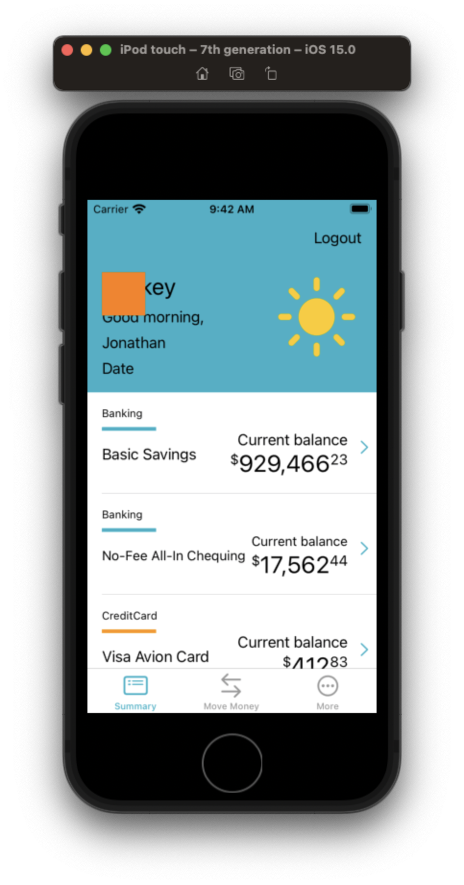

# Animating with Core Animation

- Core Animation Intro.
- Key concepts.

While you can go deep with Core Animation, you don't have to become an expert in bezier curves to get some really cool effects.

Let's know go back to our project and see how we can bright things up by adding some cool Core Animations to our project.


## Shaking the login button

Let's make it so that when the user enters an incorrect password, the login button shakes.

Set our username and password.

**LoginViewController**

```swift
// Check for blanks
if username.isEmpty || password.isEmpty {
    configureView(withMessage: "Username / password cannot be blank")
    return
}
    
if username == "Flynn" && password == "Welcome" {
    signInButton.configuration?.showsActivityIndicator = true
    delegate?.didLogin()
} else {
    configureView(withMessage: "Incorrect username / password")
}
```

Run the app. Error message if password wrong.

Let's animate things by shaking the sign in button showing login failed.


**LoginViewController**

```swift
private func configureView(withMessage message: String) {
    errorMessageLabel.isHidden = false
    errorMessageLabel.text = message
    shakeButton()
}
    
private func shakeButton() {
    let animation = CAKeyframeAnimation()
    animation.keyPath = "position.x"
    animation.values = [0, 10, -10, 10, 0]
    animation.keyTimes = [0, 0.16, 0.5, 0.83, 1]
    animation.duration = 0.4

    animation.isAdditive = true
    signInButton.layer.add(animation, forKey: "shake")
}
```

Save your work

```
> git add -p
> git commit -m "feat: Shake signin button if login fails"
```

## Shakey Bell

Now that's just one small simple but powerful example of what Core Animation can do. Let's now look at a more advanced example, and see if we can't add shakey bell.

- Demo shakey bell.
- Explain the mechanics behind how it works
- Go over construction

### Creating the view

- Create a new dir called `Components`.
- Create a new view called `NotificationBellView`

**NotificationBellView**

```swift
import Foundation
import UIKit

class NotificationBellView: UIView {
        
    @IBOutlet var contentView: UIView!
    
    override func awakeFromNib() {
        super.awakeFromNib()
        let bundle = Bundle.init(for: NotificationBellView.self)
        bundle.loadNibNamed("NotificationBellView", owner: self, options: nil)
        addSubview(contentView)
    }
    
    override var intrinsicContentSize: CGSize {
        return CGSize(width: 48, height: 48)
    }
}
```

- Create a new nib called `NotificationBellView`
- Set the `File's Owner`


- Control + Option + Command + Enter should now show associated code file in assistant
- Control drag the nib `View` to `contentView` in the code file.
- If outlet won't connect - restart Xcode

Nib is now ready to be worked on.

### Creating the bell

We are going to add the bell as in `UIImageView` and the set it's image as an SF Symbol `bell.fill`.

- Add image view
- Set image to `bell.fill`
- Set tint to `Label Color`
- Center in view
- Set height/width constraints to `28pt`

### Adding it to our view controller

Going to add it programmatically as a view.

First let's turn off login.

**LoginViewController**

```swift
//        if username.isEmpty || password.isEmpty {
//            configureView(withMessage: "Username / password cannot be blank")
//            return
//        }
        
        if username == "" && password == "" {
```

Then let's add to view controller.

**AccountSummaryViewController**

```swift
let notificiationBellView = NotificationBellView()
    
    
private func setup() {
    setupTableView()
    setupTableHeaderView()
    setupNotificationBell()
    fetchData()
}    

    private func setupNotificationBell() {
        notificiationBellView.translatesAutoresizingMaskIntoConstraints = false
        notificiationBellView.backgroundColor = .orange
        view.addSubview(notificiationBellView)
        
        NSLayoutConstraint.activate([
            notificiationBellView.topAnchor.constraint(equalToSystemSpacingBelow: view.safeAreaLayoutGuide.topAnchor, multiplier: 2),
            notificiationBellView.leadingAnchor.constraint(equalToSystemSpacingAfter: view.leadingAnchor, multiplier: 2)
        ])
    }
```

If we run this now, we will see our view, but no bell! Why?

It's because of the way nibs and sizes work. The 

	


### Making it tappable

### Animating it in a test rig

### Taking it for a test drive in the controller

### Adding a badge


### Links that help

- [Intro to Core Graphics](https://github.com/jrasmusson/swift-arcade/blob/master/Animation/CoreGraphicsIntro/README.md)
- [Intro to Core Animation](https://github.com/jrasmusson/swift-arcade/blob/master/Animation/CoreAnimation/Intro/README.md)

