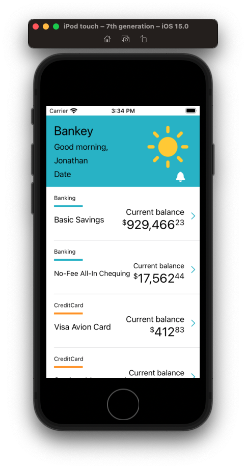

# Animating with Core Animation

- Core Animation Intro.
- Key concepts.

While you can go deep with Core Animation, you don't have to become an expert in bezier curves to get some really cool effects.

Let's know go back to our project and see how we can bright things up by adding some cool Core Animations to our project.


## Shaking the login button

Let's make it so that when the user enters an incorrect password, the login button shakes.

Set our username and password.

**LoginViewController**

```swift
// Check for blanks
if username.isEmpty || password.isEmpty {
    configureView(withMessage: "Username / password cannot be blank")
    return
}
    
if username == "Flynn" && password == "Welcome" {
    signInButton.configuration?.showsActivityIndicator = true
    delegate?.didLogin()
} else {
    configureView(withMessage: "Incorrect username / password")
}
```

Run the app. Error message if password wrong.

Let's animate things by shaking the sign in button showing login failed.


**LoginViewController**

```swift
private func configureView(withMessage message: String) {
    errorMessageLabel.isHidden = false
    errorMessageLabel.text = message
    shakeButton()
}
    
private func shakeButton() {
    let animation = CAKeyframeAnimation()
    animation.keyPath = "position.x"
    animation.values = [0, 10, -10, 10, 0]
    animation.keyTimes = [0, 0.16, 0.5, 0.83, 1]
    animation.duration = 0.4

    animation.isAdditive = true
    signInButton.layer.add(animation, forKey: "shake")
}
```

Save your work

```
> git add -p
> git commit -m "feat: Shake signin button if login fails"
```

## Shakey Bell

Now that's just one small simple but powerful example of what Core Animation can do. Let's now look at a more advanced example, and see if we can't add shakey bell.

- Demo shakey bell.
- Explain the mechanics behind how it works.
 - Programmatically going to build a custom view
 - Going to add the shake animation in there
 - Display in our header view  

### Create the bell

- Create a new dir called `Components`.
- Create a new view called `NotificationBellView`

**ShakeyBellView**

```swift
import Foundation
import UIKit

class ShakeyBellView: UIView {
    
    let imageView = UIImageView()
    
    override init(frame: CGRect) {
        super.init(frame: frame)
        
        style()
        layout()
    }
    
    required init?(coder: NSCoder) {
        fatalError("init(coder:) has not been implemented")
    }
    
    override var intrinsicContentSize: CGSize {
        return CGSize(width: 48, height: 48)
    }
}

extension ShakeyBellView {
    
    func style() {
        translatesAutoresizingMaskIntoConstraints = false
        imageView.translatesAutoresizingMaskIntoConstraints = false
                
        let image = UIImage(systemName: "bell.fill")!.withTintColor(.white, renderingMode: .alwaysOriginal)
        
        imageView.image = image
    }
    
    func layout() {
        addSubview(imageView)
        
        NSLayoutConstraint.activate([
            imageView.centerXAnchor.constraint(equalTo: centerXAnchor),
            imageView.centerYAnchor.constraint(equalTo: centerYAnchor),
            imageView.heightAnchor.constraint(equalToConstant: 24),
            imageView.widthAnchor.constraint(equalToConstant: 24)
        ])
    }
}
```

### Add it to the table view header

Because we are in a table view, and because the header is right at the top, to include our shakey bell in the table we need to add it to the header.


Now this is going to seem weird. Our header is designed as a nib, and really we should probably design our shakey bell that way too, but I want to show you how you can programmatically add elements in nibs that aren't nibs themselves.

We start by simply defining the variable.

**AccountSummaryHeaderView**

```swift
let shakeyBellView = ShakeyBellView()
```

And then adding it to our view and doing Auto Layout just like any other control.

```swift
private func commonInit() {
        setupShakeyBell()
    }
    
    private func setupShakeyBell() {
        shakeyBellView.translatesAutoresizingMaskIntoConstraints = false
        addSubview(shakeyBellView)
        
        NSLayoutConstraint.activate([
            shakeyBellView.trailingAnchor.constraint(equalTo: trailingAnchor),
            shakeyBellView.bottomAnchor.constraint(equalTo: bottomAnchor)
        ])
    }
}
```




### Making it tappable

One last thing before we tackle the animation, we need to make it tappable. We don't necessary need to make it tappable from a design point of view, but it helps with debugging, and it's also a cool thing to know how to do.

**ShakeyBellView**

```swift
override init(frame: CGRect) {
super.init(frame: frame)
    setup()
}

extension NotificationBellView {
    
    func setup() {
        let singleTap = UITapGestureRecognizer(target: self, action: #selector(imageViewTapped(_: )))
        imageView.addGestureRecognizer(singleTap)
        imageView.isUserInteractionEnabled = true
    }
}

// MARK: - Actions
extension ShakeyBellView {
    @objc func imageViewTapped(_ recognizer: UITapGestureRecognizer) {
        // insert animation here...
        print("Shaking!!!")
    }
}
```

If we run, we'll just see a print statement for now. But that's OK. Now we are ready to talk animation.

### Animating it in a test rig

Explain and demo how animation works in test rig.

[Swift Arcade Shakey Bell](https://github.com/jrasmusson/swift-arcade/blob/master/Animation/ShakeyBell/README.md)

### Adding the animation to the view

So now that we understand how the animation works, let's add it.

**NotificationBellView**

```swift
// MARK: - Actions
extension NotificationBellView {
    @objc func imageViewTapped(_ recognizer: UITapGestureRecognizer) {
        shakeWith(duration: 1.0, angle: .pi/8, yOffset: 0.0)
    }

    private func shakeWith(duration: Double, angle: CGFloat, yOffset: CGFloat) {
        print("duration: \(duration) angle: \(angle) offset: \(yOffset)")
        
        let numberOfFrames: Double = 6
        let frameDuration = Double(1/numberOfFrames)
        
        imageView.setAnchorPoint(CGPoint(x: 0.5, y: yOffset))

        print("anchorPoint: \(imageView.layer.anchorPoint)")

        UIView.animateKeyframes(withDuration: duration, delay: 0, options: [],
          animations: {
            UIView.addKeyframe(withRelativeStartTime: 0.0,
                               relativeDuration: frameDuration) {
                self.imageView.transform = CGAffineTransform(rotationAngle: -angle)
            }
            UIView.addKeyframe(withRelativeStartTime: frameDuration,
                               relativeDuration: frameDuration) {
                self.imageView.transform = CGAffineTransform(rotationAngle: +angle)
            }
            UIView.addKeyframe(withRelativeStartTime: frameDuration*2,
                               relativeDuration: frameDuration) {
                self.imageView.transform = CGAffineTransform(rotationAngle: -angle)
            }
            UIView.addKeyframe(withRelativeStartTime: frameDuration*3,
                               relativeDuration: frameDuration) {
                self.imageView.transform = CGAffineTransform(rotationAngle: +angle)
            }
            UIView.addKeyframe(withRelativeStartTime: frameDuration*4,
                               relativeDuration: frameDuration) {
                self.imageView.transform = CGAffineTransform(rotationAngle: -angle)
            }
            UIView.addKeyframe(withRelativeStartTime: frameDuration*5,
                               relativeDuration: frameDuration) {
                self.imageView.transform = CGAffineTransform.identity
            }
          },
          completion: nil
        )
    }
}

// https://www.hackingwithswift.com/example-code/calayer/how-to-change-a-views-anchor-point-without-moving-it
extension UIView {
    func setAnchorPoint(_ point: CGPoint) {
        var newPoint = CGPoint(x: bounds.size.width * point.x, y: bounds.size.height * point.y)
        var oldPoint = CGPoint(x: bounds.size.width * layer.anchorPoint.x, y: bounds.size.height * layer.anchorPoint.y);

        newPoint = newPoint.applying(transform)
        oldPoint = oldPoint.applying(transform)

        var position = layer.position

        position.x -= oldPoint.x
        position.x += newPoint.x

        position.y -= oldPoint.y
        position.y += newPoint.y

        layer.position = position
        layer.anchorPoint = point
    }
}
```


### Adding a badge


### Links that help

- [Intro to Core Graphics](https://github.com/jrasmusson/swift-arcade/blob/master/Animation/CoreGraphicsIntro/README.md)
- [Intro to Core Animation](https://github.com/jrasmusson/swift-arcade/blob/master/Animation/CoreAnimation/Intro/README.md)

