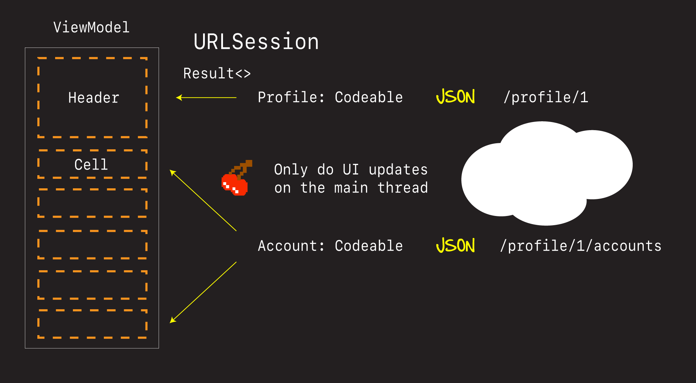
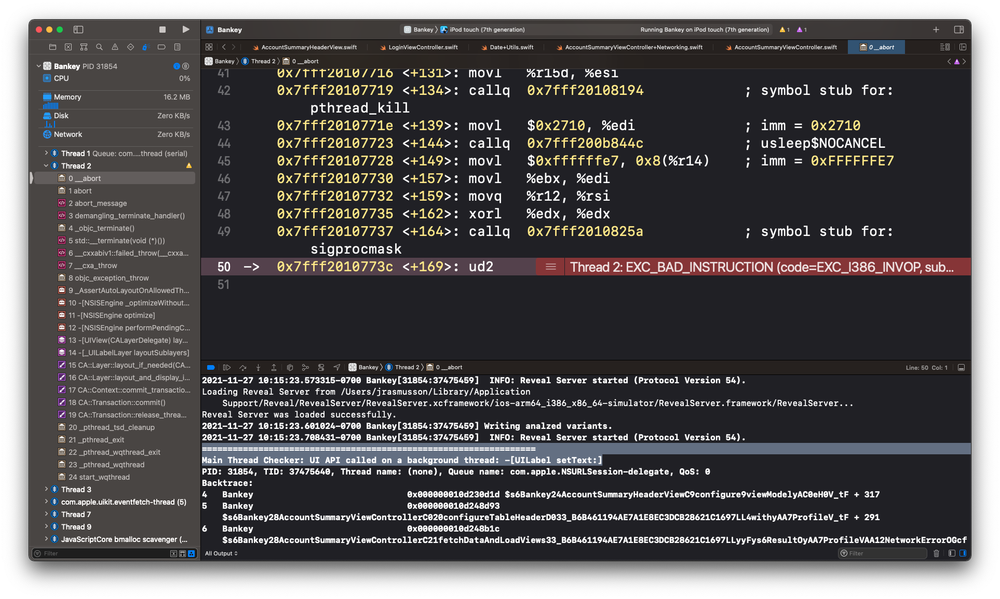
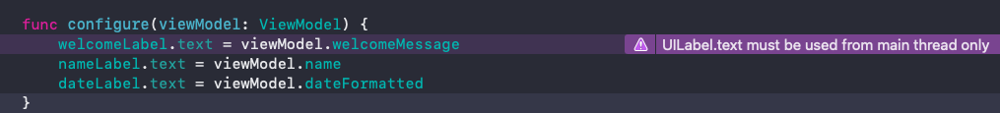
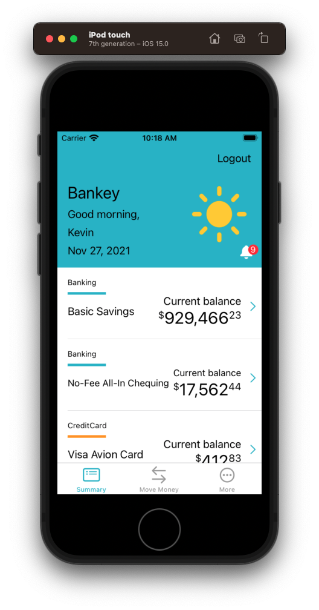

# Networking

In this section we are going to add networking to our app.

- Going to look at different ways of importing data in
- Different ways of utilizing tools like playgrounds for quick rapid prototyping
- And how to unit testing thing like JSON parsing when writing code


## Profile

This is how we are going to do networking in our application.



In code that looks like this. Open playground. And go through.

1. Codeable
2. URLSession
3. Result

### Codable

- `Codeable` is actually a combination of x2 protocols
- Complying with this protocol, or alias, means your type can convert itself into and out of an external representation. In this case JSON.
- By using a `JSONDecoder` we can convert incoming messages into Swift objects, and if neccessary go in the other direction Swift > JSON.

[Examples](https://github.com/jrasmusson/level-up-swift/blob/master/11-JSON/1-json.md)


### URLSession

[Apple docs - Fetching website data into memory](https://developer.apple.com/documentation/foundation/url_loading_system/fetching_website_data_into_memory)

- Simple. Elegant. No need for third party libraries though many projects do.
- Main thing to note is when the completion block returns you may not necessarily be on the main thread.

But we can put ourselves there with code like this:

```swift
DispatchQueue.main.async {
   // On main thread
}
```

### ResultType

Let's quickly review this dedicated enum called result type.

## Fetch Accounts

Let's fetch account just like we did profile.

[End point](https://fierce-retreat-36855.herokuapp.com/bankey/customer/1/accounts)

### Account Challenge

Open challenge playground.

### Account Solution

Open solution playground.

We can start like this:

```swift

struct Account: Codable {
    // 🕹 Game on here
    let id: String
    let type: String
    let name: String
    let amount: Decimal
    let createdDateTime: Date
}
```

But will run into trouble with the `Date`.

```
__lldb_expr_1/5-Account-Solution.playground:49: Fatal error: 'try!' expression unexpectedly raised an error: Swift.DecodingError.typeMismatch(Swift.Double, Swift.DecodingError.Context(codingPath: [_JSONKey(stringValue: "Index 0", intValue: 0), CodingKeys(stringValue: "createdDateTime", intValue: nil)], debugDescription: "Expected to decode Double but found a string/data instead.", underlyingError: nil))
```

This is an `iso8601` date and we need parse it in a special way.

```swift
// If iso8601 use dateEncodingStrategy.

let jsonIso = """
{
  "date" : "2017-06-21T15:29:32Z"
}
"""

let isoData = jsonIso.data(using: .utf8)!
let isoDecoder = JSONDecoder()
isoDecoder.dateDecodingStrategy = .iso8601
let isoResult = try! isoDecoder.decode(DateRecord.self, from: isoData)
isoResult.date
```

Fortunately it's not a lot of work. We just need to tell our decoder what `dateDecodingStrategy` to use.

```swift
let jsonData = json.data(using: .utf8)!
let decoder = JSONDecoder()
decoder.dateDecodingStrategy = .iso8601
let result = try! decoder.decode([AccountModel].self, from: jsonData)
```

Voila. Accounts parsed.

Note: This one is not a `ViewModel` we are going to do some translation. See how to do that in a moment.

## Bringing it into the app

### Making the header configurable

Before we can populate our header dynamically, we need to make it configurable.

That means adding outlets:

- `welcomeLabel`
- `nameLabel`
- `dateLabel`


Add a view model to our header.

**AccountSummaryHeaderView**

```swift
let shakeyBellView = ShakeyBellView()
    
struct ViewModel {
    let welcomeMessage: String
    let name: String
    let date: Date
    
    var dateFormatted: String {
        return date.monthDayYearString
    }
}
```

And let's also add a method at the bottom called `configure`.

```swift
func configure(viewModel: ViewModel) {
    welcomeLabel.text = viewModel.welcomeMessage
    nameLabel.text = viewModel.name
    dateLabel.text = viewModel.dateFormatted
}
```

### Formatting the Date

Let's create a Util class for formatting dates.

**Date+Utils**

```swift
import Foundation

extension Date {
    static var bankeyDateFormatter: DateFormatter {
        let formatter = DateFormatter()
        formatter.timeZone = TimeZone(abbreviation: "MDT")
        return formatter
    }
    
    var monthDayYearString: String {
        let dateFormatter = Date.bankeyDateFormatter
        dateFormatter.dateFormat = "MMM d, yyyy"
        return dateFormatter.string(from: self)
    }
}
```

### Fetching in the view controller

Let create an extension and put our networking code in there `AccountSummaryViewController+Networking`.


**AccountSummaryViewController+Networking**

```swift
import Foundation
import UIKit

enum NetworkError: Error {
    case serverError
    case decodingError
}

struct Profile: Codable {
    let id: String
    let firstName: String
    let lastName: String
    
    enum CodingKeys: String, CodingKey {
        case id
        case firstName = "first_name"
        case lastName = "last_name"
    }
}

extension AccountSummaryViewController {
    func fetchProfile(forUserId userId: String, completion: @escaping (Result<Profile,NetworkError>) -> Void) {
        let url = URL(string: "https://fierce-retreat-36855.herokuapp.com/bankey/profile/\(userId)")!

        URLSession.shared.dataTask(with: url) { data, response, error in
            guard let data = data, error == nil else {
                completion(.failure(.serverError))
                return
            }
            
            do {
                let profile = try JSONDecoder().decode(Profile.self, from: data)
                completion(.success(profile))
            } catch {
                completion(.failure(.decodingError))
            }
        }.resume()
    }
}
```


Do the fetch in the view controller.

**AccountSummaryViewController**

```swift
// Request Models
var profile: Profile?
    
// View Models
var headerViewModel = AccountSummaryHeaderView.ViewModel(welcomeMessage: "Welcome", name: "", date: Date())
var accountCellViewModels: [AccountSummaryCell.ViewModel] = []
```

The profile is going to feed our header. And when we get to the accounts that is going to feed our cells.

Rename `fetchData` to `fetchAccounts` and then comment it out.

And then add a new method to fetch and load like this one.

```swift
private func setup() {
    // fetchAccounts()
    fetchDataAndLoadViews()
}
```

Then finally, let's call `fetchProfile`, get our profile data, and then configure it in our header view.

```swift
// MARK: - Networking
extension AccountSummaryViewController {
    private func fetchDataAndLoadViews() {
        
        fetchProfile(forUserId: "1") { result in
            switch result {
            case .success(let profile):
                self.profile = profile
                self.configureTableHeaderView(with: profile)
                self.tableView.reloadData()
            case .failure(let error):
                print(error.localizedDescription)
            }
        }

        fetchAccounts()
    }
    
    private func configureTableHeaderView(with profile: Profile) {
        let vm = AccountSummaryHeaderView.ViewModel(welcomeMessage: "Good morning,",
                                                    name: profile.firstName,
                                                    date: Date())
        headerViewModel.configure(viewModel: vm)
    }
}
```

Because we are updating our `headerView` we need to pull it out of the setup function and make it a variable.

Rename it `headerView`

```swift
    private func setupTableHeaderView() {
        let headerView = AccountSummaryHeaderView(frame: .zero)
```

And then pull it up and make it a variable.

```swift
var tableView = UITableView()
var headerView = AccountSummaryHeaderView(frame: .zero)
```

### Ready to run - Boom!

OK we are finally ready to give this a go. Now watch what happens when we run this. Boom 💥!



```
=================================================================
Main Thread Checker: UI API called on a background thread: -[UILabel setText:]
```

Here's what's going on here...

[Apple Docs Main Thread](https://developer.apple.com/documentation/foundation/url_loading_system/fetching_website_data_into_memory)

And Xcode is even trying to tell us. Look at `AccountSummaryHeaderView.configure`.



The way to fix this is to ensure that we are on the main ui thread whenever we update the UI.

```swift
DispatchQueue.main.async {
   // OK to update UI ✅
}
```

We can do this everytime we update the UI in our views or view controllers. Or we could do it once in our network call, and ensure we return on the main UI thread from there. Let's do that.

**AccountSummaryViewController+Networking**

```swift
extension AccountSummaryViewController {
    func fetchProfile(forUserId userId: String, completion: @escaping (Result<Profile,NetworkError>) -> Void) {
        let url = URL(string: "https://fierce-retreat-36855.herokuapp.com/bankey/profile/\(userId)")!

        URLSession.shared.dataTask(with: url) { data, response, error in
            DispatchQueue.main.async {
                guard let data = data, error == nil else {
                    completion(.failure(.serverError))
                    return
                }
                
                do {
                    let profile = try JSONDecoder().decode(Profile.self, from: data)
                    completion(.success(profile))
                } catch {
                    completion(.failure(.decodingError))
                }
            }
        }.resume()
    }
}
```

Now when we run, the error and warning go away.



### Accounts

Let's repeat this process for accounts.

Because we are going to reuse `AccountType` in our view and our request, let's pull this out globally as a type so everyone can access while also making it `Codeable`.

**AccountSummaryCell**

```swift
enum AccountType: String, Codable {
    case Banking
    case CreditCard
    case Investment
}

class AccountSummaryCell: UITableViewCell {
    
    struct ViewModel {
        let accountType: AccountType
        let accountName: String
        let balance: Decimal
```


**AccountSummaryViewController+Networking**

```swift
struct Account: Codable {
    let id: String
    let type: AccountType
    let name: String
    let amount: Decimal
    let createdDateTime: Date
}

extension AccountSummaryViewController {
    func fetchAccounts(forUserId userId: String, completion: @escaping (Result<[Account],NetworkError>) -> Void) {
        let url = URL(string: "https://fierce-retreat-36855.herokuapp.com/bankey/profile/\(userId)/accounts")!

        URLSession.shared.dataTask(with: url) { data, response, error in
            DispatchQueue.main.async {
                guard let data = data, error == nil else {
                    completion(.failure(.serverError))
                    return
                }
                
                do {
                    let decoder = JSONDecoder()
                    decoder.dateDecodingStrategy = .iso8601
                    
                    let accounts = try decoder.decode([Account].self, from: data)
                    completion(.success(accounts))
                } catch {
                    completion(.failure(.decodingError))
                }
            }
        }.resume()
    }
}
```

**AccountSummaryViewController**

```swift
// Request Models
var profile: Profile?
var accounts: [Account] = []
```

And the fetch.

```swift
// MARK: - Networking
extension AccountSummaryViewController {
    private func fetchDataAndLoadViews() {
        
        fetchProfile(forUserId: "1") { result in
            ...
        }

        fetchAccounts(forUserId: "1") { result in
            switch result {
            case .success(let accounts):
                self.accounts = accounts
                self.configureTableCells(with: accounts)
                self.tableView.reloadData()
            case .failure(let error):
                print(error.localizedDescription)
            }
        }
    }
    
    private func configureTableCells(with accounts: [Account]) {
        accountCellViewModels = accounts.map {
            AccountSummaryCell.ViewModel(accountType: $0.type,
                                         accountName: $0.name,
                                         balance: $0.amount)
        }
    }
}
```

Discuss

- [Map filter reduce](https://useyourloaf.com/blog/swift-guide-to-map-filter-reduce/)

If we run the app now everything loads - 🎉.

Let's delete the old hard coded data `fetchAccounts()`.

### Save our work

```
> git add .
> git commit -m "feat: Add networking to AccountSummary"
```

## Unit testing

Now as good as our playgrounds are, it would be really nice if we could capture this work in the form of an automated test.

Let's add some unit tests to verify we can parse our JSON and handle network requests.

First let's create a dir for `Utils` and stick our existing tests in there.

Then let's create another folder called `AccountSummary` and in there create a file called `ProfileTests` and to it add the code from our playground.

**ProfileTests**

```swift
import Foundation
import XCTest

@testable import Bankey

class ProfileTests: XCTestCase {
    
    override func setUp() {
        super.setUp()
    }
    
    func testCanParse() throws {
        let json = """
        {
        "id": "1",
        "first_name": "Kevin",
        "last_name": "Flynn",
        }
        """
        
        let data = json.data(using: .utf8)!
        let result = try! JSONDecoder().decode(Profile.self, from: data)
        
        XCTAssertEqual(result.id, "1")
        XCTAssertEqual(result.firstName, "Kevin")
        XCTAssertEqual(result.lastName, "Flynn")
    }
}
```

This is basically our playground, but captured in the form of a unit test.

### Challenge

Let's do the same for account. Let's create a new test for `Account`.

**AccountTests**

```swift
import Foundation
import XCTest

@testable import Bankey

class AccountTests: XCTestCase {
    
    override func setUp() {
        super.setUp()
    }
    
    func testCanParse() throws {
        let json = """
         [
           {
             "id": "1",
             "type": "Banking",
             "name": "Basic Savings",
             "amount": 929466.23,
             "createdDateTime" : "2010-06-21T15:29:32Z"
           },
           {
             "id": "2",
             "type": "Banking",
             "name": "No-Fee All-In Chequing",
             "amount": 17562.44,
             "createdDateTime" : "2011-06-21T15:29:32Z"
           },
          ]
        """

        // Game on here 🕹
    }
}
```

Add see if you can write the unit test for parsing account.

### Solution

**AccountTests**

```swift
import Foundation
import XCTest

@testable import Bankey

class AccountTests: XCTestCase {
    
    override func setUp() {
        super.setUp()
    }
    
    func testCanParse() throws {
        let json = """
         [
           {
             "id": "1",
             "type": "Banking",
             "name": "Basic Savings",
             "amount": 929466.23,
             "createdDateTime" : "2010-06-21T15:29:32Z"
           },
           {
             "id": "2",
             "type": "Banking",
             "name": "No-Fee All-In Chequing",
             "amount": 17562.44,
             "createdDateTime" : "2011-06-21T15:29:32Z"
           },
          ]
        """

        // Game on here 🕹
        let data = json.data(using: .utf8)!
        let decoder = JSONDecoder()
        decoder.dateDecodingStrategy = .iso8601
        
        let result = try decoder.decode([Account].self, from: data)
        
        XCTAssertEqual(result.count, 2)
        
        let account1 = result[0]
        XCTAssertEqual(account1.id, "1")
        XCTAssertEqual(account1.type, .Banking)
        XCTAssertEqual(account1.name, "Basic Savings")
        XCTAssertEqual(account1.amount, 929466.23)
        XCTAssertEqual(account1.createdDateTime.monthDayYearString, "Jun 21, 2010")
    }
}
```

### Save our work

```
> git add .
> git commit -m "test: Add unit tests for JSON parsing"
```

### Summary

Good stuff! In this section we:

- We've added networking
- Parsed JSON
- Worked with `URLSession`
- Saw how to use `Result` type
- Re-inforced the importance of updating the UI on the main thread
- Added unit tests for JSON parsing
- How to leverage playgrounds
- Even did a little bit of funtional programming with Map

And now our app is really starting to take shape. 

Next up, in affordances, you will see how professional iOS develoeprs take things on step further and add some really nice affordances that make their apps even more delightful and easier to use.

Can't wait! See you there.


### Links that help

- [Apple docs - Fetching website data into memory](https://developer.apple.com/documentation/foundation/url_loading_system/fetching_website_data_into_memory)
- [Map filter reduce](https://useyourloaf.com/blog/swift-guide-to-map-filter-reduce/)