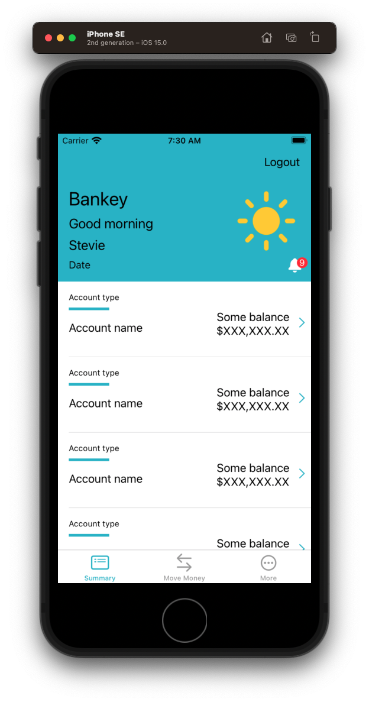

# Affordances

## Dispatch Group

It's hard to see, but sometimes parts of our app can load before others leading to a jarring `tableView.reload` experience. That, and because calling `tableView.reload` twice isn't very optimal, it would be nice if there was a way to only refresh the `tableView` once all the data has been fetched.


Fortunately there is. It's called `DispatchGroup`. And it works like this.

## What are DispatchGroups


- How do they work?

### Adding to Bankey


**AccountSummaryViewController**

```swift
// MARK: - Networking
extension AccountSummaryViewController {
    private func fetchDataAndLoadViews() {
        let group = DispatchGroup()

        group.enter()
        fetchProfile(forUserId: "1") { result in
			group.leave()
        }

        group.enter()
        fetchAccounts(forUserId: "1") { result in
			group.leave()
        }

        group.notify(queue: .main) {
            self.tableView.reloadData()
        }
```

### Save our work

```
> git add -p
> git commit -m "feat: Group account summary network calls together"
```

Demo. No noticable change. But it does smoooth out the loading our our `tableView` while also giving us one convenient place to react whenever network calls complete.

Which is super handy for pull to refresh.


## Pull to refresh

Pull to refresh is a feature a lot of mobile apps have where you can pull down on the app screen, and have all the data refresh.

- Gmail
- YouTube
- Starbucks

A lot of major apps have it. But we can have it too. And it's really easy to add now that we've grouped our network calls together.

### UIRefresh

[UIRefresh](https://developer.apple.com/documentation/uikit/uirefreshcontrol)

This is a control you can attach to any `UIScrollView`, including table views and collection views. It gives your users a standard way to refresh their contents. When the user drags the top of the scrollable content area downward, the scroll view reveals the refresh control, begings animating its progress indicator, and notifies your app. Use that notification to update your content and dismiss the refresh control.

Let's add one to our account summary view.

**AccountSummaryViewController**

```swift
// Components
var tableView = UITableView()
var headerView = AccountSummaryHeaderView(frame: .zero)
let refreshControl = UIRefreshControl()

private func setup() {
    setupNavigationBar()
    setupTableView()
    setupTableHeaderView()
    setupRefreshControl() //
    fetchDataAndLoadViews()
}

private func setupRefreshControl() {
    refreshControl.tintColor = appColor
    refreshControl.addTarget(self, action: #selector(refreshContent), for: .valueChanged)
    tableView.refreshControl = refreshControl
}

// MARK: Actions
extension AccountSummaryViewController {
    @objc func refreshContent() {
        DispatchQueue.main.async {
            self.fetchDataAndLoadViews()
            self.tableView.refreshControl?.endRefreshing()
        }
    }
}
```

## Skeleton loaders

Those nice shimmery boxes of grey that signal to the user things are loading.

Do understand the mechanics behind how to add skeleton loaders we first need to understand:

- [Gradients](https://github.com/jrasmusson/swift-arcade/blob/master/Animation/CoreAnimation/Gradients/README.md)
- [Skeleton Loaders](https://github.com/jrasmusson/swift-arcade/blob/master/Animation/Shimmer/README.md)

### Create a SkeletonCell

Let's start by creating a placeholder `SkeletonCell`.

**SkeletonCell**

```swift
//
//  SkeletonCell.swift
//  Bankey
//
//  Created by jrasmusson on 2021-11-30.
//

import UIKit

class SkeletonCell: UITableViewCell {
    
    let typeLabel = UILabel()
    let underlineView = UIView()
    let nameLabel = UILabel()
        
    let balanceStackView = UIStackView()
    let balanceLabel = UILabel()
    let balanceAmountLabel = UILabel()
        
    let chevronImageView = UIImageView()

    static let reuseID = "SkeletonCell"
    static let rowHeight: CGFloat = 112
    
    override init(style: UITableViewCell.CellStyle, reuseIdentifier: String?) {
        super.init(style: style, reuseIdentifier: reuseIdentifier)
        setup()
        layout()
    }
    
    required init?(coder: NSCoder) {
        fatalError("init(coder:) has not been implemented")
    }
}

extension SkeletonCell {
    
    private func setup() {
        typeLabel.translatesAutoresizingMaskIntoConstraints = false
        typeLabel.font = UIFont.preferredFont(forTextStyle: .caption1)
        typeLabel.adjustsFontForContentSizeCategory = true
        typeLabel.text = "Account type"
        
        underlineView.translatesAutoresizingMaskIntoConstraints = false
        underlineView.backgroundColor = appColor

        nameLabel.translatesAutoresizingMaskIntoConstraints = false
        nameLabel.font = UIFont.preferredFont(forTextStyle: .body)
        nameLabel.adjustsFontSizeToFitWidth = true
        nameLabel.text = "Account name"

        balanceStackView.translatesAutoresizingMaskIntoConstraints = false
        balanceStackView.axis = .vertical
        balanceStackView.spacing = 0

        balanceLabel.translatesAutoresizingMaskIntoConstraints = false
        balanceLabel.font = UIFont.preferredFont(forTextStyle: .body)
        balanceLabel.textAlignment = .right
        balanceLabel.adjustsFontSizeToFitWidth = true
        balanceLabel.text = "Some balance"

        balanceAmountLabel.translatesAutoresizingMaskIntoConstraints = false
        balanceAmountLabel.textAlignment = .right
        balanceAmountLabel.text = "$XXX,XXX.XX"
        
        chevronImageView.translatesAutoresizingMaskIntoConstraints = false
        let chevronImage = UIImage(systemName: "chevron.right")!.withTintColor(appColor, renderingMode: .alwaysOriginal)
        chevronImageView.image = chevronImage
    }
    
    private func layout() {
        contentView.addSubview(typeLabel)
        contentView.addSubview(underlineView)
        contentView.addSubview(nameLabel)
        
        balanceStackView.addArrangedSubview(balanceLabel)
        balanceStackView.addArrangedSubview(balanceAmountLabel)
        
        contentView.addSubview(balanceStackView)
        contentView.addSubview(chevronImageView)

        NSLayoutConstraint.activate([
            typeLabel.topAnchor.constraint(equalToSystemSpacingBelow: topAnchor, multiplier: 2),
            typeLabel.leadingAnchor.constraint(equalToSystemSpacingAfter: leadingAnchor, multiplier: 2),
            underlineView.topAnchor.constraint(equalToSystemSpacingBelow: typeLabel.bottomAnchor, multiplier: 1),
            underlineView.leadingAnchor.constraint(equalToSystemSpacingAfter: leadingAnchor, multiplier: 2),
            underlineView.widthAnchor.constraint(equalToConstant: 60),
            underlineView.heightAnchor.constraint(equalToConstant: 4),
            nameLabel.topAnchor.constraint(equalToSystemSpacingBelow: underlineView.bottomAnchor, multiplier: 2),
            nameLabel.leadingAnchor.constraint(equalToSystemSpacingAfter: leadingAnchor, multiplier: 2),
            balanceStackView.topAnchor.constraint(equalToSystemSpacingBelow: underlineView.bottomAnchor, multiplier: 0),
            balanceStackView.leadingAnchor.constraint(equalTo: nameLabel.trailingAnchor, constant: 4),
            trailingAnchor.constraint(equalToSystemSpacingAfter: balanceStackView.trailingAnchor, multiplier: 4),
            chevronImageView.topAnchor.constraint(equalToSystemSpacingBelow: underlineView.bottomAnchor, multiplier: 1),
            trailingAnchor.constraint(equalToSystemSpacingAfter: chevronImageView.trailingAnchor, multiplier: 1)
        ])
    }
}
```

This is basically a copy of our `AccountSummaryCell` without the `ViewModel` and `configure` methods.

The layout is the same. Which is basically what we want.

Next let's add these into our `tableView`.

### Load Skeletons into TableView

The way skeletons work is we want our `UITableView` to be loaded and displaying these while are actual network calls are going on.

When our network calls completely, we will swap out the `SkeletonCell`, and display the `AccountSummaryCell` configured with our loaded data.

There are a couple of ways we could do this:

1. We could define a variable called `isLoaded` and use that to signal when our skeletons should be displayed.
2. We could add a property onto `Account` called `isSkeleton`, and let the `Account` objects create the necessary `ViewModels` in such a way that when initially loaded, they can figure out for themselve whether they are skeletons or not.

Let's go with the former, because I think it is simpler and it will make seeing how skeleton loaders work easier to understand.

**AccountSummaryViewController**

```swift
// Components
var tableView = UITableView()
var headerView = AccountSummaryHeaderView(frame: .zero)
let refreshControl = UIRefreshControl()

var isLoaded = false
```

Then we need to register our `SkeletonCell` identifier with the `tableView`.

```swift
tableView.register(AccountSummaryCell.self, forCellReuseIdentifier: AccountSummaryCell.reuseID)
tableView.register(SkeletonCell.self, forCellReuseIdentifier: SkeletonCell.reuseID)
```

Then we need to intially load the `accounts` with fake data so our skeletons have something to show on the page.

Let's create a factory method on `Account` to create a fake skeleton account for loading.

**Account**

```swift
struct Account: Codable {
    let id: String
    let type: AccountType
    let name: String
    let amount: Decimal
    let createdDateTime: Date
    
    static func makeSkeleton() -> Account {
        return Account(id: "1", type: .Banking, name: "", amount: 0.0, createdDateTime: Date())
    }
}
```

**AccountSummaryViewController**

Then let's use that to populate our `accountCellViewModels` which are what drive and power the `tableView`. We can configure those as part of our `setup`.

```swift
// MARK: - Setup
extension AccountSummaryViewController {
    private func setup() {
        setupNavigationBar()
        setupTableView()
        setupTableHeaderView()
        setupRefreshControl()
        setupSkeletons() //
        fetchDataAndLoadViews()
    }
    
    private func setupSkeletons() {
        let row = Account.makeSkeleton()
        accounts = Array(repeating: row, count: 10)
        
        configureTableCells(with: accounts)
    }
```

With our skeletons setup and ready to go, we just need to add some logic to display them when the table initially loads.

```swift
extension AccountSummaryViewController: UITableViewDataSource {
    func tableView(_ tableView: UITableView, cellForRowAt indexPath: IndexPath) -> UITableViewCell {
        guard !accountCellViewModels.isEmpty else { return UITableViewCell() }

        let account = accountCellViewModels[indexPath.row]

        if isLoaded {
            let cell = tableView.dequeueReusableCell(withIdentifier: AccountSummaryCell.reuseID, for: indexPath) as! AccountSummaryCell
            cell.configure(with: account)
            return cell
        }
        
        let cell = tableView.dequeueReusableCell(withIdentifier: SkeletonCell.reuseID, for: indexPath) as! SkeletonCell
        return cell
    }
```

Now we just need to remember to set our `isLoaded` flag to true once the data loads.

```swift
group.notify(queue: .main) {
    self.isLoaded = true
    self.tableView.reloadData()
}
```

And that should be it! Let's give it a go.

It happens so fast that we can't even see the skeletons. Let's comment out the networking temporarily just to see the skeletons load.

```swift
// MARK: - Setup
extension AccountSummaryViewController {
    private func setup() {
        setupNavigationBar()
        setupTableView()
        setupTableHeaderView()
        setupRefreshControl()
        setupSkeletons()
//        fetchDataAndLoadViews()
    }
```

And if we run it now. Yay! Skeletons.



Next, let's make those skeletons shimmer.

## Making the skeletons shimmer

To make our skeletons shimmer we are going to define a `SkeletonLoadable` protocol, let it create our shimmer animation group, and then inherit that in our `SkeletonCell`.

But first let's define some colors.

**UIColor+Utils**

```swift
import UIKit

extension UIColor {
    static var gradientDarkGrey: UIColor {
        return UIColor(red: 239 / 255.0, green: 241 / 255.0, blue: 241 / 255.0, alpha: 1)
    }

    static var gradientLightGrey: UIColor {
        return UIColor(red: 201 / 255.0, green: 201 / 255.0, blue: 201 / 255.0, alpha: 1)
    }
}
```

Then let's defining the protocol.

**SkeletonLoadable**

```swift
import UIKit

/*
 Functional programming inheritance.
 */

protocol SkeletonLoadable {}

extension SkeletonLoadable {
    
    func makeAnimationGroup(previousGroup: CAAnimationGroup? = nil) -> CAAnimationGroup {
        let animDuration: CFTimeInterval = 1.5
        let anim1 = CABasicAnimation(keyPath: #keyPath(CAGradientLayer.backgroundColor))
        anim1.fromValue = UIColor.gradientLightGrey.cgColor
        anim1.toValue = UIColor.gradientDarkGrey.cgColor
        anim1.duration = animDuration
        anim1.beginTime = 0.0

        let anim2 = CABasicAnimation(keyPath: #keyPath(CAGradientLayer.backgroundColor))
        anim2.fromValue = UIColor.gradientDarkGrey.cgColor
        anim2.toValue = UIColor.gradientLightGrey.cgColor
        anim2.duration = animDuration
        anim2.beginTime = anim1.beginTime + anim1.duration

        let group = CAAnimationGroup()
        group.animations = [anim1, anim2]
        group.repeatCount = .greatestFiniteMagnitude // infinite
        group.duration = anim2.beginTime + anim2.duration
        group.isRemovedOnCompletion = false

        if let previousGroup = previousGroup {
            // Offset groups by 0.33 seconds for effect
            group.beginTime = previousGroup.beginTime + 0.33
        }

        return group
    }
    
}
```

Then let's use that protocol in our `SkeletonCell`.

**SkeletonCell**

```swift
// inherit
extension SkeletonCell: SkeletonLoadable {}
```

This is how we do inheritance in Swift. Via protcols. By implement this we get access to `makeAnimationGroup`.

Now we just need to make our cell shimmer. This is where we add our gradients to our labels.

Let's start with one.

```swift
let typeLabel = UILabel()
let typeLayer = CAGradientLayer()

override init(style: UITableViewCell.CellStyle, reuseIdentifier: String?) {
    super.init(style: style, reuseIdentifier: reuseIdentifier)
    setup()
    setupLayers() //
    setupAnimation() //
    layout()
}

extension SkeletonCell {
      
    private func setupLayers() {
        typeLayer.startPoint = CGPoint(x: 0, y: 0.5)
        typeLayer.endPoint = CGPoint(x: 1, y: 0.5)
        typeLabel.layer.addSublayer(typeLayer)
    }
    
    private func setupAnimation() {
        let titleGroup = makeAnimationGroup()
        titleGroup.beginTime = 0.0
        typeLayer.add(titleGroup, forKey: "backgroundColor")
    }
```

OK. If we run this now we will see our `typeLabel` shimmer!


Now it's just a matter of doing it for the rest of the controls on the page.

### Challenge

See if you can make the `nameLabel` shimmer. Follow the steps we did for `typeLabel`.

- Add a `nameLayer` gradient
- Setup the layer
- Setup the animation

And then step your `nameLayer` animation on top of the `typeLayer` by doing something like this.

```swift
let nameGroup = makeAnimationGroup(previousGroup: typeGroup)
nameLayer.add(nameGroup, forKey: "backgroundColor")
```

Good luck!


### Links that help

- [UIRefeshControl](https://developer.apple.com/documentation/uikit/uirefreshcontrol)

