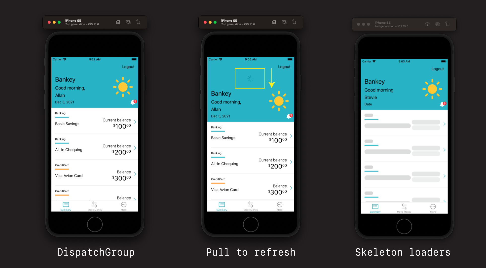
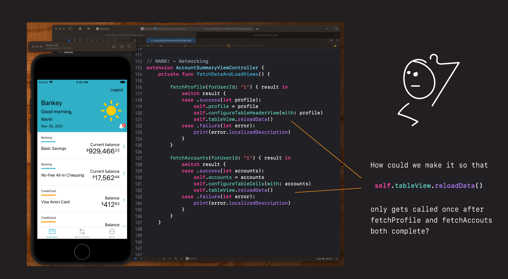
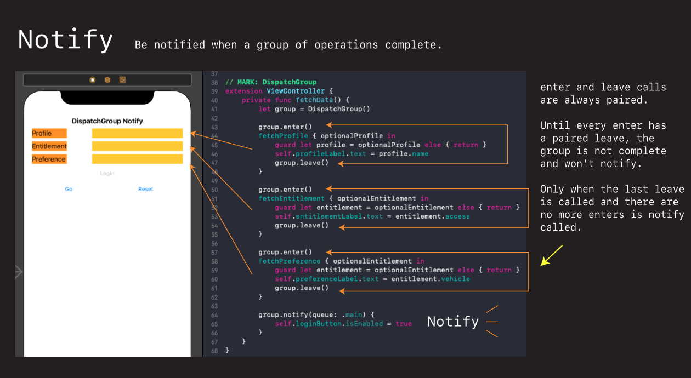
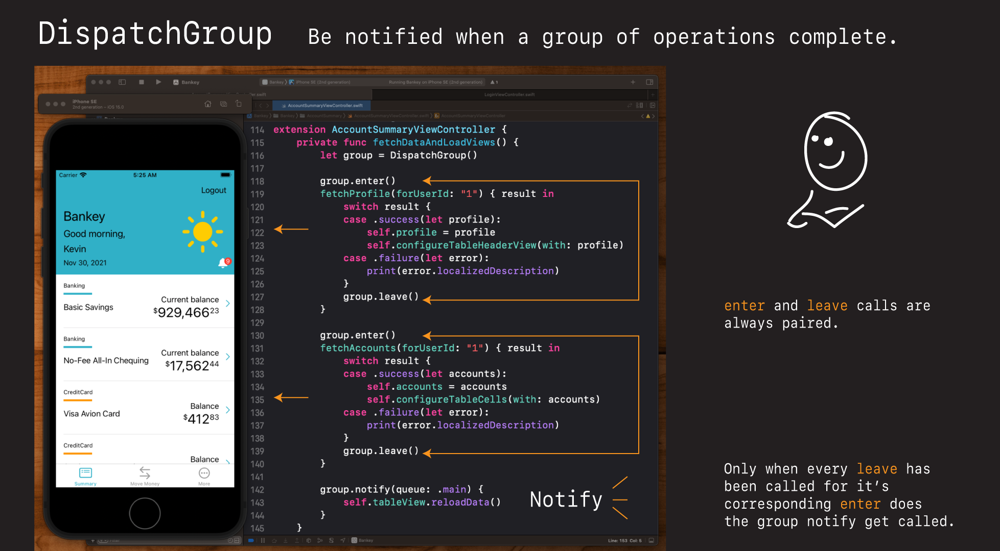
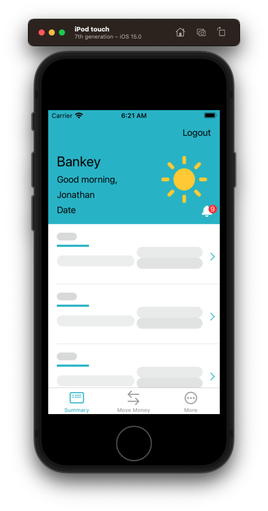
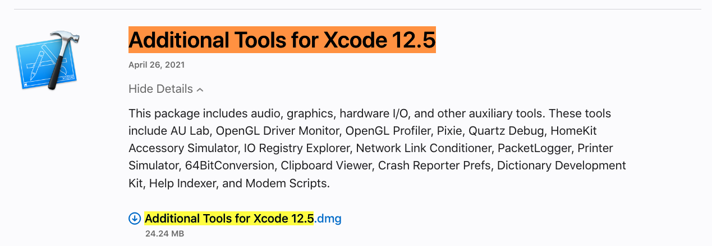

# Affordances



## DispatchGroup

It's hard to see, but sometimes parts of our app can load before others leading to a jarring `tableView.reload` experience. What would be nice if there was a way to group all our network calls together, and only reload the `tableView` once they've all completed.



Fortunately there is. It's called `DispatchGroup`. And it works like this.

## What are DispatchGroups



- How do they work?

### Adding to Bankey



**AccountSummaryViewController**

First let's rename `fetchDataAndLoadViews` > `fetchData`. Demo refactoring.

Then let's add the `DispatchGroup`.

```swift
// MARK: - Networking
extension AccountSummaryViewController {
    private func fetchData() {
        let group = DispatchGroup()

        group.enter()
        fetchProfile(forUserId: "1") { result in
			group.leave()
        }

        group.enter()
        fetchAccounts(forUserId: "1") { result in
			group.leave()
        }

```

Add then let's move the `tableView.reloadData()`.

```swift
        fetchProfile(forUserId: userId) { result in
            switch result {
            case .success(let profile):
                self.profile = profile
                self.configureTableHeaderView(with: profile)
                self.tableView.reloadData() // delete
        }

        fetchAccounts(forUserId: userId) { result in
            switch result {
            case .success(let accounts):
                self.accounts = accounts
                self.configureTableCells(with: accounts)
                self.tableView.reloadData() // delete
        }

        group.notify(queue: .main) {
            self.tableView.reloadData() // add
        }

```

### Save our work

```
> git add -p
> git commit -m "feat: Group account summary network calls together"
```

Demo. No noticable change. But it does smoooth out the loading our our `tableView` while also giving us one convenient place to react whenever network calls complete.

Which is super handy for pull to refresh.


## Pull to refresh

Pull to refresh is a feature a lot of mobile apps have where you can pull down on the app screen, and have all the data refresh.

- Gmail
- YouTube
- Starbucks

A lot of major apps have it. And we can have it too. And it's really easy to add now that we've grouped our network calls together.

### UIRefresh

[UIRefresh](https://developer.apple.com/documentation/uikit/uirefreshcontrol)

This is a control you can attach to any `UIScrollView`, including table views and collection views. It gives your users a standard way to refresh their contents. When the user drags the top of the scrollable content area downward, the scroll view reveals the refresh control, begings animating its progress indicator, and notifies your app. Use that notification to update your content and dismiss the refresh control.

Let's add one to our account summary view.

First let's move `setupNavigationBar` to `setup` where it belongs.

**AccountSummaryViewController**

```swift
    override func viewDidLoad() {
        super.viewDidLoad()
        setup()
        setupNavigationBar() //
    }
    
    private func setup() {
        setupNavigationBar() //
        setupTableView()
        setupTableHeaderView()
        fetchData()
    }

```

Then add refresh.

```swift
// Components
var tableView = UITableView()
var headerView = AccountSummaryHeaderView(frame: .zero)
let refreshControl = UIRefreshControl()

private func setup() {
    setupNavigationBar()
    setupTableView()
    setupTableHeaderView()
    setupRefreshControl() //
    fetchData()
}

private func setupRefreshControl() {
    refreshControl.tintColor = appColor
    refreshControl.addTarget(self, action: #selector(refreshContent), for: .valueChanged)
    tableView.refreshControl = refreshControl
}

// MARK: Actions
extension AccountSummaryViewController {
    @objc func refreshContent() {
            fetchData()
    }
}
```

And we will end the pull to refresh when our network calls return.

```swift
// MARK: - Networking
extension AccountSummaryViewController {
    private func fetchData() {
   
        group.notify(queue: .main) {
            self.tableView.reloadData()
            self.tableView.refreshControl?.endRefreshing() // 
        }
    }
```

Demo. Can now see the refresh control. But can't notice any different in the UI. Purely for testing purposes, lets randomize our networking and call different accounts every time the data is fetched.

```swift
// MARK: - Networking
extension AccountSummaryViewController {
    private func fetchData() {
        let group = DispatchGroup()
        
        // Testing - random number selection
        let userId = String(Int.random(in: 1..<4))
        
        group.enter()
        fetchProfile(forUserId: userId) { result in
        
        group.enter()
        fetchAccounts(forUserId: userId) { result in
```

Now when we pull to refresh, we will see the data change.

### Save our work

```
> git add .
> git commit -m "feat: Add refresh control"
```

## Skeleton loaders

Skeleton loaders are those nice shimmery boxes of grey that signal to the user things are loading.

Demo.

To understand the mechanics behind how to add skeleton loaders we first need to understand:

- [Gradients](https://github.com/jrasmusson/swift-arcade/blob/master/Animation/CoreAnimation/Gradients/README.md)
- [How skeleton loaders work](https://github.com/jrasmusson/swift-arcade/blob/master/Animation/Shimmer/README.md)

## Defining a protocol

Wouldn't it be nice if we could have a class that handled the making of that animation group for us? Let's define a `SkeletonLoadable` protocol and put that logic in there.

Create a new file called `SkeletonLoadable` in the `Cells` directory.

```swift
import UIKit

/*
 Functional programming inheritance.
 */

protocol SkeletonLoadable {}

extension SkeletonLoadable {
    
    func makeAnimationGroup(previousGroup: CAAnimationGroup? = nil) -> CAAnimationGroup {
        let animDuration: CFTimeInterval = 1.5
        let anim1 = CABasicAnimation(keyPath: #keyPath(CAGradientLayer.backgroundColor))
        anim1.fromValue = UIColor.gradientLightGrey.cgColor
        anim1.toValue = UIColor.gradientDarkGrey.cgColor
        anim1.duration = animDuration
        anim1.beginTime = 0.0

        let anim2 = CABasicAnimation(keyPath: #keyPath(CAGradientLayer.backgroundColor))
        anim2.fromValue = UIColor.gradientDarkGrey.cgColor
        anim2.toValue = UIColor.gradientLightGrey.cgColor
        anim2.duration = animDuration
        anim2.beginTime = anim1.beginTime + anim1.duration

        let group = CAAnimationGroup()
        group.animations = [anim1, anim2]
        group.repeatCount = .greatestFiniteMagnitude // infinite
        group.duration = anim2.beginTime + anim2.duration
        group.isRemovedOnCompletion = false

        if let previousGroup = previousGroup {
            // Offset groups by 0.33 seconds for effect
            group.beginTime = previousGroup.beginTime + 0.33
        }

        return group
    }
}

extension UIColor {
    static var gradientDarkGrey: UIColor {
        return UIColor(red: 239 / 255.0, green: 241 / 255.0, blue: 241 / 255.0, alpha: 1)
    }

    static var gradientLightGrey: UIColor {
        return UIColor(red: 201 / 255.0, green: 201 / 255.0, blue: 201 / 255.0, alpha: 1)
    }
}
```

Discussion

- Swift inheritance and how it is done with protocols


### Create a SkeletonCell

Now let's create a `SkeletonCell` in `Cells` to contain our shimmering.

**SkeletonCell**

```swift
import UIKit

extension SkeletonCell: SkeletonLoadable {}

class SkeletonCell: UITableViewCell {
    
    let typeLabel = UILabel()
    let underlineView = UIView()
    let nameLabel = UILabel()

    let balanceStackView = UIStackView()
    let balanceLabel = UILabel()
    let balanceAmountLabel = UILabel()
        
    let chevronImageView = UIImageView()
    
    // Gradients
    let typeLayer = CAGradientLayer()
    let nameLayer = CAGradientLayer()
    let balanceLayer = CAGradientLayer()
    let balanceAmountLayer = CAGradientLayer()
    
    static let reuseID = "SkeletonCell"
    static let rowHeight: CGFloat = 112
    
    override init(style: UITableViewCell.CellStyle, reuseIdentifier: String?) {
        super.init(style: style, reuseIdentifier: reuseIdentifier)
        setup()
        setupLayers()
        setupAnimation()
        layout()
    }
    
    required init?(coder: NSCoder) {
        fatalError("init(coder:) has not been implemented")
    }
    
    override func layoutSubviews() {
        super.layoutSubviews()
        
        typeLayer.frame = typeLabel.bounds
        typeLayer.cornerRadius = typeLabel.bounds.height/2
        
        nameLayer.frame = nameLabel.bounds
        nameLayer.cornerRadius = nameLabel.bounds.height/2

        balanceLayer.frame = balanceLabel.bounds
        balanceLayer.cornerRadius = balanceLabel.bounds.height/2

        balanceAmountLayer.frame = balanceAmountLabel.bounds
        balanceAmountLayer.cornerRadius = balanceAmountLabel.bounds.height/2
    }
}

extension SkeletonCell {
    
    private func setup() {
        typeLabel.translatesAutoresizingMaskIntoConstraints = false
        typeLabel.font = UIFont.preferredFont(forTextStyle: .caption1)
        typeLabel.adjustsFontForContentSizeCategory = true
        typeLabel.text = "           "
                
        underlineView.translatesAutoresizingMaskIntoConstraints = false
        underlineView.backgroundColor = appColor

        nameLabel.translatesAutoresizingMaskIntoConstraints = false
        nameLabel.font = UIFont.preferredFont(forTextStyle: .body)
        nameLabel.adjustsFontSizeToFitWidth = true
        nameLabel.text = "           "

        balanceStackView.translatesAutoresizingMaskIntoConstraints = false
        balanceStackView.axis = .vertical
        balanceStackView.spacing = 4

        balanceLabel.translatesAutoresizingMaskIntoConstraints = false
        balanceLabel.font = UIFont.preferredFont(forTextStyle: .body)
        balanceLabel.textAlignment = .right
        balanceLabel.adjustsFontSizeToFitWidth = true
        balanceLabel.text = "-Some balance-"

        balanceAmountLabel.translatesAutoresizingMaskIntoConstraints = false
        balanceAmountLabel.textAlignment = .right
        balanceAmountLabel.text = "-XXX,XXX.X-"
        
        chevronImageView.translatesAutoresizingMaskIntoConstraints = false
        let chevronImage = UIImage(systemName: "chevron.right")!.withTintColor(appColor, renderingMode: .alwaysOriginal)
        chevronImageView.image = chevronImage
    }
    
    private func setupLayers() {
        typeLayer.startPoint = CGPoint(x: 0, y: 0.5)
        typeLayer.endPoint = CGPoint(x: 1, y: 0.5)
        typeLabel.layer.addSublayer(typeLayer)
        
        nameLayer.startPoint = CGPoint(x: 0, y: 0.5)
        nameLayer.endPoint = CGPoint(x: 1, y: 0.5)
        nameLabel.layer.addSublayer(nameLayer)

        balanceLayer.startPoint = CGPoint(x: 0, y: 0.5)
        balanceLayer.endPoint = CGPoint(x: 1, y: 0.5)
        balanceLabel.layer.addSublayer(balanceLayer)

        balanceAmountLayer.startPoint = CGPoint(x: 0, y: 0.5)
        balanceAmountLayer.endPoint = CGPoint(x: 1, y: 0.5)
        balanceAmountLabel.layer.addSublayer(balanceAmountLayer)
    }
    
    private func setupAnimation() {
        let typeGroup = makeAnimationGroup()
        typeGroup.beginTime = 0.0
        typeLayer.add(typeGroup, forKey: "backgroundColor")
        
        let nameGroup = makeAnimationGroup(previousGroup: typeGroup)
        nameLayer.add(nameGroup, forKey: "backgroundColor")
        
        let balanceGroup = makeAnimationGroup(previousGroup: nameGroup)
        balanceLayer.add(balanceGroup, forKey: "backgroundColor")

        let balanceAmountGroup = makeAnimationGroup(previousGroup: balanceGroup)
        balanceAmountLayer.add(balanceAmountGroup, forKey: "backgroundColor")
    }
    
    private func layout() {
        contentView.addSubview(typeLabel)
        contentView.addSubview(underlineView)
        contentView.addSubview(nameLabel)
        
        balanceStackView.addArrangedSubview(balanceLabel)
        balanceStackView.addArrangedSubview(balanceAmountLabel)
        
        contentView.addSubview(balanceStackView)
        contentView.addSubview(chevronImageView)

        NSLayoutConstraint.activate([
            typeLabel.topAnchor.constraint(equalToSystemSpacingBelow: topAnchor, multiplier: 2),
            typeLabel.leadingAnchor.constraint(equalToSystemSpacingAfter: leadingAnchor, multiplier: 2),
            underlineView.topAnchor.constraint(equalToSystemSpacingBelow: typeLabel.bottomAnchor, multiplier: 1),
            underlineView.leadingAnchor.constraint(equalToSystemSpacingAfter: leadingAnchor, multiplier: 2),
            underlineView.widthAnchor.constraint(equalToConstant: 60),
            underlineView.heightAnchor.constraint(equalToConstant: 4),
            nameLabel.topAnchor.constraint(equalToSystemSpacingBelow: underlineView.bottomAnchor, multiplier: 2),
            nameLabel.leadingAnchor.constraint(equalToSystemSpacingAfter: leadingAnchor, multiplier: 2),
            balanceStackView.topAnchor.constraint(equalToSystemSpacingBelow: underlineView.bottomAnchor, multiplier: 0),
            balanceStackView.leadingAnchor.constraint(equalTo: nameLabel.trailingAnchor, constant: 4),
            trailingAnchor.constraint(equalToSystemSpacingAfter: balanceStackView.trailingAnchor, multiplier: 4),
            chevronImageView.topAnchor.constraint(equalToSystemSpacingBelow: underlineView.bottomAnchor, multiplier: 1),
            trailingAnchor.constraint(equalToSystemSpacingAfter: chevronImageView.trailingAnchor, multiplier: 1)
        ])
    }
}
```

This is basically a copy of our `AccountSummaryCell` without the `ViewModel` and `configure` methods. The layout is the same. 

Discussion

- Show inheritance of `makeAnimationGroup` function
- Show text filler used and why

Next let's add these into our `tableView`.

### Load Skeletons into TableView

In order to show our skeleton cell while the network calls are loading let's define a variable called `isLoaded` and use that to signal when our skeletons should be displayed.

**AccountSummaryViewController**

```swift
// Components
var tableView = UITableView()
var headerView = AccountSummaryHeaderView(frame: .zero)
let refreshControl = UIRefreshControl()

var isLoaded = false
```

Then we need to register our `SkeletonCell` identifier with the `tableView`.

```swift
tableView.register(AccountSummaryCell.self, forCellReuseIdentifier: AccountSummaryCell.reuseID)
tableView.register(SkeletonCell.self, forCellReuseIdentifier: SkeletonCell.reuseID)
```

Then we need to intially load the `accounts` with fake data so our skeletons have something to show on the page.

Let's create a factory method on `Account` to create a fake skeleton account for loading.

**Account**

```swift
struct Account: Codable {
    let id: String
    let type: AccountType
    let name: String
    let amount: Decimal
    let createdDateTime: Date
    
    static func makeSkeleton() -> Account {
        return Account(id: "1", type: .Banking, name: "Account name", amount: 0.0, createdDateTime: Date())
    }
}
```

**AccountSummaryViewController**

Then let's use that to populate our `accountCellViewModels` which are what drive and power the `tableView`. We can configure those as part of our `setup`.

```swift
// MARK: - Setup
extension AccountSummaryViewController {
    private func setup() {
        setupNavigationBar()
        setupTableView()
        setupTableHeaderView()
        setupRefreshControl()
        setupSkeletons() //
        fetchData()
    }
    
    private func setupSkeletons() {
        let row = Account.makeSkeleton()
        accounts = Array(repeating: row, count: 10)
        
        configureTableCells(with: accounts)
    }
```

With our skeletons setup and ready to go, we just need to add some logic to display them when the table initially loads.

```swift
extension AccountSummaryViewController: UITableViewDataSource {
    func tableView(_ tableView: UITableView, cellForRowAt indexPath: IndexPath) -> UITableViewCell {
        guard !accountCellViewModels.isEmpty else { return UITableViewCell() }
        let account = accountCellViewModels[indexPath.row]

        if isLoaded {
            let cell = tableView.dequeueReusableCell(withIdentifier: AccountSummaryCell.reuseID, for: indexPath) as! AccountSummaryCell
            cell.configure(with: account)
            return cell
        }
        
        let cell = tableView.dequeueReusableCell(withIdentifier: SkeletonCell.reuseID, for: indexPath) as! SkeletonCell
        return cell
    }
```

Now we just need to remember to set our `isLoaded` flag to true once the data loads.

```swift
group.notify(queue: .main) {
    self.isLoaded = true // 
    self.tableView.reloadData()
    self.tableView.refreshControl?.endRefreshing()
}
```

And that should be it! Let's give it a go.

It happens so fast that we can't even see the skeletons. Let's comment out the networking temporarily just to see the skeletons load.

```swift
// MARK: - Setup
extension AccountSummaryViewController {
    private func setup() {
        setupNavigationBar()
        setupTableView()
        setupTableHeaderView()
        setupRefreshControl()
        setupSkeletons()
//        fetchData()
    }
```

And if we run it now. Yay! Skeletons.



## Swapping skeletons in on pull to refresh

One last nice little touch up would be to show skeletons when doing a pull to refresh.

We can do that by calling our skeleton setup when pull to refresh occurs and then let it refresh itself once the network calls are done.

**AccountSummaryViewController**

```swift
// MARK: Actions
extension AccountSummaryViewController {
    @objc func logoutTapped(sender: UIButton) {
        NotificationCenter.default.post(name: .logout, object: nil)
    }
    
    @objc func refreshContent() {
        reset()
        setupSkeletons()
        tableView.reloadData()
        fetchData()
    }
    
    private func reset() {
        profile = nil
        accounts = []
        isLoaded = false
    }
}
```

Now this is still hard to see. Because our network calls are so quick, it doesn't give time for our skeletons to appear.

One thing we can in an attempt to slow our network requests down is to use the Network Link Conditioner.

## Network Link Conditioner

Network Link Conditioner is Apple's offical too for simulating network connections.

- [How to simulate poor network conditions](https://medium.com/macoclock/how-to-simulate-poor-network-conditions-on-ios-simulator-and-iphone-faf35f0da1b5)

By following these instructions above you can install the tool in Xcode and slow down the network connections for your iPhone simulator and computer! So remember to turn it off when you are done.

To start follow the instructions above to install.

If your run into an error:

> Could not load network link conditioner preference pane
 
[Try installing](https://github.com/NSHipster/articles/issues/772) the Xcode 12.5 tool set even through you are working in Xcode 13. It a bug and this is the only way I could get it to work.
 


But once installed you can use it to do things like this.

- Demo network conditioner
- Re-install app if cacheing occurs too frequently
- Turn of network link conditioner!

U R HERE - new video

## Sync header and table screen refresh

You may have noticed we have a slight bug in our screen refresh. Our head updates before our table view has loaded.

Let's fix that now by moving the header and table configuration from the `fetch` to the `group.notify`.

**AccountSummaryViewController**

```swift
group.enter()
fetchProfile(forUserId: userId) { result in
    switch result {
    case .success(let profile):
        self.profile = profile
    case .failure(let error):
        print(error.localizedDescription)
    }
    group.leave()
}

group.enter()
fetchAccounts(forUserId: userId) { result in
    switch result {
    case .success(let accounts):
        self.accounts = accounts
    case .failure(let error):
        print(error.localizedDescription)
    }
    group.leave()
}
    
group.notify(queue: .main) {
    self.tableView.refreshControl?.endRefreshing()
    
    guard let profile = self.profile else { return }
    
    self.isLoaded = true
    self.configureTableHeaderView(with: profile) //
    self.configureTableCells(with: self.accounts) //
    self.tableView.reloadData()
}
```

Now if we run the app both header and cell will reload at the same time.

### Save your work

```
> git add .
> git commit -m "feat: Add skeleton to pull to refresh"
```

### What we've learned

- 🕸  How to group network calls together - DispatchGroup
- 🔄  How to make your app refreshable - UIRefresh
- 🌈 How to create gradients
- 💀 How to signal app loading with skeleton loaders
- 🪜 Swift inheritance
- 🐌 How to simulate slow network calls - Network Link Conditioner

### Links that help

- [DispatchGroup](https://developer.apple.com/documentation/dispatch/dispatchgroup)
- [UIRefeshControl](https://developer.apple.com/documentation/uikit/uirefreshcontrol)
- [How to simulate poor network conditions](https://medium.com/macoclock/how-to-simulate-poor-network-conditions-on-ios-simulator-and-iphone-faf35f0da1b5)

