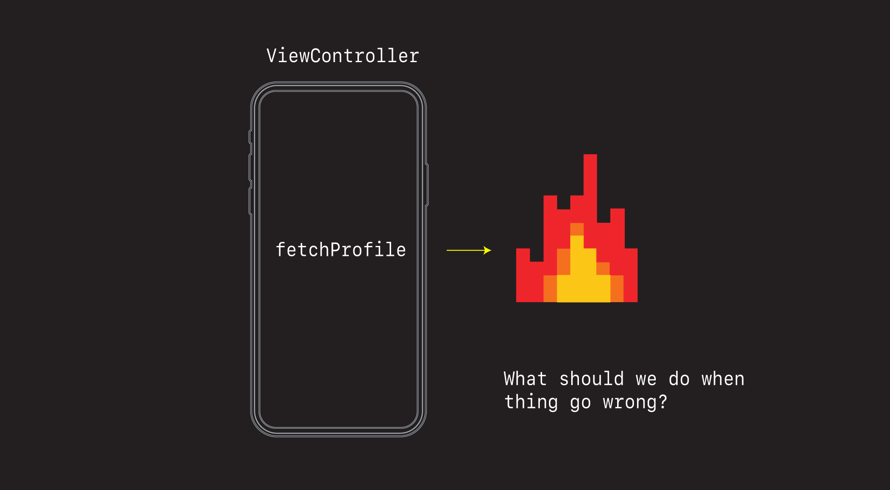
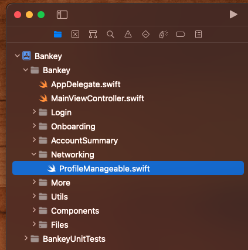
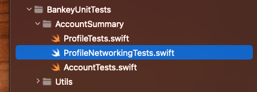

# Error Handling



It's easy to stick to happy path scenarios when building apps. But just as important is adding affordances for when things go wrong.

Let's look at a couple of ways we can anticipate things going wrong and then adding affordance to handle them.

## Handling failed network calls

### Failed profile fetch

First, if we haven't already, let's comment back in our `fetchData` call.

**AccountSummaryViewController**

```swift
// MARK: - Setup
extension AccountSummaryViewController {
    private func setup() {
        setupNavigationBar()
        ...
        fetchData() // 
    }
```

Then let's force our `fetchProfile` network call to fail by commenting out every line of code except this one here.

**AccountSummaryViewController+Networking**

```swift
completion(.failure(.decodingError))
```

This is an easy way to test and force and error in your app. Just hard code it and make it happen.

When we run the app now our screen just sits there stuck loading skeletons.


Let's pop up an alert and give them at left some feedback that we know something is going wrong.

**AccountSummaryViewController** 

```swift

private func configureTableCells(with accounts: [Account]) {
}

private func showErrorAlert() {
    let alert = UIAlertController(title: "Network Error",
                                  message: "Please check your network connectivity and try again.",
                                  preferredStyle: .alert)
    
    alert.addAction(UIAlertAction(title: "OK", style: .default, handler: nil))
    
    present(alert, animated: true, completion: nil)
}
```

And let's call it from where our fetch profile fails.

```swift
fetchProfile(forUserId: userId) { result in
    switch result {
    case .success(let profile):
        self.profile = profile
    case .failure(let error):
        self.showErrorAlert() //
    }
    group.leave()
}
```

If we run the app now we see an error alert pop-up.


### Challenge

OK - that's not bad. But what if we want to display a different error message based on the type of error that occurred?

Right now we can have one of two errors:

```swift
enum NetworkError: Error {
    case serverError
    case decodingError
}
```

Why don't you see if you can detect what kind of error gets by adding a `switch` statement here:

```swift
fetchProfile(forUserId: userId) { result in
    switch result {
    case .success(let profile):
        self.profile = profile
    case .failure(let error):
        // 🕹 Game on switch here...
        self.showErrorAlert() //
    }
    group.leave()
}
```

And then based on the error return, refactor the `showErrorAlert` func to take a `title` and `message` String and display one of the following messages:

case serverError:

 - `title` = `Server Error`
 - `message` = `Ensure you are connected to the internet. Please try again.`

case decodingError:

 - `title` = `Decoding Error`
 - `message` = `We could not process your request. Please try again.`


Give that a go. Comeback and we'll do it together. 

### Solution

Alright, let's refactor the alert funct first to take a title and a message.

```swift
private func showErrorAlert(title: String, message: String) {
    let alert = UIAlertController(title: title,
                                  message: message,
                                  preferredStyle: .alert)
    
    alert.addAction(UIAlertAction(title: "OK", style: .default, handler: nil))
    
    present(alert, animated: true, completion: nil)
}
```

Then let's add the error switch and let it determine what the `title` and `message` should be before passing it show alert.

```swift
case .failure(let error):
    let title: String
    let message: String
    switch error {
    case .serverError:
        title = "Server Error"
        message = "Ensure you are connected to the internet. Please try again."
    case .decodingError:
        title = "Decoding Error"
        message = "We could not process your request. Please try again."
    }
    self.showErrorAlert(title: title, message: message)
}
```

OK this works.

- Demo network error.
- Demo server error.

Discussion

- talk about code readability and how to refactor code so the abstractions are all at the same level

Let's extract a method to make it read like this.

```swift
fetchProfile(forUserId: userId) { result in
    switch result {
    case .success(let profile):
        self.profile = profile
    case .failure(let error):
        self.displayError(error)
    }
    group.leave()
}
```

And

```swift
private func displayError(_ error: NetworkError) {
    let title: String
    let message: String
    switch error {
    case .serverError:
        title = "Server Error"
        message = "We could not process your request. Please try again."
    case .decodingError:
        title = "Network Error"
        message = "Ensure you are connected to the internet. Please try again."
    }
    self.showErrorAlert(title: title, message: message)
}
```

Now everything reads more nicely and we don't get lost in the details of implementation.

Let's do the same for `fetchAccount`.

```swift
fetchAccounts(forUserId: userId) { result in
    switch result {
    case .success(let accounts):
        self.accounts = accounts
    case .failure(let error):
        self.displayError(error) // 
    }
    group.leave()
}
```

And let's comment back in our `fetchProfile` network code.

```swift
extension AccountSummaryViewController {
    func fetchProfile(forUserId userId: String, completion: @escaping (Result<Profile,NetworkError>) -> Void) {
        let url = URL(string: "https://fierce-retreat-36855.herokuapp.com/bankey/profile/\(userId)")!

        URLSession.shared.dataTask(with: url) { data, response, error in
            DispatchQueue.main.async {
                guard let data = data, error == nil else {
                    completion(.failure(.serverError))
                    return
                }

                do {
                    let profile = try JSONDecoder().decode(Profile.self, from: data)
                    completion(.success(profile))
                } catch {
                    completion(.failure(.decodingError))
                }
            }
        }.resume()
    }
}
```

Good stuff. Network error cases handled.

### Save your work

```
> git add .
> git commit -m "feat: Handle network errors"
```

## Unit testing network failures

As good as manually testing network errors are, what's even better is if we can automate them. 

Let's look at a couple of ways we could unit test the displaying or alerts, and while keeping our application intact.

### Dependency Injection


- What is it?
- How does it work?
- Why is is so handy for unit testing?

### Define the protocol

This is the thing we are going to inject into our ViewController. Create a new section called `Networking` and create a new file in there called `ProfileManager`.



**ProfileManager**

```swift
protocol ProfileManageable {
    func fetchProfile(forUserId userId: String, completion: @escaping (Result<Profile,NetworkError>) -> Void)
}
```

### Create the concrete real implementation

Now we need something to implement this protocol. Something that can do the actually networking.

Currently this code is embedded in our `AccountSummaryViewController+Networking` extention. Let's extract it and all related code into it's this newly created file.

**ProfileManager**

```swift
protocol ProfileManageable {
    func fetchProfile(forUserId userId: String, completion: @escaping (Result<Profile,NetworkError>) -> Void)
}

enum NetworkError: Error {
    case serverError
    case decodingError
}

struct Profile: Codable {
    let id: String
    let firstName: String
    let lastName: String
    
    enum CodingKeys: String, CodingKey {
        case id
        case firstName = "first_name"
        case lastName = "last_name"
    }
}

struct ProfileManager: ProfileManageable {
    func fetchProfile(forUserId userId: String, completion: @escaping (Result<Profile,NetworkError>) -> Void) {
        let url = URL(string: "https://fierce-retreat-36855.herokuapp.com/bankey/profile/\(userId)")!

        URLSession.shared.dataTask(with: url) { data, response, error in
            DispatchQueue.main.async {
                guard let data = data, error == nil else {
                    completion(.failure(.serverError))
                    return
                }

                do {
                    let profile = try JSONDecoder().decode(Profile.self, from: data)
                    completion(.success(profile))
                } catch {
                    completion(.failure(.decodingError))
                }
            }
        }.resume()
    }
}
```

Discussion:

- Note how we are implementing the protocol

Now we just need to update the `AccountSummaryViewController` to use it.

**AccountSummaryViewController**

```swift
// Components
...
let refreshControl = UIRefreshControl()
    
// Networking
var profileManageable = ProfileManager() //

// MARK: - Networking
extension AccountSummaryViewController {
    private func fetchData() {
		...        
        group.enter()
        profileManageable.fetchProfile(forUserId: userId) { //

```

Run the app. Everything should still work.

But this is magic. Now that we have this protocol defined, we can *inject* whatever we want.

Let's now head over to the unit testing section of our app, and see what tests we can write there.

### Leveraging protocols in our unit tests

Let's create a new file called `ProfileNetworkingTests`.



And let's start by writing a happy path scenario for what we expect to happen when `AccountSummaryViewController` calls `fetchProfile`.

**ProfileNetworkingTests**

```swift
import Foundation

import XCTest

@testable import Bankey

class ProfileNetworkingTests: XCTestCase {
    var vc: AccountSummaryViewController!
    
    override func setUp() {
        super.setUp()
        vc = AccountSummaryViewController()
        vc.loadViewIfNeeded()
    }
    
    func testFetchProfile() throws {
        
    }
}
```

What we really want to test here, is that the `profile` gets set after we successfully do a fetch.

**AccountSummaryViewController**

```swfit
case .success(let profile):
    self.profile = profile
```

The problem is we have no way of triggering it from our test. Let's make `AccountSummaryViewController` a little more testable by extracting `fetchProfile` and `fetchAccounts` into their own public methods.

**AccountSummaryViewController**

```swift
fetchProfile(group: group, userId: userId)
fetchAccounts(group: group, userId: userId)
self.reloadView()

private func fetchProfile(group: DispatchGroup, userId: String) {
    group.enter()
    profileManageable.fetchProfile(forUserId: userId) { result in
        switch result {
        case .success(let profile):
            self.profile = profile
        case .failure(let error):
            self.displayError(error)
        }
        group.leave()
    }
}
    
private func fetchAccounts(group: DispatchGroup, userId: String) {
    group.enter()
    fetchAccounts(forUserId: userId) { result in
        switch result {
        case .success(let accounts):
            self.accounts = accounts
        case .failure(let error):
            self.displayError(error)
        }
        group.leave()
    }
}

private func reloadView() {
    self.tableView.refreshControl?.endRefreshing()
    
    guard let profile = self.profile else { return }
    
    self.isLoaded = true
    self.configureTableHeaderView(with: profile)
    self.configureTableCells(with: self.accounts)
    self.tableView.reloadData()
}
```

And then add a unit testing extension to access them publically.

```swift
// MARK: Unit testing
extension AccountSummaryViewController {
    func forceFetchProfile() {
        fetchProfile(group: DispatchGroup(), userId: "1")
    }
}
```

Discussion:

- Why the unit testing extension?
- Trade-offs of OO and testability

Now that our view controller is a little more testable, let's start with the happy path scenario of simply calling `fetchProfile` and verifying it sets the profile it returns to non-nil.

**ProfileNetworkingTests**

```swift
func testFetchProfile() throws {
    vc.profile = nil
    
    vc.forceFetchProfile()
    XCTAssertNotNil(vc.profile)
}
```

OK - if we run this now our test fails. Why? Because we are trying to do an asynchronous HTTP call. The way the view controller is configured, it is using the real `ProfileManageable` object that goes out and does the network call. We don't want that.

Unit tests that make network calls aren't really unit tests. They are more integration tests. Which are valuable. They just aren't the kind of test we want to write here.

What we want instead is something that is:

- Deterministic
- Not flakey
- Can be run reliable
- And is fast

That's kind of what a unit test is. Something fast, that doesn't rely on external dependencies. And can be run over-and-over again and never fail.

This is where our dependency-injection comes in. 

We can swap out the real network call with a fake one by defining a `StubProfileManager`, inserting it into the view controller in the unit test, and then control what happens from there.

Let's start by adding a `profileManager` to the test.

**ProfileNetworkingTests**

```swift
var vc: AccountSummaryViewController!
var profileManager: ProfileManageable! //
```

Then let create a stub to return hard coded values of synchronously of whatever we'd like to return.

```swift
struct StubProfileManager: ProfileManageable {
    var profile = Profile(id: "1", firstName: "FirstName", lastName: "LastName")
    
    func fetchProfile(forUserId userId: String, completion: @escaping (Result<Profile, NetworkError>) -> Void) {
        completion(.success(profile))
    }
}
```

Explain what this is doing.

Then we can inject it into our view controller in the setup.

```swift
override func setUp() {
    super.setUp()
    vc = AccountSummaryViewController()
    
    profileManager = StubProfileManager() //
    vc.profileManageable = profileManager! //
    
    vc.loadViewIfNeeded()
}
```

Now when we run out tests they pass, because we are using the stub instead of the real network call manager.

✅ Tests pass

Disucssion:

- Why we don't really want to do a real network call
- How we make this synchronous
- Stub vs Mock

## Testing for errors

U R HERE


### What we've learned

- 💥  How to manually test for network errors
- ⛑  How to fix them with pop-ups and alerts
- 🚀  How to unit test network code
- 🌟 How to build a more robust application

### Links that help

- [UIAlertController](https://developer.apple.com/documentation/uikit/uialertcontroller)
- [UIAlertControllerExample](https://github.com/jrasmusson/ios-starter-kit/blob/master/basics/UIAlertController/UIAlertController.md)
- [Mocks vs Stubs](https://martinfowler.com/articles/mocksArentStubs.html)
