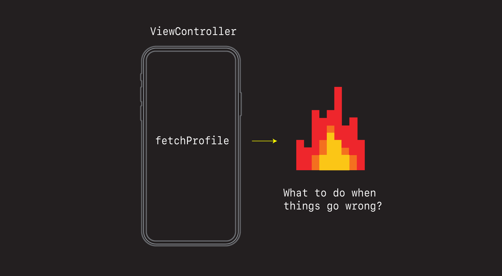
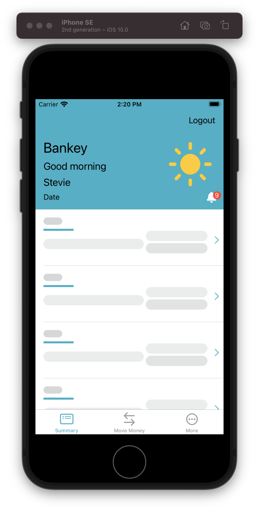
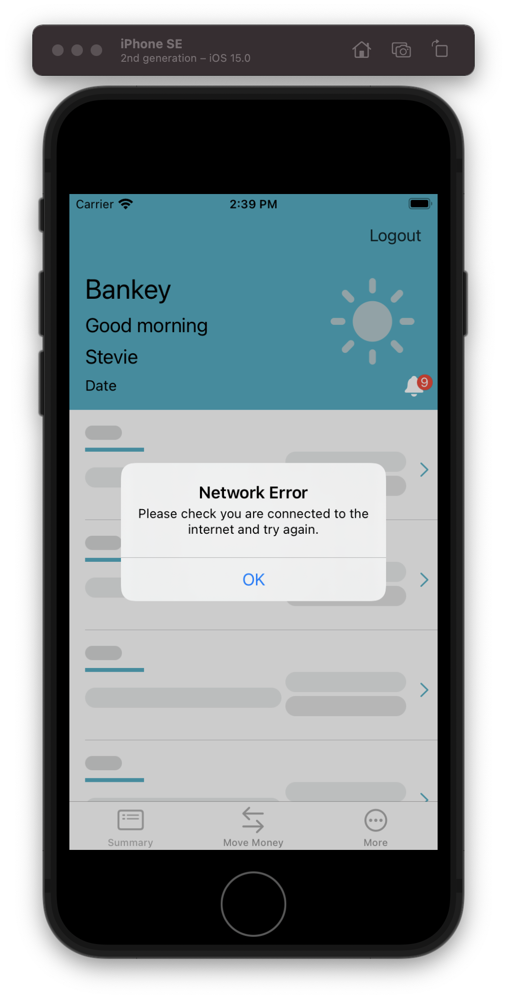
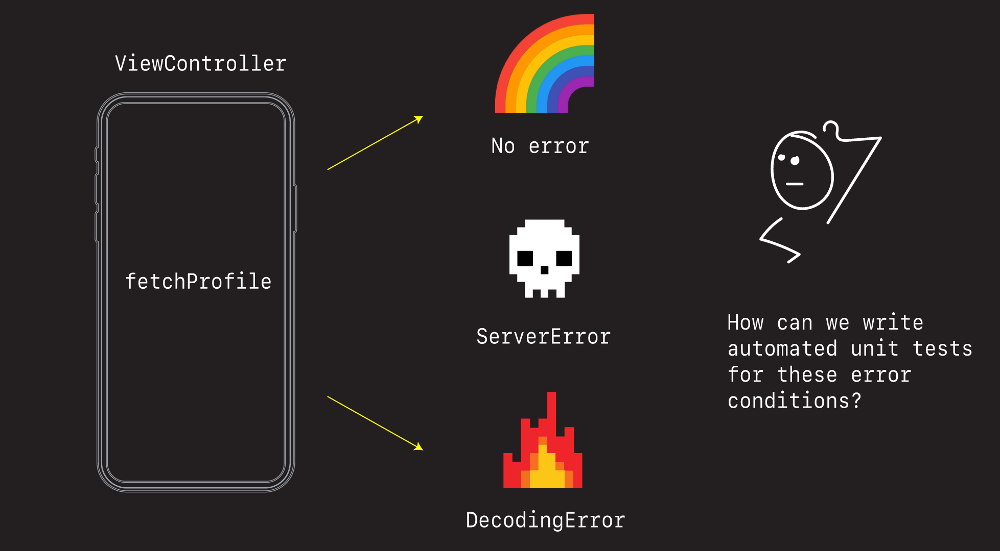
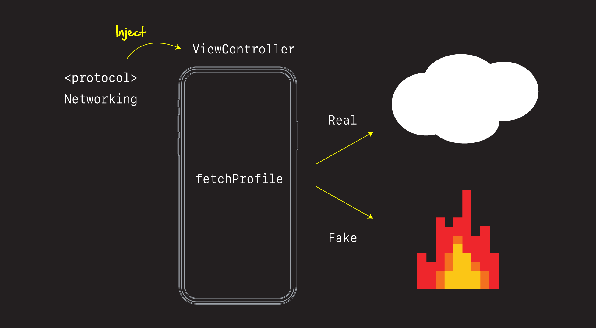
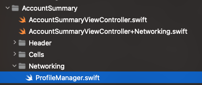
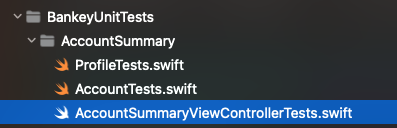

# Error Handling



It's easy to stick to happy path scenarios when building apps. But just as important is adding affordances for when things go wrong.

Let's look at a couple of ways we can anticipate things going wrong and then adding affordance to handle them.

## Handling failed network calls

### Failed profile fetch

First, if we haven't already, let's comment back in our `fetchData` call.

**AccountSummaryViewController**

```swift
// MARK: - Setup
extension AccountSummaryViewController {
    private func setup() {
        setupNavigationBar()
        ...
        fetchData() // 
    }
```

Then let's force our `fetchProfile` network call to fail by commenting out every line of code except this one here.

**AccountSummaryViewController+Networking**

```swift
completion(.failure(.decodingError))
```

This is an easy way to test and force and error in your app. Just hard code it and make it happen.

When we run the app now our screen just sits there stuck loading skeletons.



Let's pop up an alert and give them at left some feedback that we know something is going wrong.

**AccountSummaryViewController** 

```swift

private func configureTableCells(with accounts: [Account]) {
}

private func showErrorAlert() {
    let alert = UIAlertController(title: "Network Error",
                                  message: "Please check your network connectivity and try again.",
                                  preferredStyle: .alert)
    
    alert.addAction(UIAlertAction(title: "OK", style: .default, handler: nil))
    
    present(alert, animated: true, completion: nil)
}
```

And let's call it from where our fetch profile fails.

```swift
fetchProfile(forUserId: userId) { result in
    switch result {
    case .success(let profile):
        self.profile = profile
    case .failure(let error):
        self.showErrorAlert() //
    }
    group.leave()
}
```

If we run the app now we see an error alert pop-up.



### Challenge

OK - that's not bad. But what if we want to display a different error message based on the type of error that occurred?

Right now we can have one of two errors:

```swift
enum NetworkError: Error {
    case serverError
    case decodingError
}
```

Why don't you see if you can detect what kind of error gets by adding a `switch` statement here:

```swift
fetchProfile(forUserId: userId) { result in
    switch result {
    case .success(let profile):
        self.profile = profile
    case .failure(let error):
        // 🕹 Game on switch here...
        self.showErrorAlert() //
    }
    group.leave()
}
```

And then based on the error return, refactor the `showErrorAlert` func to take a `title` and `message` String and display one of the following messages:

case serverError:

 - `title` = `Server Error`
 - `message` = `Ensure you are connected to the internet. Please try again.`

case decodingError:

 - `title` = `Decoding Error`
 - `message` = `We could not process your request. Please try again.`


Give that a go. Comeback and we'll do it together. 

### Solution

Alright, let's refactor the alert funct first to take a title and a message.

```swift
private func showErrorAlert(title: String, message: String) {
    let alert = UIAlertController(title: title,
                                  message: message,
                                  preferredStyle: .alert)
    
    alert.addAction(UIAlertAction(title: "OK", style: .default, handler: nil))
    
    present(alert, animated: true, completion: nil)
}
```

Then let's add the error switch and let it determine what the `title` and `message` should be before passing it show alert.

```swift
case .failure(let error):
    let title: String
    let message: String
    switch error {
    case .serverError:
        title = "Server Error"
        message = "Ensure you are connected to the internet. Please try again."
    case .decodingError:
        title = "Decoding Error"
        message = "We could not process your request. Please try again."
    }
    self.showErrorAlert(title: title, message: message)
}
```

OK this works.

- Demo network error.
- Demo server error.

Discussion

- talk about code readability and how to refactor code so the abstractions are all at the same level

Let's extract a method to make it read like this.

```swift
fetchProfile(forUserId: userId) { result in
    switch result {
    case .success(let profile):
        self.profile = profile
    case .failure(let error):
        self.displayError(error)
    }
    group.leave()
}
```

And

```swift
private func displayError(_ error: NetworkError) {
    let title: String
    let message: String
    switch error {
    case .serverError:
        title = "Server Error"
        message = "We could not process your request. Please try again."
    case .decodingError:
        title = "Network Error"
        message = "Ensure you are connected to the internet. Please try again."
    }
    self.showErrorAlert(title: title, message: message)
}
```

Now everything reads more nicely and we don't get lost in the details of implementation.

Let's do the same for `fetchAccount`.

```swift
fetchAccounts(forUserId: userId) { result in
    switch result {
    case .success(let accounts):
        self.accounts = accounts
    case .failure(let error):
        self.displayError(error) // 
    }
    group.leave()
}
```

And let's comment back in our `fetchProfile` network code.

```swift
extension AccountSummaryViewController {
    func fetchProfile(forUserId userId: String, completion: @escaping (Result<Profile,NetworkError>) -> Void) {
        let url = URL(string: "https://fierce-retreat-36855.herokuapp.com/bankey/profile/\(userId)")!

        URLSession.shared.dataTask(with: url) { data, response, error in
            DispatchQueue.main.async {
                guard let data = data, error == nil else {
                    completion(.failure(.serverError))
                    return
                }

                do {
                    let profile = try JSONDecoder().decode(Profile.self, from: data)
                    completion(.success(profile))
                } catch {
                    completion(.failure(.decodingError))
                }
            }
        }.resume()
    }
}
```

Good stuff. Network error cases handled.

### Save your work

```
> git add .
> git commit -m "feat: Handle network errors"
```

## Unit testing network failures

As good as manually testing network errors are, what's even better is if we can automate them. 



The challenge is how do we fake the network? The network is a real thing.

- We can't control what it does
- We can't make it fail in ways that we want

On can we?

In this section we are going to look at a super powerful unit testing technique called *dependency injection* which is perfect for unit testing situations like this. And in this section you are going to learn how it works, and why it's so powerful for getting to those hard to reach places in our code.

### What is Dependency Injection



- What is it?
- How does it work?
- Why is is so handy for unit testing?

### Define the protocol

The protocol is the thing we want to inject into our ViewController. Create a new section called `Networking` and create a new file in there called `ProfileManager`.



**ProfileManager**

```swift
protocol ProfileManageable: AnyObject {
    func fetchProfile(forUserId userId: String, completion: @escaping (Result<Profile,NetworkError>) -> Void)
}
```

Discussion:

- Why `AnyObject`

### Merge the protocol with the real implementation

Now we already have the real version of this protocol going in our app. In order to unit test it however, we need to merge our protocol with the real thing.

Currently this code is embedded in our `AccountSummaryViewController+Networking` extention. Let's extract it and all related code into it's this newly created file, and make it implement our protocol.

**ProfileManager**

```swift
protocol ProfileManageable: AnyObject {
    func fetchProfile(forUserId userId: String, completion: @escaping (Result<Profile,NetworkError>) -> Void)
}

enum NetworkError: Error {
    case serverError
    case decodingError
}

struct Profile: Codable {
    let id: String
    let firstName: String
    let lastName: String
    
    enum CodingKeys: String, CodingKey {
        case id
        case firstName = "first_name"
        case lastName = "last_name"
    }
}

class ProfileManager: ProfileManageable {
    func fetchProfile(forUserId userId: String, completion: @escaping (Result<Profile,NetworkError>) -> Void) {
        let url = URL(string: "https://fierce-retreat-36855.herokuapp.com/bankey/profile/\(userId)")!

        URLSession.shared.dataTask(with: url) { data, response, error in
            DispatchQueue.main.async {
                guard let data = data, error == nil else {
                    completion(.failure(.serverError))
                    return
                }

                do {
                    let profile = try JSONDecoder().decode(Profile.self, from: data)
                    completion(.success(profile))
                } catch {
                    completion(.failure(.decodingError))
                }
            }
        }.resume()
    }
}
```

Discussion:

- Note how we are implementing the protocol
- Note how this is a `class`.

Now we just need to update the `AccountSummaryViewController` to use it.

**AccountSummaryViewController**

```swift
// Components
...
let refreshControl = UIRefreshControl()
    
// Networking
var profileManager: ProfileManageable = ProfileManager()

// MARK: - Networking
extension AccountSummaryViewController {
    private func fetchData() {
		...        
        group.enter()
        profileManager.fetchProfile(forUserId: userId) { //

```

Run the app. Everything should still work.

But this is magic 🌈. Now that we have this protocol defined, we can *inject* into our view controller whatever we want.

Let's now head over to the unit testing section of our app, and see what tests we can write there.

## Unit testing view controllers

Unit testing view controllers can be tricky.

- View hierarchies between tests and production don't always match
- Getting access to view and view controllers in tests can be tough
- And then you've got view controller life cycle stuff to worry about. Gotta know when `viewDidLoad` is called an how that affects your tests.

Fortunately, we don't have to test everything about the view controller. Only the bits that change or the things we care about. 

Let's look at a couple of techniques for making our view controllers more testable, and then automating those things we can about in our tests.

### Creating the unit test

First let's create a placeholder for all our account summary unit tests.



And then into there copy the following code.

**AccountSummaryViewControllerTests**

```swift
import Foundation
import XCTest

@testable import Bankey

class AccountSummaryViewControllerTests: XCTestCase {
    var vc: AccountSummaryViewController!
    
    override func setUp() {
        super.setUp()
        vc = AccountSummaryViewController()
        // vc.loadViewIfNeeded()
    }
    
    func testSomething() throws {
        
    }
}
```

Discussion

- `vc.loadViewIfNeeded()`

We are just going to leave this here for now, but will return to it when we find something we'd like to test.

But first let's talk a little more about unit testing.

### Looking for effects

Unit testing is about looking for effects. You do something - you expect something to change.

For us, we want to test that when certain error codes get returned, our alert gets populated with certain messages.

It all really comes down how do we unit test this code here. 

**AccountSummaryViewController**

```swift
// MARK: - Networking
extension AccountSummaryViewController {
    private func displayError(_ error: NetworkError) {
        let title: String
        let message: String
        switch error {
        case .serverError:
            title = "Server Error"
            message = "We could not process your request. Please try again."
        case .decodingError:
            title = "Network Error"
            message = "Ensure you are connected to the internet. Please try again."
        }
        self.showErrorAlert(title: title, message: message)
    }
}
```

How can we test that? The short answer is in it's current form unit testing this is not easy. So let's talk about the power of extraction.

     
### The power of extraction


One of the most powerful things you can do while unit testing is extract logic. By extracting things out of your view controllers, and breaking them down into smaller bits, you suddenly gain the ability to take things that look big and daunting, and break them down into smaller more manageable pieces.

Take this display function here. It's function is really doing two things.

```swift
private func displayError(_ error: NetworkError) {
    let title: String
    let message: String
    switch error {
    case .serverError:
        title = "Server Error"
        message = "We could not process your request. Please try again."
    case .decodingError:
        title = "Network Error"
        message = "Ensure you are connected to the internet. Please try again."
    }
    self.showErrorAlert(title: title, message: message)
}
```

1. It's determining what the `title` and `message` for the alert.
2. It's showing the alert and presenting it.

We could make this easier to test by extracting the message setting part into it's own function like this.

```swift
private func displayError(_ error: NetworkError) {
    let titleAndMessage = titleAndMessage(for: error)
    self.showErrorAlert(title: titleAndMessage.0, message: titleAndMessage.1)
}

private func titleAndMessage(for error: NetworkError) -> (String, String) {
    let title: String
    let message: String
    switch error {
    case .serverError:
        title = "Server Error"
        message = "We could not process your request. Please try again."
    case .decodingError:
        title = "Network Error"
        message = "Ensure you are connected to the internet. Please try again."
    }
    return (title, message)
}
```

And then to make it public we could either remove the `private` modifier and expose it directly to our unit tests. Or we could add an extension like this that would keep the function private but enable unit test access via an extension.

```swift
// MARK: Unit testing
extension AccountSummaryViewController {
    func titleAndMessageForTesting(for error: NetworkError) -> (String, String) {
            return titleAndMessage(for: error)
    }
}
```

Talk to your team. See what they like. Some Object-Orient purists don't like trading off encapsulation for testing by making functions public for testing. Others are OK with it. I don't mind the trade-off. Both ways work and have their advantages. We'll use the extension for now to keep the OO folks happy.

With that we can now test our alert message setting like this.

**AccountSummaryViewControllerTests**

```swift
func testTitleAndMessageForServerError() throws {
    let titleAndMessage = vc.titleAndMessageForTesting(for: .serverError)
    XCTAssertEqual("Server Error", titleAndMessage.0)
    XCTAssertEqual("We could not process your request. Please try again.", titleAndMessage.1)
}
```
 
Run this test, and the test will pass 🎉.

### Challenge 🕹

See if you can write the corresponding test for `decodingError`.

- Copy the previous test we just wrote.
- Adjust the expectations in the assert.
- And cover the other test case.

### Solution 🚀

**AccountSummaryViewControllerTests**

```swift
func testTitleAndMessageForNetworkError() throws {
    let titleAndMessage = vc.titleAndMessageForTesting(for: .decodingError)
    XCTAssertEqual("Network Error", titleAndMessage.0)
    XCTAssertEqual("Ensure you are connected to the internet. Please try again.", titleAndMessage.1)
}
```

### A little more refactoring

Before we tackle unit testing the alert, let's do a little more refactoring to make our code even more testable.

One thing I'd like to do is call `fetchProfile` without calling `fetchAccount`. Right now it's all lumped together in `fetchData`.

Let's extract a few functions from `fetchData` for testing.

**AccountSummaryViewController**

```swift
// MARK: - Networking
extension AccountSummaryViewController {
    private func fetchData() {
        let group = DispatchGroup()
        
        // Testing - random number selection
        let userId = String(Int.random(in: 1..<4))
        
        fetchProfile(group: group, userId: userId)
        fetchAccounts(group: group, userId: userId)
        
        group.notify(queue: .main) {
            self.reloadView()
        }
    }
    
    private func fetchProfile(group: DispatchGroup, userId: String) {
    group.enter()
    profileManager.fetchProfile(forUserId: userId) { result in
        switch result {
        case .success(let profile):
            self.profile = profile
        case .failure(let error):
            self.displayError(error)
        }
        group.leave()
    }
}
    
private func fetchAccounts(group: DispatchGroup, userId: String) {
    group.enter()
    fetchAccounts(forUserId: userId) { result in
        switch result {
        case .success(let accounts):
            self.accounts = accounts
        case .failure(let error):
            self.displayError(error)
        }
        group.leave()
    }
}
    
private func reloadView() {
    self.tableView.refreshControl?.endRefreshing()
    
    guard let profile = self.profile else { return }
    
    self.isLoaded = true
    self.configureTableHeaderView(with: profile)
    self.configureTableCells(with: self.accounts)
    self.tableView.reloadData()
}
```

For practice, let's also keep these methods private and add an extension method to access them from the outside. 

```swift
// MARK: Unit testing
extension AccountSummaryViewController {
    func titleAndMessageForTesting(for error: NetworkError) -> (String, String) {
        return titleAndMessage(for: error)
    }
    
    func forceFetchProfile() {
        fetchProfile(group: DispatchGroup(), userId: "1")
    }
}
```

OK. Now let's tackle the alert.

## Testing the alert

Now, we've tested that we can return the correct text given certain error message, and for many that would be enough.

But what if we really wanted to make sure that the error messages actually made it into the alert controllers we pop-up. How could test the alert?

To test the alert we'll need to do three things.

1. Create an instance variable of the alert in the view controller for testing.
3. Dependency inject a fake `ProfileManager` into our view controller.
4. Write the test.

## Creating instance variables of the things you want to test

We can't test the state of the alert view controller if we can't get our hands on it. So to assert that it contains the right title and message we'll need to store a reference in it in our view controller.

**AccountSummaryViewController**

```swift
// Networking
var profileManager: ProfileManageable = ProfileManager()
    
// Error alert
lazy var errorAlert: UIAlertController = {
    let alert =  UIAlertController(title: "", message: "", preferredStyle: .alert)
    alert.addAction(UIAlertAction(title: "OK", style: .default, handler: nil))
    return alert
}()
```

And then when the error occurs set it like this.

```swift
private func showErrorAlert(title: String, message: String) {
//        let alert = UIAlertController(title: title,
//                                      message: message,
//                                      preferredStyle: .alert)
//
//        alert.addAction(UIAlertAction(title: "OK", style: .default, handler: nil))
    
    errorAlert.title = title
    errorAlert.message = message
    
    present(errorAlert, animated: true, completion: nil)
}
```

See what we did here? Instead of creating a brand new alert controller everytime the error occurs, we create one instance for the entire view controller, which then enables us to write a unit test for it liks this.

## Dependency inject the mock

To fake our the real `ProfileManager` with a fake one, we need to inject our `AccountSummaryViewController` with a mock.

Copy the following into our test.

**AccountSummaryViewControllerTests**

```swift
class ProfileNetworkingTests: XCTestCase {
    var vc: AccountSummaryViewController!
    var mockManager: MockProfileManager! // 
    
    class MockProfileManager: ProfileManageable {
        var profile: Profile?
        var error: NetworkError?
        
        func fetchProfile(forUserId userId: String, completion: @escaping (Result<Profile, NetworkError>) -> Void) {
            if error != nil {
                completion(.failure(error!))
                return
            }
            profile = Profile(id: "1", firstName: "FirstName", lastName: "LastName")
            completion(.success(profile!))
        }
    }
    
    override func setUp() {
        super.setUp()
        vc = AccountSummaryViewController()
        // vc.loadViewIfNeeded()
        
        mockManager = MockProfileManager()
        vc.profileManager = mockManager
    }
```

Discussion:

- Explain what's going on here
- Point out the `mockManager` type

Now with our mock configured we can test our alert like this.

**AccountSummaryViewControllerTests**

```swift
func testAlertForServerError() throws {
    mockManager.error = NetworkError.serverError
    vc.forceFetchProfile()
    
    XCTAssertEqual("Server Error", vc.errorAlert.title)
    XCTAssertEqual("We could not process your request. Please try again.", vc.errorAlert.message)
}
```

### Challenge 🕹

See if you can write the equivalent alert test for `.decodingError`.

- Copy the previous test
- Update it to pass in the `. decodingError`
- Decide what level of coupling to add to your test

### Solution 🚀

```swift
func testAlertForDecodingError() throws {
    mockManager.error = NetworkError.decodingError
    vc.forceFetchProfile()
    
    XCTAssertEqual("Network Error", vc.errorAlert.title)
    XCTAssertEqual("Ensure you are connected to the internet. Please try again.", vc.errorAlert.message)
}
```

### Save your work

```
> git add .
> git commit -m "test: Add alert controller unit tests"
```

Discussion:

- What is `loadViewIfNeeded()` and what it does in unit tests
- Unit testing is a real art (being doing for years, many languages and still learning).

Two maximum that help:

1. Break thing down into smaller pieces.
2. Dependency inject the things you want to change.

### What we've learned

- 💥  How to manually test for network errors
- ⛑  How to fix them with pop-ups and alerts
- 🚀  How to unit test network code
- 🌟 How to build a more robust application

### Links that help

- [UIAlertController](https://developer.apple.com/documentation/uikit/uialertcontroller)
- [UIAlertControllerExample](https://github.com/jrasmusson/ios-starter-kit/blob/master/basics/UIAlertController/UIAlertController.md)
