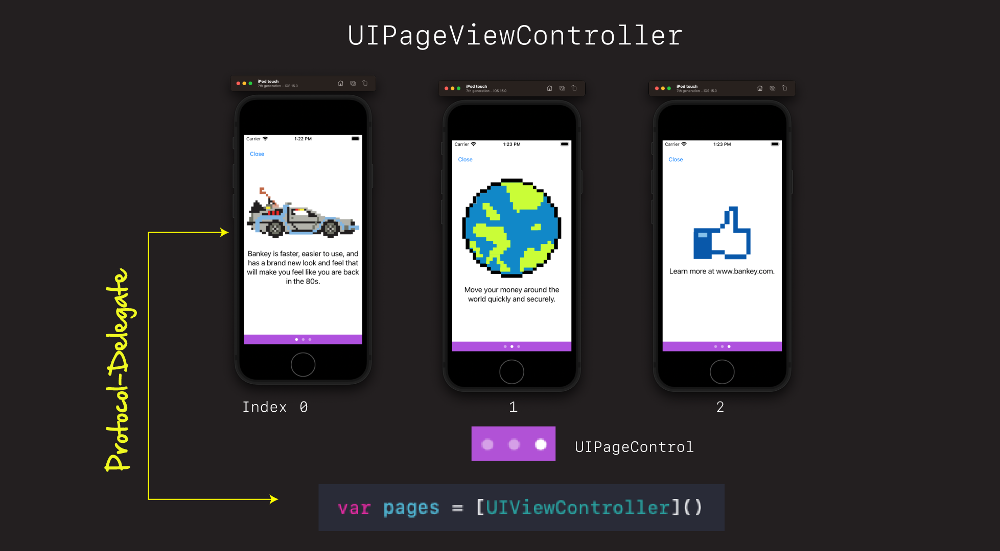
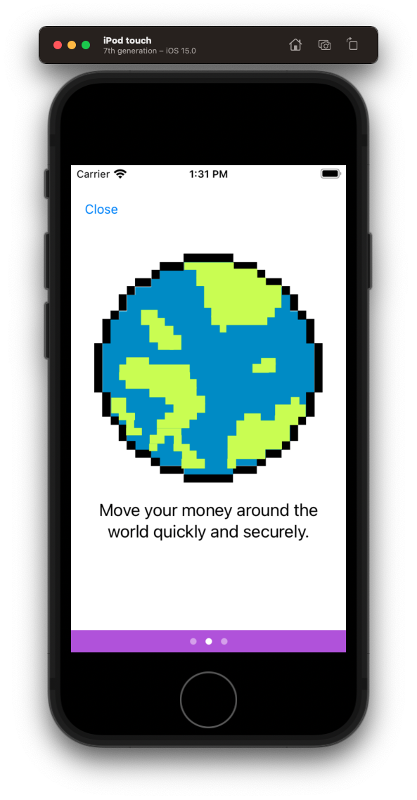

# Onboarding

## Setup

### Agile storyboard

- Introduce [Agile story board](https://trello.com/b/vU5ETuV5/ios-professional)
- Explain mechanics of how it works with stories
- Mention Jira
- Go over story
- Move over story

## Create Container View Controller

- Explain how `UIPageViewController` works
 - Illustrator or iPad 

 
 
- Create a new group in project `Onboarding`
- Move Files to bottom
- Rename LoginView Login
- Create a new `OnboardingContainerViewController`
- Copy and paste in code from professional repos
 - Explain that you don't want them typing this stuff
 - When working professionally explain how you go to a repos of examples you have built up and you copy and paste from there. 
 - Encourge them to either star yourself, or even better create their own
 - Show them your course repos - explain the show notes - copy from there 

Discussion

- adding child view controllers
- protocol-delegate
- convenience routines `getPrevious` and `getNext`

Demo and switch simulator to dark mode (Command+Shift+A).

**OnboardingContainerViewController**

```swift
//
//  OnboardingContainerViewController.swift
//  Bankey
//
//  Created by jrasmusson on 2021-09-28.
//

import UIKit

class OnboardingContainerViewController: UIViewController {

    let pageViewController: UIPageViewController
    var pages = [UIViewController]()
    var currentVC: UIViewController {
        didSet {
        }
    }
    
    override init(nibName nibNameOrNil: String?, bundle nibBundleOrNil: Bundle?) {
        self.pageViewController = UIPageViewController(transitionStyle: .scroll, navigationOrientation: .horizontal, options: nil)
        
        let page1 = ViewController1()
        let page2 = ViewController2()
        let page3 = ViewController3()
        
        pages.append(page1)
        pages.append(page2)
        pages.append(page3)
        
        currentVC = pages.first!
        
        super.init(nibName: nibNameOrNil, bundle: nibBundleOrNil)
    }
    
    required init?(coder: NSCoder) {
        fatalError("init(coder:) has not been implemented")
    }
    
    override func viewDidLoad() {
        super.viewDidLoad()
        
        view.backgroundColor = .systemPurple
        
        addChild(pageViewController)
        view.addSubview(pageViewController.view)
        pageViewController.didMove(toParent: self)
        
        pageViewController.dataSource = self
        pageViewController.view.translatesAutoresizingMaskIntoConstraints = false
        
        NSLayoutConstraint.activate([
            view.topAnchor.constraint(equalTo: pageViewController.view.topAnchor),
            view.leadingAnchor.constraint(equalTo: pageViewController.view.leadingAnchor),
            view.trailingAnchor.constraint(equalTo: pageViewController.view.trailingAnchor),
            view.bottomAnchor.constraint(equalTo: pageViewController.view.bottomAnchor),
        ])
        
        pageViewController.setViewControllers([pages.first!], direction: .forward, animated: false, completion: nil)
        currentVC = pages.first!
    }
}

// MARK: - UIPageViewControllerDataSource
extension OnboardingContainerViewController: UIPageViewControllerDataSource {

    func pageViewController(_ pageViewController: UIPageViewController, viewControllerBefore viewController: UIViewController) -> UIViewController? {
        return getPreviousViewController(from: viewController)
    }

    func pageViewController(_ pageViewController: UIPageViewController, viewControllerAfter viewController: UIViewController) -> UIViewController? {
        return getNextViewController(from: viewController)
    }

    private func getPreviousViewController(from viewController: UIViewController) -> UIViewController? {
        guard let index = pages.firstIndex(of: viewController), index - 1 >= 0 else { return nil }
        currentVC = pages[index - 1]
        return pages[index - 1]
    }

    private func getNextViewController(from viewController: UIViewController) -> UIViewController? {
        guard let index = pages.firstIndex(of: viewController), index + 1 < pages.count else { return nil }
        currentVC = pages[index + 1]
        return pages[index + 1]
    }

    func presentationCount(for pageViewController: UIPageViewController) -> Int {
        return pages.count
    }

    func presentationIndex(for pageViewController: UIPageViewController) -> Int {
        return pages.firstIndex(of: self.currentVC) ?? 0
    }
}

// MARK: - ViewControllers
class ViewController1: UIViewController {
    override func viewDidLoad() {
        super.viewDidLoad()
        view.backgroundColor = .systemRed
    }
}

class ViewController2: UIViewController {
    override func viewDidLoad() {
        super.viewDidLoad()
        view.backgroundColor = .systemGreen
    }
}

class ViewController3: UIViewController {
    override func viewDidLoad() {
        super.viewDidLoad()
        view.backgroundColor = .systemBlue
    }
}
```

Update `AppDelegate` to call.

**AppDelegate**

```swift
window?.rootViewController = OnboardingViewController()
```

- Git add/commit your work `Add onboarding view controller`

## Not all art is created equal

### Discusson iPad demo

- Explain pdf vs retina display
  - pdf scale better
  - take less memory and space
  - don't alias like an image 
  - represented as bezier curves (i.e. `y = (1 - t)^3`)
  - reason why is vectors and their pdf representation can compactly be represented as a series of equations and numbers

- Why Apple has retina
 - need retina for photographs
 - photographs cant be easily represented as equations 

- So unless the image you are displaying is a photograph always ask for pdfs - else take scaled retina images

### Add art to project

- Drag art assets into catalog
- Show how to use pdf
 - Preserve Vector Data
 - Scales > Single Scale
 

## Your first onboarding screen

- Explain your thinking behind this layout
 - Want centered in screen
 - `StackView` is good for general spacing
 - Want to avoid hard pinning to top
 - Control and buttons can be directly pinned
 - But image and label we will put in a stack

- Create a new class called `OnboardingViewController`.

 **OnboardingViewController**
 
```swift
//
//  OnboardingViewController.swift
//  Bankey
//
//  Created by jrasmusson on 2021-09-29.
//

import UIKit

class OnboardingViewController: UIViewController {
    
    let stackView = UIStackView()
    let imageView = UIImageView()
    let label = UILabel()
    
    override func viewDidLoad() {
        super.viewDidLoad()
        style()
        layout()
    }
}

extension OnboardingViewController {
    func style() {
        view.backgroundColor = .systemBackground // ! dont forget
    
        stackView.translatesAutoresizingMaskIntoConstraints = false
        stackView.axis = .vertical
        stackView.spacing = 20
        
        // Image
        imageView.translatesAutoresizingMaskIntoConstraints = false
        imageView.contentMode = .scaleAspectFit
        imageView.image = UIImage(named: "delorean")
        
        // Label
        label.translatesAutoresizingMaskIntoConstraints = false
        label.textAlignment = .center
        label.font = UIFont.preferredFont(forTextStyle: .title3)
        label.adjustsFontForContentSizeCategory = true
        label.numberOfLines = 0
        label.text = "Bankey is faster, easier to use, and has a brand new look and feel that will make you feel like you are back in 1989."
    }
    
    func layout() {
        stackView.addArrangedSubview(imageView)
        stackView.addArrangedSubview(label)
        
        view.addSubview(stackView)
        
        NSLayoutConstraint.activate([
            stackView.centerXAnchor.constraint(equalTo: view.centerXAnchor),
            stackView.centerYAnchor.constraint(equalTo: view.centerYAnchor),
            stackView.leadingAnchor.constraint(equalToSystemSpacingAfter: view.leadingAnchor, multiplier: 1),
            view.trailingAnchor.constraint(equalToSystemSpacingAfter: stackView.trailingAnchor, multiplier: 1)
        ])
    }
}
```

- Adjust `AppDelegate` to display.
- Explain why overriding view controller in app delegate is such a powerful technique


- Save your work - `First onboarding page`.

 ### Boss Challenge - Make it Reusable
 
- This is a good start, it would be nice if we could somehow reuse it for our other story boards
- See if you can add an initizaler like this.

```swift
init(heroImageName: String, titleText: String) {
    self.heroImageName = heroImageName
    self.titleText = titleText
    
    super.init(nibName: nil, bundle: nil)
}
```

And pass in the name of our hero image along with the title text.

This is a tougher challenge. Give it a go. Take note of any questions you might have, and then come back and we will do it together. Good luck!

### What is required init?

OK so let's add our initializer.

```swift
init(heroImageName: String, titleText: String) {
    self.heroImageName = heroImageName
    self.titleText = titleText
    
    super.init(nibName: nil, bundle: nil)
}
```

Let's add some variables for our image and title.

```swift
let heroImageName: String
let titleText: String
```

And let's talk about how these initializers work.

What is this?

```swift
required init?(coder: NSCoder) {
    fatalError("init(coder:) has not been implemented")
}
```

- This is here because of story boards
- View controller has an initializer that can load a story boards via xml and because it is required, we need to implement it even though we don't want it.

```swift
init(coder aDecoder: NSCoder) {
    // Deserialize your object here
}
```

- Ask them if they know what NS means? [Interface Builder](https://arstechnica.com/gadgets/2012/12/the-legacy-of-next-lives-on-in-os-x/2/).

```swift
@available(iOS 2.0, *)
open class UIViewController : UIResponder, NSCoding, UIAppearanceContainer, UITraitEnvironment, UIContentContainer, UIFocusEnvironment {
    public init(nibName nibNameOrNil: String?, bundle nibBundleOrNil: Bundle?)
    public init?(coder: NSCoder)
```

Use the parameters

- `imageView.image = UIImage(named: heroImageName)`
- `label.text = titleText`

Use the new view controller (copy from notes).

**OnboardingContainerViewController**

```swift
let page1 = OnboardingViewController(heroImageName: "delorean", titleText: "Bankey is faster, easier to use, and has a brand new look and feel that will make you feel like you are back in the 80s.")
let page2 = OnboardingViewController(heroImageName: "world", titleText: "Move your money around the world quickly and securely.")
let page3 = OnboardingViewController(heroImageName: "thumbs", titleText: "Learn more at www.bankey.com.")
```

Delete the view controllers at the bottom.

- Update AppDelegate.
- Run/Demo still looking good in dark mode

#### Saving your work with a longer commit message

Sometimes we want to say more about our commits. In those cases you can do the following:

```
> git add .
> git commit
```

This will open up vi, or whatever text edit you have automatically setup to edit text files, and put you into a mode where you can freely type free form git message.

Start with a title and then add a message. For the title use imperative language - not painting the fence, or painted the fence. Paint the fense.

Completes the sentence `This commit will...`.

```
refactor: create generic onboarding view controller

This commit adds a generic onboarding view controller that can be reused
across multiple onboarding screens. 
```

Once complete esc :wq.

`> git log`

Handy for when you want to add explain yourself more or add further detail.


## Adding the close button

We want to add a close button in the upper-left-hand corner on all three screens in case someone wants to exit onboarding earlier.



First lets do a little refactoring and break these methods up a bit in `viewDidLoad`:

- setup()
- style()
- layout()

**OnboardingContainerViewController**

Close and Done are just like the others. Close appears always. Done only when we are on the last page.

First let's do close.

```swift
let closeButton = UIButton(type: .system)

// Close
closeButton.translatesAutoresizingMaskIntoConstraints = false
closeButton.setTitle("Close", for: [])
closeButton.addTarget(self, action: #selector(closeTapped), for: .primaryActionTriggered)

view.addSubview(closeButton)

// Close
NSLayoutConstraint.activate([
    closeButton.leadingAnchor.constraint(equalToSystemSpacingAfter: view.leadingAnchor, multiplier: 2),
    closeButton.topAnchor.constraint(equalToSystemSpacingBelow: view.safeAreaLayoutGuide.topAnchor, multiplier: 2)
])

@objc func closeTapped(_ sender: UIButton) {
    // TODO
}
```
Don't worry about Close and Done not doing anything. We will handle that in the next section.

Go ahead and commit and add and save your work `Add onboarding buttons`.

Let's save our work:

```
> git add .
> git commit -m "Add close button"
```

## Protocol Delegate

Before we can go any further, we need a way of signally back to our `AppDelegate` when certain events in our app occur. For example it would be nice to know when the user has clicked `Signin` so we can present onboarding. Or when the click `Close` on onboarding, that's a signal for us to continue and move them onto the next stage in our app.

There are lots of ways we could solve this problem (`NotificationCenter`, `ResponderChain`, `Closures`). But the simplest, and most elegant and in my opinion `UIKit` consist way is to communicate back via the `protocol-delegate` pattern.

Let's quickly review this pattern. See how it works. And then apply it to our login screen and onboarding process. See you in the next section!

## New section called Protocol-Delegate

- Explain how protocol delegate works

- Show how we want to use it in our app

- Add protocol delegate to login

- Use it in app delegate to display onboarding

- Challenge - get students to add to onboarding for close button

- Use it to display a temporary DummyView

- Onboard only once


