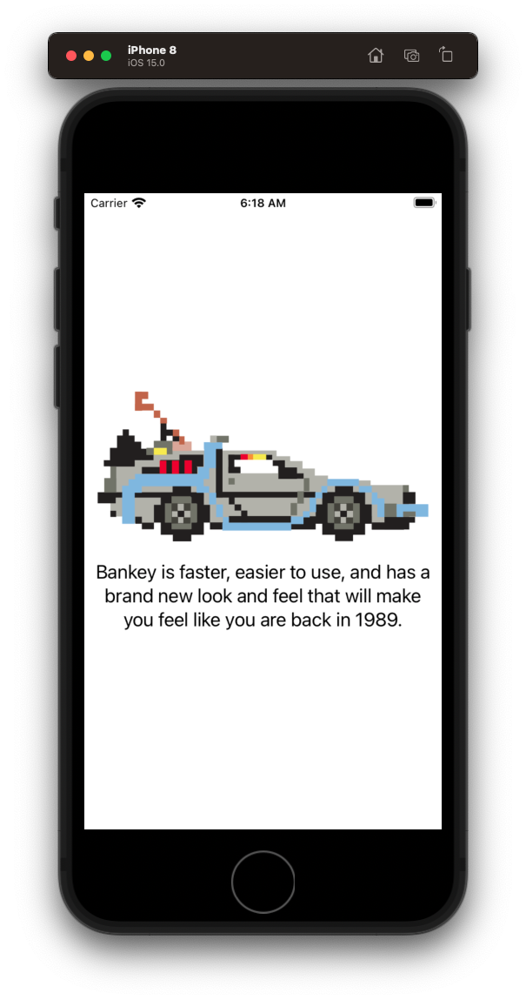
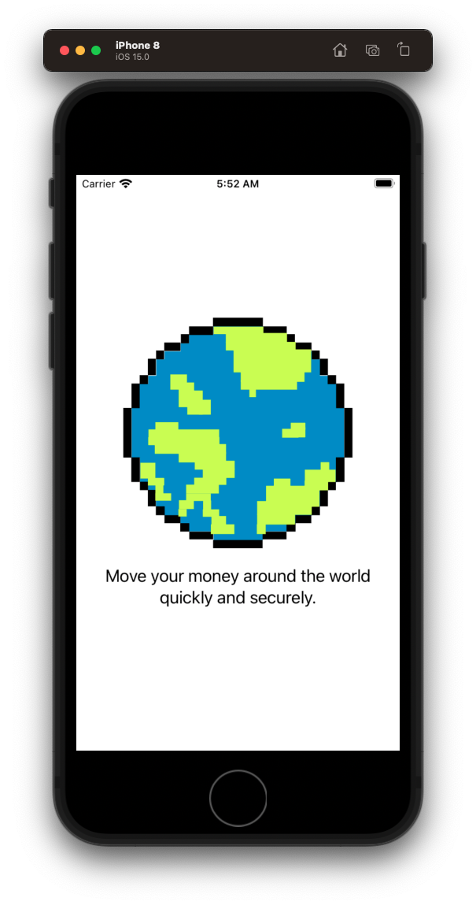

# Onboarding

## Setup

### Agile storyboard

- Introduce Agile story board
- Explain mechanics of how it works with stories
- Move over story

### Git branching

- Next, create a git branch
- Demo and explain how git branching works
- Create a git branch for this work

## Create Container View Controller

- Explain how `UIPageViewController` works
 - Illustrator or iPad 
- Create a new group in project `Onboarding`
- Move Files to bottom
- Rename LoginView Login
- Create a new `OnboardingContainerViewController`
- Copy and paste in code incrementally explaining as you go
- Switch to dark mode

**OnboardingContainerViewController**

```swift
//
//  OnboardingViewController.swift
//  Bankey
//
//  Created by jrasmusson on 2021-09-28.
//

import UIKit

class OnboardingContainerViewController: UIPageViewController {

    var pages = [UIViewController]()
    let pageControl = UIPageControl()
    let initialPage = 0
    
    override func viewDidLoad() {
        super.viewDidLoad()
        
        setup()
        style()
        layout()
    }
}

extension OnboardingContainerViewController {
    
    func setup() {
        dataSource = self
        delegate = self
        
        pageControl.addTarget(self, action: #selector(pageControlTapped(_:)), for: .valueChanged)

        // add the individual viewControllers to the pageViewController
        let page1 = ViewController1()
        let page2 = ViewController2()
        let page3 = ViewController3()

        pages.append(page1)
        pages.append(page2)
        pages.append(page3)
        setViewControllers([pages[initialPage]], direction: .forward, animated: true, completion: nil)
    }
    
    func style() {
        pageControl.translatesAutoresizingMaskIntoConstraints = false
        pageControl.currentPageIndicatorTintColor = .black
        pageControl.pageIndicatorTintColor = .systemGray2
        pageControl.numberOfPages = pages.count
        pageControl.currentPage = initialPage
    }
    
    func layout() {
        view.addSubview(pageControl)
        
        NSLayoutConstraint.activate([
            pageControl.widthAnchor.constraint(equalTo: view.widthAnchor),
            pageControl.heightAnchor.constraint(equalToConstant: 20),
            view.bottomAnchor.constraint(equalToSystemSpacingBelow: pageControl.bottomAnchor, multiplier: 1),
        ])
    }
}

// MARK: - Actions

extension OnboardingContainerViewController {
    
    // How we change page when pageControl tapped.
    // Note - Can only skip ahead on page at a time.
    @objc func pageControlTapped(_ sender: UIPageControl) {
        setViewControllers([pages[sender.currentPage]], direction: .forward, animated: true, completion: nil)
    }
}

// MARK: - DataSources

extension OnboardingContainerViewController: UIPageViewControllerDataSource {
    
    func pageViewController(_ pageViewController: UIPageViewController, viewControllerBefore viewController: UIViewController) -> UIViewController? {
        
        // Get the currentIndex from the view controller currently being displayed
        guard let currentIndex = pages.firstIndex(of: viewController) else { return nil }
        
        if currentIndex == 0 {
            return nil                      // Stay on first page
        } else {
            return pages[currentIndex - 1]  // Go previous
        }
    }
    
    func pageViewController(_ pageViewController: UIPageViewController, viewControllerAfter viewController: UIViewController) -> UIViewController? {
        
        guard let currentIndex = pages.firstIndex(of: viewController) else { return nil }

        if currentIndex < pages.count - 1 {
            return pages[currentIndex + 1]  // Go next
        } else {
            return nil                      // Stay on last page
        }
    }
}

// MARK: - Delegates

extension OnboardingContainerViewController: UIPageViewControllerDelegate {
    
    // How we keep our pageControl in sync with viewControllers
    func pageViewController(_ pageViewController: UIPageViewController, didFinishAnimating finished: Bool, previousViewControllers: [UIViewController], transitionCompleted completed: Bool) {
        
        guard let viewControllers = pageViewController.viewControllers else { return }
        guard let currentIndex = pages.firstIndex(of: viewControllers[0]) else { return }
        
        pageControl.currentPage = currentIndex
    }
}

// MARK: - ViewControllers

class ViewController1: UIViewController {
    override func viewDidLoad() {
        super.viewDidLoad()
        view.backgroundColor = .systemRed
    }
}

class ViewController2: UIViewController {
    override func viewDidLoad() {
        super.viewDidLoad()
        view.backgroundColor = .systemGreen
    }
}

class ViewController3: UIViewController {
    override func viewDidLoad() {
        super.viewDidLoad()
        view.backgroundColor = .systemBlue
    }
}
```

Update `AppDelegate` to call.

**AppDelegate**

```swift
window?.rootViewController = OnboardingViewController(transitionStyle: .scroll, navigationOrientation: .horizontal, options: nil)
```

- Demo explaining how it work (use iPad).
- Git add/commit your work

## Not all art is created equal

- Drag art assets into catalog
- Show how to use pdf
 - Preserve Vector Data
 - Scales > Single Scale
 
### Discusson

- Explain pdf vs retina display
  - pdf scale better
  - take less memory and space
  - don't alias like an image 
  - reason why is vectors and their pdf representation can compactly be represented as a series of equations and numbers

- Why Apple has retina
 - need retina for photographs
 - photographs cant be easily represented as equations 

- So unless the image you are displaying is a photograph always ask for pdfs - else take scaled retina images

## Your first onboarding screen

- Explain your thinking behind this layout
 - Want centered in screen
 - `StackView` is good for general spacing
 - Want to avoid hard pinning to top
 - Control and buttons can be directly pinned
 - But image and label we will put in a stack

 **OnboardingViewController1**
 
```swift
//
//  OnboardingViewController1.swift
//  Bankey
//
//  Created by jrasmusson on 2021-09-29.
//

import UIKit

class OnboardingViewController1: UIViewController {
    
    let stackView = UIStackView()
    let imageView = UIImageView()
    let label = UILabel()
    
    override func viewDidLoad() {
        super.viewDidLoad()
        style()
        layout()
    }
}

extension OnboardingViewController1 {
    func style() {
        stackView.translatesAutoresizingMaskIntoConstraints = false
        stackView.axis = .vertical
        stackView.spacing = 20
        
        // Image
        imageView.translatesAutoresizingMaskIntoConstraints = false
        imageView.contentMode = .scaleAspectFit
        imageView.image = UIImage(named: "delorean")
        
        // Label
        label.translatesAutoresizingMaskIntoConstraints = false
        label.textAlignment = .center
        label.font = UIFont.preferredFont(forTextStyle: .title3)
        label.adjustsFontForContentSizeCategory = true
        label.numberOfLines = 0
        label.text = "Bankey is faster, easier to use, and has a brand new look and feel that will make you feel like you are back in 1989."
    }
    
    func layout() {
        stackView.addArrangedSubview(imageView)
        stackView.addArrangedSubview(label)
        
        view.addSubview(stackView)
        
        NSLayoutConstraint.activate([
            stackView.centerXAnchor.constraint(equalTo: view.centerXAnchor),
            stackView.centerYAnchor.constraint(equalTo: view.centerYAnchor),
            stackView.leadingAnchor.constraint(equalToSystemSpacingAfter: view.leadingAnchor, multiplier: 1),
            view.trailingAnchor.constraint(equalToSystemSpacingAfter: stackView.trailingAnchor, multiplier: 1)
        ])
    }
}
```

- Adjust `AppDelegate` to display.
- Explain why overriding view controller in app delegate is such a powerful technique



- Save your work - `First onboarding page`.

 ### Boss Challenge
 
- Your turn. Create the next screen.
- Create a new view controller called `OnboardingViewController2`.
- Use the `world` pdf as art
- Add the text `Move your money around the world quickly and securely.`
- Update the `AppDelegate` to test it out.
- Good luck!

Solution 
- Copy and paste view controller 1
- Change image, and text.
- Run



- Save your work - `Added second onboarding page`.

## Refactoring - the art of writing less code

- Copy and paste is a perfectly fine way to get started, but we don't want to do it too much because then we have a lot of code to update when something changes
- Let's see if we can refactor our view controllers to put all this onboarding code in one place, and reuse it three times

### Create base view controller

- Create a new swift class `OnboardingViewController`.
- Copy view controller 1 entirely / rename
- Explain how you want to parameterize this view controller
- Meaning pass in the name of the image and text you want displayed, and then have this base view controller just use it

### What is required init?

```swift
init(heroImageName: String, titleText: String) {
    self.heroImageName = heroImageName
    self.titleText = titleText
    
    super.init(nibName: nil, bundle: nil)
}
```

Explain 

```swift
required init?(coder: NSCoder) {
    fatalError("init(coder:) has not been implemented")
}
```

- This is here because `UIViewController` has an initializer defined in its base class to deserialize view controllers in story boars

```swift
init(coder aDecoder: NSCoder) {
    // Deserialize your object here
}
```

- Because it defines it, and it is required, we need to override it here - even though we aren't using it.
- Annoying but something we have to do.
- It has been there since the dawn of time. Something we just need to do.

```swift
@available(iOS 2.0, *)
open class UIViewController : UIResponder, NSCoding, UIAppearanceContainer, UITraitEnvironment, UIContentContainer, UIFocusEnvironment {
    public init(nibName nibNameOrNil: String?, bundle nibBundleOrNil: Bundle?)
    public init?(coder: NSCoder)
```

Use the parameters

`heroImageView.image = UIImage(named: heroImageName)`
`titleLabel.text = titleText`

Use the new view controller

**OnboardingContainerViewController**

```swift
let page1 = OnboardingViewController(heroImageName: "delorean", titleText: "Bankey is faster, easier to use, and has a brand new look and feel that will make you feel like you are back in the 80s.")
let page2 = OnboardingViewController(heroImageName: "world", titleText: "Move your money around the world quickly and securely.")
let page3 = OnboardingViewController(heroImageName: "thumbs", titleText: "Learn more at www.bankey.com.")
```

- Update AppDelegate.
- Run
- Delete onboard 1 and 2 view controllers

#### Saving your work with a longer commit message

Sometimes we want to say more about our commits. In those cases you can do the following:

```
> git add .
> git commit
```

This will open up vi, or whatever text edit you have automatically setup to edit text files, and put you into a mode where you can freely type free form git message.

Start with a title and then add a message

```
refactor: added base onboarding view controller

Realizing there was a lot of code duplication, I created a base
onboarding view controller taking an image name and text as arguments.

This made the other two view controllers redundant and were deleted.
```

Once complete esc :wq.

`> git log`

Handy for when you want to add further detail.


## Adding the buttons

### Buttons

We want:

- `Close` on all x3 screens
- `Next` and `Back` on the middle screen
- `Back` and `Done` on last screen

Open up and lets programmatically add the buttons one at a time. Starting with `Next` and `Back`.

### Next

**OnboardingContainerViewController**


#### Close button


## Onboard only once

## Turn off onboarding via debug screen


### Level Up


