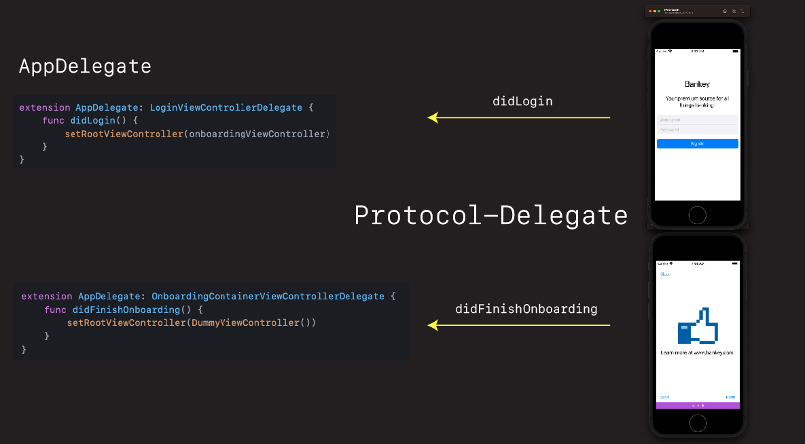

# Protocol-Delegate



- In this section you are going to learn not only learn what protocol-delegate is and how it works
 - you are also going to see how we can leverage its power ourselves when building UIKit applications
- We will start by first reviewing what the protocol-delegate is and how it works, then we'll shift gears and use it in our app for handling signin and onboarding

Explain what protocol-delegate is.

Explain how we are going to use it. 

OK, so now that you've seen how protocol-delegate works, let's head over to the arcade, and see how we can use it to signal to our `AppDelegate` that login and onboarding are done, and then ultimately aid us in our navigation.

## Protocol-Delegate Login

First lets define the protocol and delegate.

**LoginViewController**

```swift
protocol LoginViewControllerDelegate: AnyObject {
//    func didLogin(_ sender: LoginViewController) //  in you need to pass data back
    func didLogin()
}

weak var delegate: LoginViewControllerDelegate?
```

- Discuss alternative naming conventions.

Then let's use it in `AppDelgate` to signal login was complete and successful.

**AppDelegate**

```swift
extension AppDelegate: LoginViewControllerDelegate {
    func didLogin() {
        // Display home screen
        print("foo - Did login")
    }
}
```

- Discuss
 - Extensions common way to in Swift implement `protocol` 
 -  `foo` in print statement.

Need to keep our view controllers around so we can register ourselves as the delegate.

```swift
import UIKit

@main
class AppDelegate: UIResponder, UIApplicationDelegate {
        
    let loginViewController = LoginViewController()
    
    func application(_ application: UIApplication, didFinishLaunchingWithOptions launchOptions: [UIApplication.LaunchOptionsKey: Any]?) -> Bool {
                
        loginViewController.delegate = self
        
        window?.rootViewController = loginViewController
    }
}

extension AppDelegate: LoginViewControllerDelegate {
    func didLogin() {
        // TODO: Display home screen or onboarding
        print("foo - Did login")
    }
}
```

- Discuss why `let` vs `var` on `loginViewController`

- Test it out. 
- Should now see print statement.
- Discuss how to filter print statements.
- Except it doesn't work. Because we forget to call it.

**LoginViewController**

```swift
if username == "" && password == "" {
    signInButton.configuration?.showsActivityIndicator = true
    delegate?.didLogin()
```

Run again. Now should see print statement.


## Protocol-Delegate Onboarding
 
Boss challenge - not you add it to onboarding.

Open up `OnboardingContainerViewController`. 

Go through same steps we did in login:

- Define protocol named:

```swift
didFinishOnboarding()
```

- Assign as `weak var` variable
- Call delegate when onboarding complete - `Done` button pressed or `Close` (where the `TODOs` are located).
- Then switch to `AppDelegate` - assign yourself as delegate in there.
- Implement the protocol
- Set onboarding as the `rootViewController` temporarily for testing.
- Print out statement when onboarding done.

Good luck!

**OnboardingContainerViewController**

```swift
protocol OnboardingContainerViewControllerDelegate: AnyObject {
    func didFinishOnboarding()
}

var pages = [UIViewController]()
weak var delegate: OnboardingContainerViewControllerDelegate?

@objc func closeTapped(_ sender: UIButton) {
    delegate?.didFinishOnboarding()
}
    
@objc func doneTapped(_ sender: UIButton) {
    delegate?.didFinishOnboarding()
}
```

**AppDelegate**

```swift
let onboardingViewController = OnboardingContainerViewController()

onboardingViewController.delegate = self
window?.rootViewController = onboardingViewController

extension AppDelegate: OnboardingContainerViewControllerDelegate {
    func didFinishOnboarding() {
        // TODO: Display home screen
        print("foo - Did onboard")
    }
}
```

OK let's test it out. Click `Next` and `Close`. Yay 🎉!
  
## Onboard only once

Now that we have our protocol-delegate hooked up, let's us it to only onboard once.

Let's comment back in the `loginViewController` in our `AppDelegate`.

```swift
window?.rootViewController = loginViewController
```

Then let's display onboarding when login completes.

```swift
extension AppDelegate: LoginViewControllerDelegate {
    func didLogin() {
        window?.rootViewController = onboardingViewController
    }
}
```

OK now, this works. But it is a bit abrupt. It directly replaces the login with the onboarding vc on the `rootViewController` but there is no nice transition or animation. Let's fix that.

Add this method into the `AppDelegate`.

```swift
func setRootViewController(_ vc: UIViewController, animated: Bool = true) {
    guard animated, let window = self.window else {
        self.window?.rootViewController = vc
        self.window?.makeKeyAndVisible()
        return
    }

    window.rootViewController = vc
    window.makeKeyAndVisible()
    UIView.transition(with: window,
                      duration: 0.3,
                      options: .transitionCrossDissolve,
                      animations: nil,
                      completion: nil)
}
```

And replacing setting the rootViewController directly with this.

```swift
extension AppDelegate: LoginViewControllerDelegate {
    func didLogin() {
        setRootViewController(onboardingViewController)
    }
}
```

- Discuss: Explain what is going on here with animation etc.

Great - so now we can finish logging in, present the onboarding view controller. Where do we go after onboarding?

Well that is what we are going to tackle in the next section when we get into navigation. 

But for now, let's just create a dummary view controller, and a stand in for our home screen, and do the real thing in the next section when we get there.

Create new class `DummyViewController` in `Login` directory. Go ahead and type this code in.

**DummyViewController**

```swift
import Foundation
import UIKit

class ViewController: UIViewController {
    
    let stackView = UIStackView()
    let label = UILabel()
    
    override func viewDidLoad() {
        super.viewDidLoad()
        style()
        layout()
    }
}

extension ViewController {
    func style() {
        stackView.translatesAutoresizingMaskIntoConstraints = false
        stackView.axis = .vertical
        stackView.spacing = 20
        
        label.translatesAutoresizingMaskIntoConstraints = false
        label.text = "Dummy"
        label.font = UIFont.preferredFont(forTextStyle: .title1)
    }
    
    func layout() {
        stackView.addArrangedSubview(label)
        
        view.addSubview(stackView)
        
        NSLayoutConstraint.activate([
            stackView.centerXAnchor.constraint(equalTo: view.centerXAnchor),
            stackView.centerYAnchor.constraint(equalTo: view.centerYAnchor),
        ])
    }
}
```

- Discuss - create a snippet if you haven't already for this. We are going to reuse this going forward. Will save some typing.

Now let's display this dummy view controller when onboarding is done.

**AppDelegate**

```swift
extension AppDelegate: OnboardingContainerViewControllerDelegate {
    func didFinishOnboarding() {
        setRootViewController(DummyViewController())
    }
}
```

Good stuff!

## Overview of what we've learned

- `UIPageViewController`
- Onboarding
- Protocol-Delegate (the most important pattern)
- Controlling app flow from app delegate

Next up we are going to talk navigation. Probably one of the most important, and confusing topics, for those not familiar with UIKit and all the different ways we can move around.

Take a break. Stretch. Grab a coffee. Then comeback and we'll dive into the world of UIKit navigation.


### Links that help


