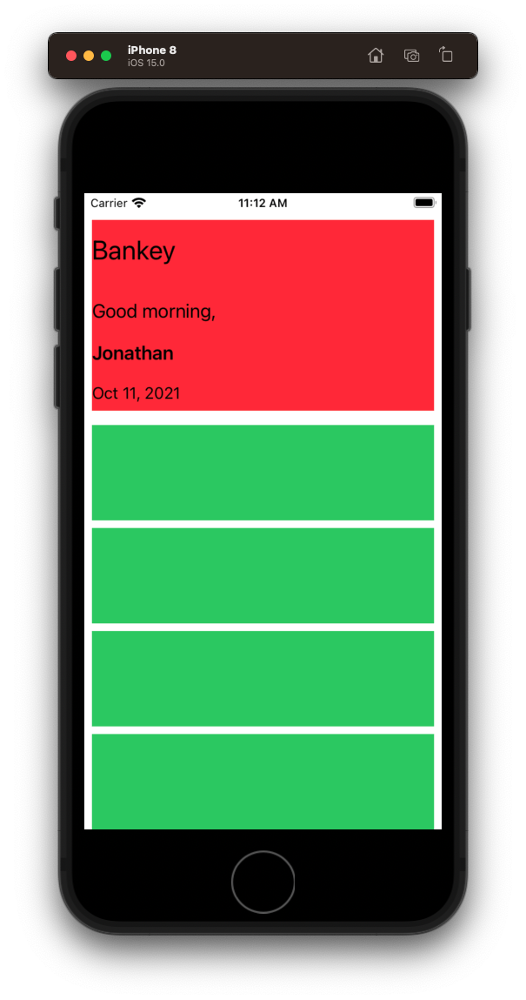
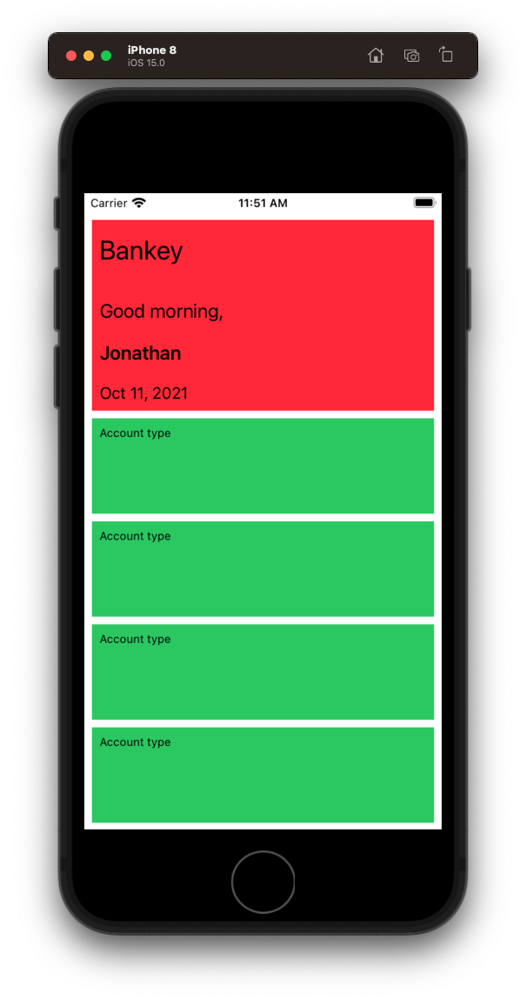
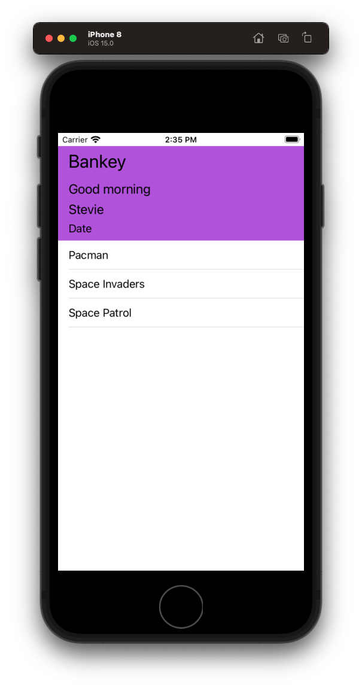
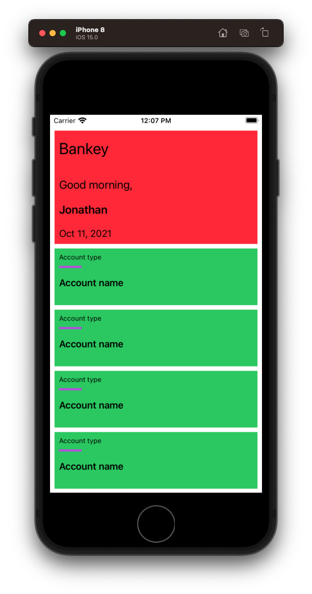
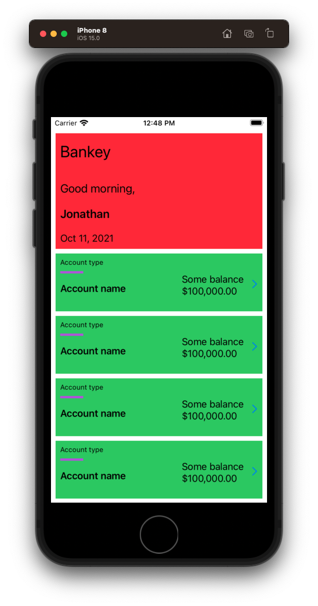
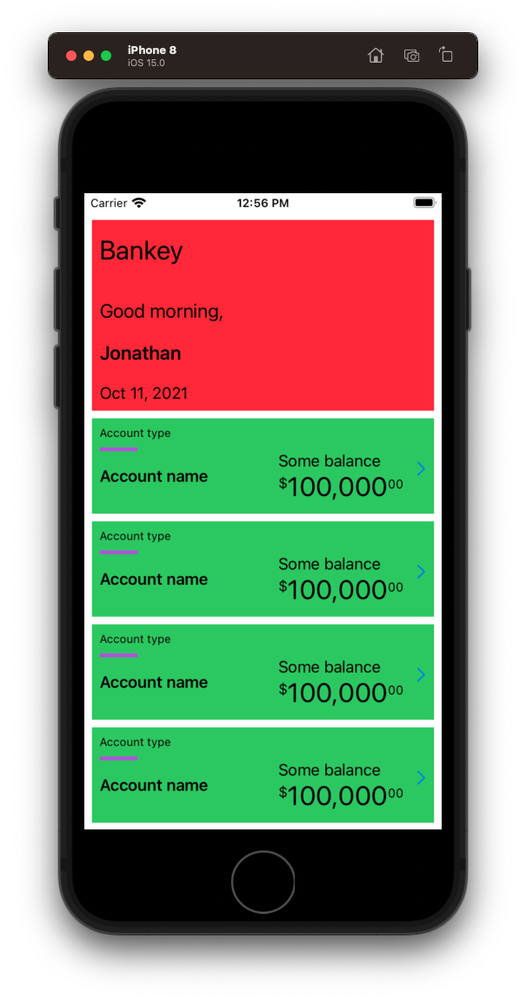

# Account Summary

- image of app navigation

## Setup

- create branch `account-summary`.
- explain what branches are how they work

## Account Summary View Controller

- demo the page
- explain how it is laid out
- demo some of they affordances (collapable title)
- start building it

## Adding the tab bar

**MainViewController**

```swift
import UIKit

class MainViewController: UITabBarController {

    override func viewDidLoad() {
        super.viewDidLoad()
        setupViews()
    }

    func setupViews() {
        view.backgroundColor = .systemPurple

        let summaryVC = AccountSummaryViewController()
        summaryVC.setTabBarImage(imageName: "list.dash.header.rectangle", title: "Summary")

        let moveMoneyVC = MoveMoneyViewController()
        moveMoneyVC.setTabBarImage(imageName: "arrow.left.arrow.right", title: "Move Money")

        let moreVC = MoreViewController()
        moreVC.setTabBarImage(imageName: "ellipsis.circle", title: "More")

        let tabBarList = [summaryVC, moveMoneyVC, moreVC]

        viewControllers = tabBarList
    }
}

class AccountSummaryViewController: UIViewController {
    override func viewDidLoad() {
        view.backgroundColor = .systemGray6
    }
}

class MoveMoneyViewController: UIViewController {
    override func viewDidLoad() {
        view.backgroundColor = .systemGray5
    }
}

class MoreViewController: UIViewController {
    override func viewDidLoad() {
        view.backgroundColor = .systemGray4
    }
}

extension UIViewController {
    func setTabBarImage(imageName: String, title: String) {
        let configuration = UIImage.SymbolConfiguration(scale: .large)
        let image = UIImage(systemName: imageName, withConfiguration: configuration)
        tabBarItem = UITabBarItem(title: title, image: image, tag: 0)
    }
}
```

Delete `DummyViewController`. Add `MainViewController`.

**AppDelegate**

```swift
let mainViewController = MainViewController()
setRootViewController(mainViewController) // x2
```

## Creating Account Summary View Controller

- Scroll View with tiles
- Create directory `AccountSummary`
- Extract into own class

### Create the header

- Custom view
- Start with an empty view

**AccountSummaryHeaderView**

```swift
class AccounSummaryHeaderView: UIView {
    
    override init(frame: CGRect) {
        super.init(frame: frame)
        
        style()
        layout()
    }
    
    required init?(coder: NSCoder) {
        fatalError("init(coder:) has not been implemented")
    }
    
    override var intrinsicContentSize: CGSize {
        return CGSize(width: 200, height: 200)
    }
}

extension AccounSummaryHeaderView {
    
    func style() {
        translatesAutoresizingMaskIntoConstraints = false
    }
    
    func layout() {
        
    }
}
```

- Add it to the summary.

**AccountSummaryViewController**

```swift
import Foundation
import UIKit

class AccountSummaryViewController: UIViewController {
    
    let headerView = AccountSummaryHeaderView()
    
    override func viewDidLoad() {
        view.backgroundColor = .systemBackground
        
        style()
        layout()
    }
}

extension AccountSummaryViewController {
    private func style() {
        headerView.translatesAutoresizingMaskIntoConstraints = false
        headerView.backgroundColor = .systemRed
    }
    
    private func layout() {
        view.addSubview(headerView)
        
        NSLayoutConstraint.activate([
            headerView.topAnchor.constraint(equalToSystemSpacingBelow: view.safeAreaLayoutGuide.topAnchor, multiplier: 1),
            headerView.leadingAnchor.constraint(equalToSystemSpacingAfter: view.leadingAnchor, multiplier: 1),
            view.trailingAnchor.constraint(equalToSystemSpacingAfter: headerView.trailingAnchor, multiplier: 1)
        ])
    }
}
```


### Styling the header

- Lets fill in some details and give it some style.
- You add one label, let them add some others.
- Also hard code header to appear in `AppDelegate` for faster iterations.

`window?.rootViewController = AccountSummaryViewController()`

**AccountSummaryHeaderView**

- Enable bolding

**UIFont+Traits**

```swift
import Foundation
import UIKit

extension UIFont {
    func withTraits(traits: UIFontDescriptor.SymbolicTraits) -> UIFont {
        let descriptor = fontDescriptor.withSymbolicTraits(traits)
        return UIFont(descriptor: descriptor!, size: 0) //size 0 means keep the size as it is
    }

    func bold() -> UIFont {
        return withTraits(traits: .traitBold)
    }

    func italic() -> UIFont {
        return withTraits(traits: .traitItalic)
    }
}
```

```swift
//
//  AccountSummaryHeaderView.swift
//  Bankey
//
//  Created by jrasmusson on 2021-10-11.
//

import Foundation
import UIKit

class AccountSummaryHeaderView: UIView {
    
    let stackView = UIStackView()
    
    let logoLabel = UILabel()
    let greetingLabel = UILabel()
    let nameLabel = UILabel()
    let dateLabel = UILabel()
    
    override init(frame: CGRect) {
        super.init(frame: frame)
        
        style()
        layout()
    }
    
    required init?(coder: NSCoder) {
        fatalError("init(coder:) has not been implemented")
    }
    
    override var intrinsicContentSize: CGSize {
        return CGSize(width: 200, height: 200)
    }
}

extension AccountSummaryHeaderView {
    
    func style() {
        translatesAutoresizingMaskIntoConstraints = false
        
        stackView.translatesAutoresizingMaskIntoConstraints = false
        stackView.axis = .vertical
        stackView.spacing = 20

        logoLabel.translatesAutoresizingMaskIntoConstraints = false
        logoLabel.font = UIFont.preferredFont(forTextStyle: .title1)
        logoLabel.adjustsFontForContentSizeCategory = true
        logoLabel.text = "Bankey"

        greetingLabel.translatesAutoresizingMaskIntoConstraints = false
        greetingLabel.font = UIFont.preferredFont(forTextStyle: .title3)
        greetingLabel.adjustsFontForContentSizeCategory = true
        greetingLabel.text = "Good morning,"

        nameLabel.translatesAutoresizingMaskIntoConstraints = false
        nameLabel.font = UIFont.preferredFont(forTextStyle: .title3).bold()
        nameLabel.adjustsFontForContentSizeCategory = true
        nameLabel.text = "Jonathan"

        dateLabel.translatesAutoresizingMaskIntoConstraints = false
        dateLabel.font = UIFont.preferredFont(forTextStyle: .body)
        dateLabel.adjustsFontForContentSizeCategory = true
        
        let formatter = DateFormatter()
        formatter.dateFormat = "MMM dd, yyyy"
        dateLabel.text = formatter.string(from: Date())
    }
    
    func layout() {
        stackView.addArrangedSubview(logoLabel)
        stackView.addArrangedSubview(greetingLabel)
        stackView.addArrangedSubview(nameLabel)
        stackView.addArrangedSubview(dateLabel)
        
        addSubview(stackView)
        
        NSLayoutConstraint.activate([
            stackView.topAnchor.constraint(equalTo: topAnchor),
            stackView.leadingAnchor.constraint(equalTo: leadingAnchor, constant: 8),
            stackView.trailingAnchor.constraint(equalTo: trailingAnchor),
            stackView.bottomAnchor.constraint(equalTo: bottomAnchor, constant: -8),
        ])
    }
}
```


Discussion

- Why is `Bankey` more spaced to top?
- That's how Stack Views work. They stretch to fill.

Couple ways we can fix:

 - modify intrinisc content size
 - give a fixed constraint / height for header view
 - or leave it if we think it looks good

Save your work

### Creating the scroll view

- Scroll views are...
- And the way they work is...
- The trick with scroll views is understanding that there are x2 sets of constraints and then everything needs a height.

Lets start by:

- Creating a tile view
- Adding our scroll and stack view
- Adding our tiles to the stack.

#### Creating the tile view

**AccountSummaryTile**

```swift
import Foundation
import UIKit

class AccountSummaryTile: UIView {
    
    override init(frame: CGRect) {
        super.init(frame: frame)
        
        style()
        layout()
    }
    
    required init?(coder: NSCoder) {
        fatalError("init(coder:) has not been implemented")
    }
    
    override var intrinsicContentSize: CGSize {
        return CGSize(width: 200, height: 100)
    }
}

extension AccountSummaryTile {
    
    func style() {
        translatesAutoresizingMaskIntoConstraints = false
    }
    
    func layout() {
        
    }
}
```

#### Adding the tile to the view controller

**AccountSummaryViewController**

```swift
let scrollView = UIScrollView()
let stackView = UIStackView()

let tiles = [
    AccountSummaryTile(),
    AccountSummaryTile(),
    AccountSummaryTile(),
    AccountSummaryTile(),
    AccountSummaryTile()
]

scrollView.translatesAutoresizingMaskIntoConstraints = false

stackView.translatesAutoresizingMaskIntoConstraints = false
stackView.axis = .vertical
stackView.spacing = 8

for tile in tiles {
    stackView.addArrangedSubview(tile)
}

// Scroll + StackView
NSLayoutConstraint.activate([
    scrollView.topAnchor.constraint(equalTo: headerView.bottomAnchor, constant: 8),
    scrollView.leadingAnchor.constraint(equalTo: view.leadingAnchor, constant: 8),
    scrollView.trailingAnchor.constraint(equalTo: view.trailingAnchor, constant: -8),
    scrollView.bottomAnchor.constraint(equalTo: view.safeAreaLayoutGuide.bottomAnchor),
    
    stackView.topAnchor.constraint(equalTo: scrollView.topAnchor),
    stackView.leadingAnchor.constraint(equalTo: scrollView.leadingAnchor),
    stackView.trailingAnchor.constraint(equalTo: scrollView.trailingAnchor),
    stackView.bottomAnchor.constraint(equalTo: scrollView.bottomAnchor),
    
    stackView.widthAnchor.constraint(equalTo: scrollView.widthAnchor),
])
```



- Save your work

#### Creating a generic tile

Let's create a generic tile that can display all our various bits of information.

- first lets analyze what we need
- then lets build it out full
- then we will define a type (an `enum`) that will tell us what to display and what not to
- then we'll fill it in with some realistic looking data

Adding the `typeLabel`.

**AccountSummaryTile**

```swift
let typeLabel = UILabel()

typeLabel.translatesAutoresizingMaskIntoConstraints = false
typeLabel.font = UIFont.preferredFont(forTextStyle: .caption1)
typeLabel.adjustsFontForContentSizeCategory = true
typeLabel.text = "Account type"

addSubview(typeLabel)
    
NSLayoutConstraint.activate([
    typeLabel.topAnchor.constraint(equalToSystemSpacingBelow: topAnchor, multiplier: 1),
    typeLabel.leadingAnchor.constraint(equalToSystemSpacingAfter: leadingAnchor, multiplier: 1),
])
```



Adding the `underlineView`.

```swift
let underlineView = UIView()

underlineView.translatesAutoresizingMaskIntoConstraints = false
underlineView.backgroundColor = .systemPurple

underlineView.topAnchor.constraint(equalToSystemSpacingBelow: typeLabel.bottomAnchor, multiplier: 1),
underlineView.leadingAnchor.constraint(equalToSystemSpacingAfter: leadingAnchor, multiplier: 1),
underlineView.widthAnchor.constraint(equalToConstant: 40),
underlineView.heightAnchor.constraint(equalToConstant: 4)
```



Add `nameLabel` - challenge!

- See if you can add the `nameLabel`.
- Give it a font of `.headline`.
- Placeholder text of `Account name`.
- The put it a spacing of `2` multiplier beneath the underline view
- And leading anchor of `1` from the edge.
- Good luck!

```swift
let nameLabel = UILabel()

nameLabel.translatesAutoresizingMaskIntoConstraints = false
nameLabel.font = UIFont.preferredFont(forTextStyle: .headline)
nameLabel.text = "Account name"

addSubview(nameLabel)

nameLabel.topAnchor.constraint(equalToSystemSpacingBelow: underlineView.bottomAnchor, multiplier: 2),
nameLabel.leadingAnchor.constraint(equalToSystemSpacingAfter: leadingAnchor, multiplier: 1),
```



Adding the balances. Let's try these out in a stack view.

```swift
let balanceStackView = UIStackView()
let balanceLabel = UILabel()
let balanceAmountLabel = UILabel()

balanceStackView.translatesAutoresizingMaskIntoConstraints = false
balanceStackView.axis = .vertical
balanceStackView.spacing = 0
    
balanceLabel.translatesAutoresizingMaskIntoConstraints = false
balanceLabel.font = UIFont.preferredFont(forTextStyle: .body)
balanceLabel.text = "Some balance"

balanceAmountLabel.translatesAutoresizingMaskIntoConstraints = false
balanceAmountLabel.font = UIFont.preferredFont(forTextStyle: .body)
balanceAmountLabel.text = "$100,000.00"

balanceStackView.addArrangedSubview(balanceLabel)
balanceStackView.addArrangedSubview(balanceAmountLabel)
    
addSubview(balanceStackView)

balanceStackView.topAnchor.constraint(equalToSystemSpacingBelow: underlineView.bottomAnchor, multiplier: 0),
trailingAnchor.constraint(equalToSystemSpacingAfter: balanceStackView.trailingAnchor, multiplier: 4)
```

Discussion:

- when to stack view and when to not

- Save your work


Now we just need the chevron.

```swift
let chevonImageView = UIImageView()

chevonImageView.translatesAutoresizingMaskIntoConstraints = false
chevonImageView.image = UIImage(systemName: "chevron.right")

addSubview(chevonImageView)

chevonImageView.topAnchor.constraint(equalToSystemSpacingBelow: underlineView.bottomAnchor, multiplier: 1),
trailingAnchor.constraint(equalToSystemSpacingAfter: chevonImageView.trailingAnchor, multiplier: 1)
```



#### How to make fancy titles

```swift
extension AccountSummaryTile {
    
    private func makeFormattedBalance(dollars: String, cents: String) -> NSMutableAttributedString {
        let dollarSignAttributes: [NSAttributedString.Key: Any] = [.font: UIFont.preferredFont(forTextStyle: .callout), .baselineOffset: 8]
        let dollarAttributes: [NSAttributedString.Key: Any] = [.font: UIFont.preferredFont(forTextStyle: .title1)]
        let centAttributes: [NSAttributedString.Key: Any] = [.font: UIFont.preferredFont(forTextStyle: .footnote), .baselineOffset: 8]
        
        let rootString = NSMutableAttributedString(string: "$", attributes: dollarSignAttributes)
        let dollarString = NSAttributedString(string: dollars, attributes: dollarAttributes)
        let centString = NSAttributedString(string: cents, attributes: centAttributes)
        
        rootString.append(dollarString)
        rootString.append(centString)
        
        return rootString
    }
}

balanceAmountLabel.attributedText = makeFormattedBalance(dollars: "100,000", cents: "00")
```



### Making the tile dynamic

### Selecting a tile

- Next up account summary detail


### Links that help

- [Container Views](https://developer.apple.com/library/archive/featuredarticles/ViewControllerPGforiPhoneOS/ImplementingaContainerViewController.html)
