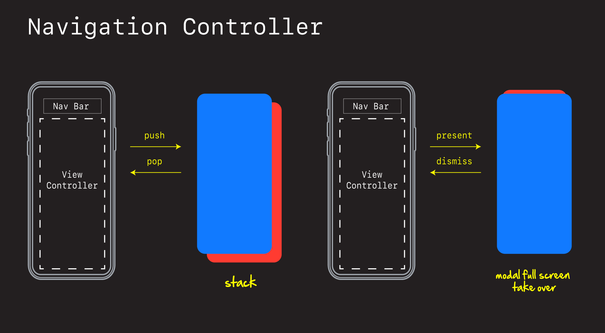
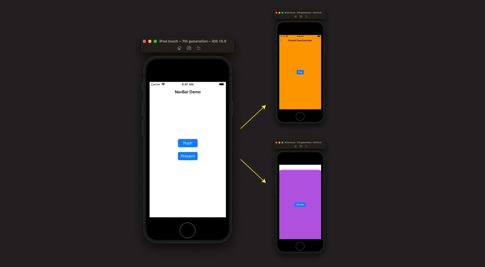
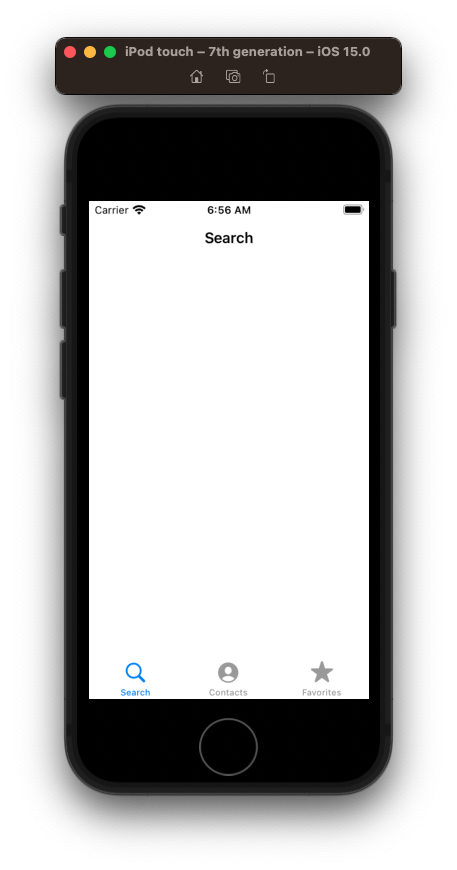
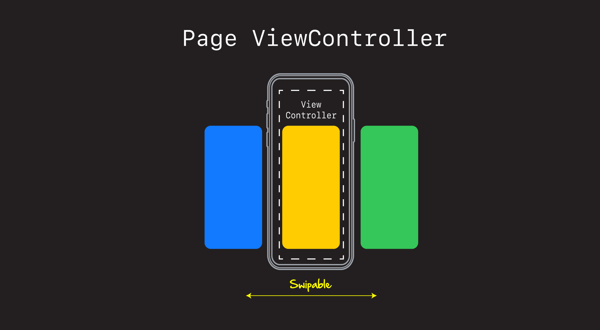
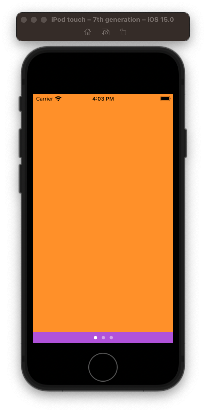
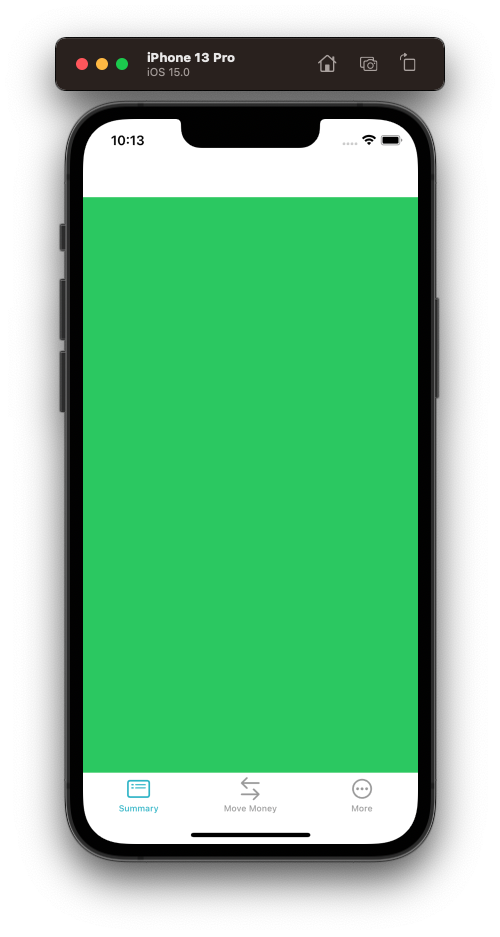

# Container View Controllers

- Container view controllers are view controllers that combine content from child view controllers into a single working interface.

  - UINavigationController
  - UITabBarController
  - UIPageViewController
  - Custom

- `General` > `UINavigationViewController`.
- Starbucks, Netflix, Spotify >`UITabBarViewController`.
- Onboard > `UIPageViewController`.
- These are all Container View Controllers.


- And then all do the same thing. They take in child view controllers, and then handle how they're displayed.

For our app, we are going to use a `UITabBarController`. Which means we need to pass in all the VCs we want managed, and then let it figure out which one to display.

But before we set that up, lets quickly review each container view controllers to see how they work.


## UINavigationController

Explain.




### Push / Pop

```swift
@objc func pushTapped(sender: UIButton) {
    navigationController?.pushViewController(PushViewController(), animated: true)
}

@objc func popTapped(sender: UIButton) {
    navigationController?.popViewController(animated: true)
}
```

### Present / Dismiss

```swift
@objc func presentTapped(sender: UIButton) {
    navigationController?.present(PresentViewController(), animated: true, completion: nil)
}

@objc func dismissTapped(sender: UIButton) {
    dismiss(animated: true, completion: nil)
}
```

### Demo



```swift
import UIKit

class ViewController: UIViewController {
    
    let stackView = UIStackView()
    let pushButton = UIButton(type: .system)
    let presentButton = UIButton(type: .system)
    
    override func viewDidLoad() {
        super.viewDidLoad()
        style()
        layout()
    }
    
    func style() {
        title = "NavBar Demo"

        stackView.translatesAutoresizingMaskIntoConstraints = false
        stackView.axis = .vertical
        stackView.spacing = 20
        
        pushButton.translatesAutoresizingMaskIntoConstraints = false
        pushButton.configuration = .filled()
        pushButton.setTitle("Push", for: [])
        pushButton.addTarget(self, action: #selector(pushTapped), for: .primaryActionTriggered)
        
        presentButton.translatesAutoresizingMaskIntoConstraints = false
        presentButton.configuration = .filled()
        presentButton.setTitle("Present", for: [])
        presentButton.addTarget(self, action: #selector(presentTapped), for: .primaryActionTriggered)
    }
    
    func layout() {
        stackView.addArrangedSubview(pushButton)
        stackView.addArrangedSubview(presentButton)
        
        view.addSubview(stackView)
        
        NSLayoutConstraint.activate([
            stackView.centerXAnchor.constraint(equalTo: view.centerXAnchor),
            stackView.centerYAnchor.constraint(equalTo: view.centerYAnchor),
        ])
    }
    
    @objc func pushTapped(sender: UIButton) {
        navigationController?.pushViewController(PushViewController(), animated: true)
    }
    
    @objc func presentTapped(sender: UIButton) {
        navigationController?.present(PresentViewController(), animated: true, completion: nil)
    }
}

class PushViewController: UIViewController {
    
    let stackView = UIStackView()
    let popButton = UIButton(type: .system)
    
    override func viewDidLoad() {
        super.viewDidLoad()
        style()
        layout()
    }
    
    func style() {
        title = "Pushed ViewController"
        view.backgroundColor = .systemOrange

        stackView.translatesAutoresizingMaskIntoConstraints = false
        stackView.axis = .vertical
        stackView.spacing = 20
        
        popButton.translatesAutoresizingMaskIntoConstraints = false
        popButton.configuration = .filled()
        popButton.setTitle("Pop", for: [])
        popButton.addTarget(self, action: #selector(popTapped), for: .primaryActionTriggered)
    }
    
    func layout() {
        stackView.addArrangedSubview(popButton)
        
        view.addSubview(stackView)
        
        NSLayoutConstraint.activate([
            stackView.centerXAnchor.constraint(equalTo: view.centerXAnchor),
            stackView.centerYAnchor.constraint(equalTo: view.centerYAnchor),
        ])
    }
    
    @objc func popTapped(sender: UIButton) {
        navigationController?.popViewController(animated: true)
    }
}

class PresentViewController: UIViewController {
    
    let stackView = UIStackView()
    let dismissButton = UIButton(type: .system)
    
    override func viewDidLoad() {
        super.viewDidLoad()
        style()
        layout()
    }
    
    func style() {
        title = "Not shown"
        view.backgroundColor = .systemPurple

        stackView.translatesAutoresizingMaskIntoConstraints = false
        stackView.axis = .vertical
        stackView.spacing = 20
        
        dismissButton.translatesAutoresizingMaskIntoConstraints = false
        dismissButton.configuration = .filled()
        dismissButton.setTitle("Dismiss", for: [])
        dismissButton.addTarget(self, action: #selector(dismissTapped), for: .primaryActionTriggered)
    }
    
    func layout() {
        stackView.addArrangedSubview(dismissButton)
        
        view.addSubview(stackView)
        
        NSLayoutConstraint.activate([
            stackView.centerXAnchor.constraint(equalTo: view.centerXAnchor),
            stackView.centerYAnchor.constraint(equalTo: view.centerYAnchor),
        ])
    }
    
    @objc func dismissTapped(sender: UIButton) {
        dismiss(animated: true, completion: nil)
    }
}
```


## UITabBarController

Explain.


### Demo



```swift
import UIKit

@main
class AppDelegate: UIResponder, UIApplicationDelegate {
    
    var window: UIWindow?
    
    func application(_ application: UIApplication, didFinishLaunchingWithOptions launchOptions: [UIApplication.LaunchOptionsKey: Any]?) -> Bool {
        
        window = UIWindow(frame: UIScreen.main.bounds)
        window?.makeKeyAndVisible()
        window?.backgroundColor = .systemBackground
        
        let vc1 = SearchViewController()
        let vc2 = ContactsViewController()
        let vc3 = FavoritesViewController()
        
        vc1.tabBarItem = UITabBarItem(tabBarSystemItem: .search, tag: 0)
        vc2.tabBarItem = UITabBarItem(tabBarSystemItem: .contacts, tag: 1)
        vc3.tabBarItem = UITabBarItem(tabBarSystemItem: .favorites, tag: 2)
        
        let nc1 = UINavigationController(rootViewController: vc1)
        let nc2 = UINavigationController(rootViewController: vc2)
        let nc3 = UINavigationController(rootViewController: vc3)
        
        let tabBarController = UITabBarController()
        tabBarController.viewControllers = [nc1, nc2, nc3]
        
        window?.rootViewController = tabBarController
        
        return true
    }
    
}

class SearchViewController: UIViewController {
    override func viewDidLoad() {
        title = "Search"
    }
}

class ContactsViewController: UIViewController {
    override func viewDidLoad() {
        title = "Contacts"
    }
}

class FavoritesViewController: UIViewController {
    override func viewDidLoad() {
        title = "Favorites"
    }
}
```

## UIPageViewController

Explain.



### Demo



```swift
import UIKit

class ViewController: UIViewController {

    let pageViewController: UIPageViewController
    var pages = [UIViewController]()
    var currentVC: UIViewController {
        didSet {
//            guard let index = pages.firstIndex(of: currentVC) else { return }
//            nextButton.isHidden = index == pages.count - 1
//            backButton.isHidden = index == 0
//            doneButton.isHidden = !(index == pages.count - 1)
        }
    }
    
    override init(nibName nibNameOrNil: String?, bundle nibBundleOrNil: Bundle?) {
        self.pageViewController = UIPageViewController(transitionStyle: .scroll, navigationOrientation: .horizontal, options: nil)
        
        let page1 = ViewController1()
        let page2 = ViewController2()
        let page3 = ViewController3()
        
        self.pages.append(page1)
        self.pages.append(page2)
        self.pages.append(page3)
        
        self.currentVC = pages.first!
        
        super.init(nibName: nibNameOrNil, bundle: nibBundleOrNil)
    }
    
    required init?(coder: NSCoder) {
        fatalError("init(coder:) has not been implemented")
    }
    
    override func viewDidLoad() {
        super.viewDidLoad()
        
        view.backgroundColor = .systemPurple
        
        // how to add child view controllers
        addChild(pageViewController)
        view.addSubview(pageViewController.view)
        pageViewController.didMove(toParent: self)
        
        pageViewController.dataSource = self
        pageViewController.view.translatesAutoresizingMaskIntoConstraints = false
        
        NSLayoutConstraint.activate([
            view.topAnchor.constraint(equalTo: pageViewController.view.topAnchor),
            view.leadingAnchor.constraint(equalTo: pageViewController.view.leadingAnchor),
            view.trailingAnchor.constraint(equalTo: pageViewController.view.trailingAnchor),
            view.bottomAnchor.constraint(equalTo: pageViewController.view.bottomAnchor),
        ])
        
        pageViewController.setViewControllers([pages.first!], direction: .forward, animated: false, completion: nil)
        currentVC = pages.first!
    }
}

// MARK: - UIPageViewControllerDataSource

extension ViewController: UIPageViewControllerDataSource {

    func pageViewController(_ pageViewController: UIPageViewController, viewControllerBefore viewController: UIViewController) -> UIViewController? {
        return getPreviousViewController(from: viewController)
    }

    func pageViewController(_ pageViewController: UIPageViewController, viewControllerAfter viewController: UIViewController) -> UIViewController? {
        return getNextViewController(from: viewController)
    }

    private func getPreviousViewController(from viewController: UIViewController) -> UIViewController? {
        guard let index = pages.firstIndex(of: viewController), index - 1 >= 0 else { return nil }
        self.currentVC = pages[index - 1]
        return pages[index - 1]
    }

    private func getNextViewController(from viewController: UIViewController) -> UIViewController? {
        guard let index = pages.firstIndex(of: viewController), index + 1 < pages.count else { return nil }
        self.currentVC = pages[index + 1]
        return pages[index + 1]
    }

    func presentationCount(for pageViewController: UIPageViewController) -> Int {
        return pages.count
    }

    func presentationIndex(for pageViewController: UIPageViewController) -> Int {
        return pages.firstIndex(of: self.currentVC) ?? 0
    }
}

// MARK: - ViewControllers
class ViewController1: UIViewController {
    override func viewDidLoad() {
        super.viewDidLoad()
        view.backgroundColor = .systemOrange
    }
}

class ViewController2: UIViewController {
    override func viewDidLoad() {
        super.viewDidLoad()
        view.backgroundColor = .systemGreen
    }
}

class ViewController3: UIViewController {
    override func viewDidLoad() {
        super.viewDidLoad()
        view.backgroundColor = .systemBlue
    }
}
```

# Adding the UITabBarController



- Open project - show where we are.
- Grab the Agile story.
- Discuss different ways we could do this.
- Explain why you've chosen this way.

## Creating the MainViewController

- Move some folders around.

### Setup

- Define an app color in `AppDelegate`.

`let appColor: UIColor = .systemTeal`

- Create a `UIViewController+Utils` extension.

```swift
import UIKit

extension UIViewController {
    // Old - deprecated
//    func setStatusBar() {
//        let statusBarSize = UIApplication.shared.statusBarFrame.size // deprecated but OK
//        let frame = CGRect(origin: .zero, size: statusBarSize)
//        let statusbarView = UIView(frame: frame)

//        statusbarView.backgroundColor = appColor
//        view.addSubview(statusbarView)
//    }
    
    // New 
    func setStatusBar() {
        let navBarAppearance = UINavigationBarAppearance()
        navBarAppearance.configureWithTransparentBackground() // to hide Navigation Bar Line also
        navBarAppearance.backgroundColor = appColor
        UINavigationBar.appearance().standardAppearance = navBarAppearance
        UINavigationBar.appearance().scrollEdgeAppearance = navBarAppearance
    }

    
    func setTabBarImage(imageName: String, title: String) {
        let configuration = UIImage.SymbolConfiguration(scale: .large)
        let image = UIImage(systemName: imageName, withConfiguration: configuration)
        tabBarItem = UITabBarItem(title: title, image: image, tag: 0)
    }
}
```

### Add MainViewController

- Create new view controller `MainViewController` beside `AppDelegate`.
- Explain what is going on in here.

```swift
import UIKit

class MainViewController: UITabBarController {

    override func viewDidLoad() {
        super.viewDidLoad()
        setupViews()
        setupTabBar()
    }

    private func setupViews() {
        let summaryVC = AccountSummaryViewController()
        let moneyVC = MoveMoneyViewController()
        let moreVC = MoreViewController()

        summaryVC.setTabBarImage(imageName: "list.dash.header.rectangle", title: "Summary")
        moneyVC.setTabBarImage(imageName: "arrow.left.arrow.right", title: "Move Money")
        moreVC.setTabBarImage(imageName: "ellipsis.circle", title: "More")

        let summaryNC = UINavigationController(rootViewController: summaryVC)
        let moneyNC = UINavigationController(rootViewController: moneyVC)
        let moreNC = UINavigationController(rootViewController: moreVC)

        summaryNC.navigationBar.barTintColor = appColor
        hideNavigationBarLine(summaryNC.navigationBar)
        
        let tabBarList = [summaryNC, moneyNC, moreNC]

        viewControllers = tabBarList
    }
    
    private func hideNavigationBarLine(_ navigationBar: UINavigationBar) {
        let img = UIImage()
        navigationBar.shadowImage = img
        navigationBar.setBackgroundImage(img, for: .default)
        navigationBar.isTranslucent = false
    }
    
    private func setupTabBar() {
        tabBar.tintColor = appColor
        tabBar.isTranslucent = false
    }
}

class AccountSummaryViewController: UIViewController {
    override func viewDidLoad() {
        view.backgroundColor = .systemGreen
    }
}

class MoveMoneyViewController: UIViewController {
    override func viewDidLoad() {
        view.backgroundColor = .systemOrange
    }
}

class MoreViewController: UIViewController {
    override func viewDidLoad() {
        view.backgroundColor = .systemPurple
    }
}
```

At this point our `MainViewController` is ready to go. Let's now use it in the `AppDelegate`.

### Hookup in `AppDelegate`

```swift
class AppDelegate: UIResponder, UIApplicationDelegate {
    
    var window: UIWindow?
    let mainViewController = MainViewController()
```

- Discussion:
 - extending `UITabBarController` 
 - Show how to `hideNavigationBarLine`
 - Show how to tint tab bar (comment in / out).
 - Show how to programmatically select a tab.

 `mainViewController.selectedIndex = 2`

Now ready to Add our first screen.

Save your work - `feat: Add tab bar`


### Links that help

- [Implementing a Container View Controller](https://developer.apple.com/library/archive/featuredarticles/ViewControllerPGforiPhoneOS/)
- [Creating a Custom Container View Controller](https://developer.apple.com/documentation/uikit/view_controllers/creating_a_custom_container_view_controller)


