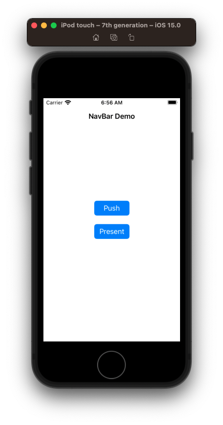

# Container View Controllers

- Where we are headed.


- To build this we need to first understand:
 - Container View Controllers
 - Scrollable View Controllers 

 
## What are they?


- Container view controllers are view controllers that combine content from child view controllers into a single working interface.

- `General` > `UINavigationViewController`.
- Starbucks, Netflix, Spotify >`UITabBarViewController`.
- Onboard > `UIPageViewController`.
- These are all Container View Controllers.

  - UINavigationController
  - UITabBarController
  - UIPageViewController
  - Custom container controllers we ourselves make

- And then all do the same thing. They take in child view controllers, and then handle how they're displayed.

For our app, we are going to use a `UITabBarController`. Which means we need to pass in all the VCs we want managed, and then let it figure out which one to display.

But before we set that up, lets quickly review each container view controllers to see how they work.

## UINavigationController

Demo and explain.



### Push / Pop

```swift
@objc func pushTapped(sender: UIButton) {
    navigationController?.pushViewController(PushViewController(), animated: true)
}

@objc func popTapped(sender: UIButton) {
    navigationController?.popViewController(animated: true)
}
```

### Present / Dismiss

```swift
@objc func presentTapped(sender: UIButton) {
    navigationController?.present(PresentViewController(), animated: true, completion: nil)
}

@objc func dismissTapped(sender: UIButton) {
    dismiss(animated: true, completion: nil)
}
```

##UITabBarController

Demo and explain.


```swift
import UIKit

@main
class AppDelegate: UIResponder, UIApplicationDelegate {
    
    var window: UIWindow?
    
    func application(_ application: UIApplication, didFinishLaunchingWithOptions launchOptions: [UIApplication.LaunchOptionsKey: Any]?) -> Bool {
        
        window = UIWindow(frame: UIScreen.main.bounds)
        window?.makeKeyAndVisible()
        window?.backgroundColor = .systemBackground
        
        let vc1 = SearchViewController()
        let vc2 = ContactsViewController()
        let vc3 = FavoritesViewController()
        
        vc1.tabBarItem = UITabBarItem(tabBarSystemItem: .search, tag: 0)
        vc2.tabBarItem = UITabBarItem(tabBarSystemItem: .contacts, tag: 1)
        vc3.tabBarItem = UITabBarItem(tabBarSystemItem: .favorites, tag: 2)
        
        let nc1 = UINavigationController(rootViewController: vc1)
        let nc2 = UINavigationController(rootViewController: vc2)
        let nc3 = UINavigationController(rootViewController: vc3)
        
        let tabBarController = UITabBarController()
        tabBarController.viewControllers = [nc1, nc2, nc3]
        
        window?.rootViewController = tabBarController
        
        return true
    }
    
}

class SearchViewController: UIViewController {
    override func viewDidLoad() {
        title = "Search"
    }
}

class ContactsViewController: UIViewController {
    override func viewDidLoad() {
        title = "Contacts"
    }
}

class FavoritesViewController: UIViewController {
    override func viewDidLoad() {
        title = "Favorites"
    }
}
```

### Links that help

- [Implementing a Container View Controller](https://developer.apple.com/library/archive/featuredarticles/ViewControllerPGforiPhoneOS/)
- [Creating a Custom Container View Controller](https://developer.apple.com/documentation/uikit/view_controllers/creating_a_custom_container_view_controller)


