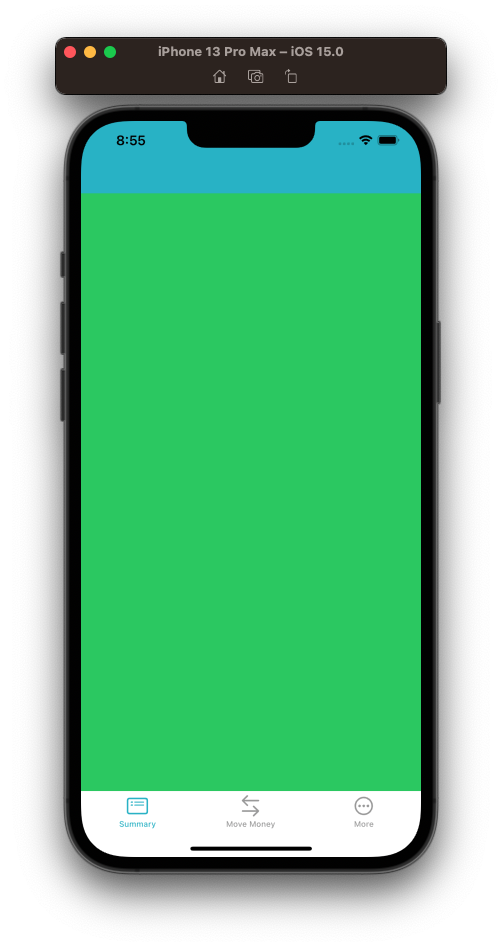

# Adding the UITabBarController



- Demo
- Discuss different ways we could do this.
- Explain why you've chosen this way.

## Creating the MainViewController

- Move some folders around.
- Define an app color in `AppDelegate`.

`let appColor: UIColor = .systemTeal`

- Create new view controller `MainViewController` beside `AppDelegate`.
- Explain what is going on in here.
- Discussion:
 - extending `UITabBarController` 
 - Show how to `hideNavigationBarLine`
 - Show how to tint tab bar.
 - We

```swift
import UIKit

class MainViewController: UITabBarController {

    override func viewDidLoad() {
        super.viewDidLoad()
        setupViews()
        setupTabBar()
    }

    private func setupViews() {
        let summaryVC = AccountSummaryViewController()
        let moneyVC = MoveMoneyViewController()
        let moreVC = MoreViewController()

        summaryVC.setTabBarImage(imageName: "list.dash.header.rectangle", title: "Summary")
        moneyVC.setTabBarImage(imageName: "arrow.left.arrow.right", title: "Move Money")
        moreVC.setTabBarImage(imageName: "ellipsis.circle", title: "More")

        let summaryNC = UINavigationController(rootViewController: summaryVC)
        let moneyNC = UINavigationController(rootViewController: moneyVC)
        let moreNC = UINavigationController(rootViewController: moreVC)

        summaryNC.navigationBar.barTintColor = appColor
        hideNavigationBarLine(summaryNC.navigationBar)
        
        let tabBarList = [summaryNC, moneyNC, moreNC]

        viewControllers = tabBarList
    }
    
    private func hideNavigationBarLine(_ navigationBar: UINavigationBar) {
        let img = UIImage()
        navigationBar.shadowImage = img
        navigationBar.setBackgroundImage(img, for: .default)
        navigationBar.isTranslucent = false
    }
    
    private func setupTabBar() {
        tabBar.tintColor = appColor
        tabBar.isTranslucent = false
    }
}

class AccountSummaryViewController: UIViewController {
    override func viewDidLoad() {
        view.backgroundColor = .systemGreen
    }
}

class MoveMoneyViewController: UIViewController {
    override func viewDidLoad() {
        view.backgroundColor = .systemOrange
    }
}

class MoreViewController: UIViewController {
    override func viewDidLoad() {
        view.backgroundColor = .systemPurple
    }
}
```


## Adding to the AppDelegate


### Links that help


