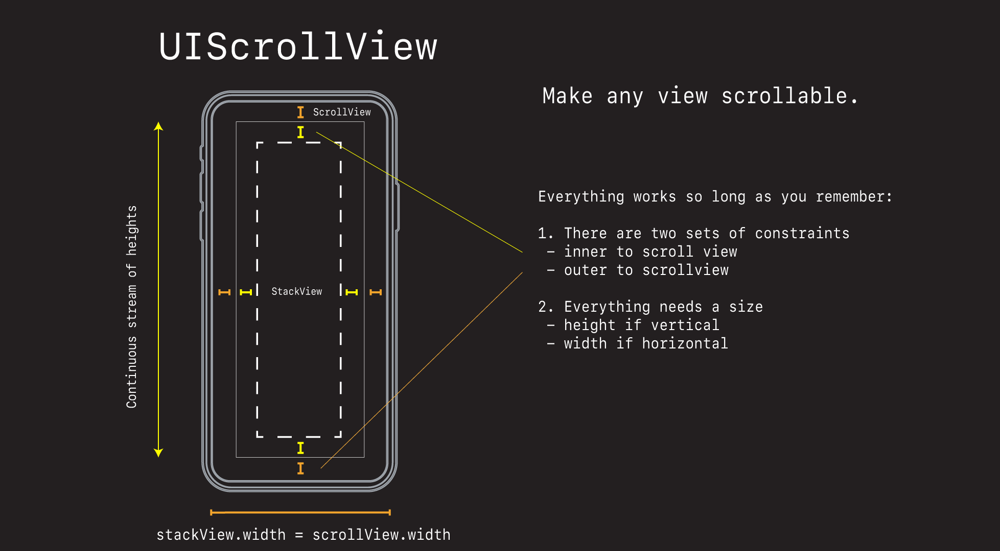
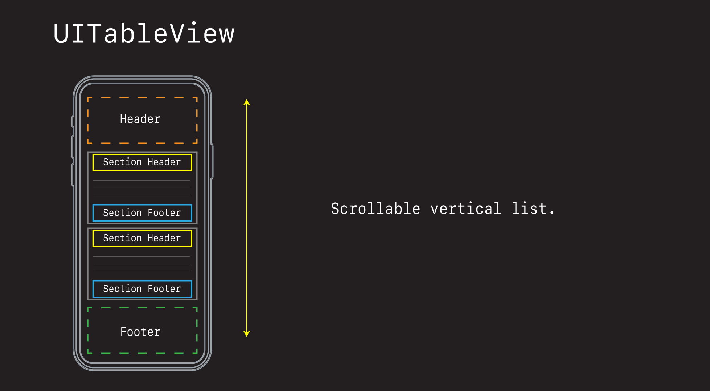

# Scrollable View Controllers

- Scrolling is everything for the iPhone
- Let's quickly review some options and see how each works.

## UIScrollView



```swift
//
//  ViewController.swift
//  ScrollViewDemo
//
//  Created by jrasmusson on 2021-10-23.
//

import UIKit

class ViewController: UIViewController {
    
    let scrollView = UIScrollView()
    let stackView = UIStackView()
    
    override func viewDidLoad() {
        super.viewDidLoad()
        style()
        layout()
    }
}

extension ViewController {
    func style() {
        scrollView.translatesAutoresizingMaskIntoConstraints = false
        
        stackView.translatesAutoresizingMaskIntoConstraints = false
        stackView.axis = .vertical
        stackView.spacing = 20
    }
    
    func layout() {
        view.addSubview(scrollView)
        scrollView.addSubview(stackView)

        stackView.addArrangedSubview(makeCustomView())
        
        for _ in 0..<20 {
            stackView.addArrangedSubview(makeLabel())
        }

        // ScrollView
        NSLayoutConstraint.activate([
            scrollView.topAnchor.constraint(equalTo: view.safeAreaLayoutGuide.topAnchor),
            scrollView.leadingAnchor.constraint(equalTo: view.safeAreaLayoutGuide.leadingAnchor),
            scrollView.trailingAnchor.constraint(equalTo: view.safeAreaLayoutGuide.trailingAnchor),
            scrollView.bottomAnchor.constraint(equalTo: view.safeAreaLayoutGuide.bottomAnchor),
        ])
        
        // StackView within the ScrollView
        NSLayoutConstraint.activate([
            stackView.topAnchor.constraint(equalTo: scrollView.topAnchor),
            stackView.leadingAnchor.constraint(equalTo: scrollView.leadingAnchor),
            stackView.trailingAnchor.constraint(equalTo: scrollView.trailingAnchor),
            stackView.bottomAnchor.constraint(equalTo: scrollView.bottomAnchor),
        ])
        
        // The magic constraint needed to make all this work
        stackView.widthAnchor.constraint(equalTo: scrollView.widthAnchor).isActive = true
    }
    
    private func makeLabel() -> UILabel {
        let label = UILabel()
        label.translatesAutoresizingMaskIntoConstraints = false
        label.text = "Welcome"
        label.textAlignment = .center
        label.backgroundColor = .systemGray
        return label
    }
    
    private func makeCustomView() -> UIView {
        let customView = CustomView()
        customView.translatesAutoresizingMaskIntoConstraints = false
        return customView
    }
}

    
class CustomView: UIView {
    override init(frame: CGRect) {
        super.init(frame: frame)
        backgroundColor = .systemOrange
    }
    
    required init?(coder: NSCoder) {
        fatalError("init(coder:) has not been implemented")
    }
    
    override var intrinsicContentSize: CGSize {
        return CGSize(width: UIView.noIntrinsicMetric, height: 200)
    }
}
```

For an example of how to use `UIScrollView` in an app see:

- [Starbucks Swift Arcade](https://www.youtube.com/watch?v=xBtQsacfDhQ&list=PLEVREFF3xBv4fLwWvXZoY8cKC6F5P-rlY&index=3&t=2s&ab_channel=SwiftArcade)

## UICollectionView


- [Flowlayout](https://github.com/jrasmusson/swift-arcade/blob/master/UIKit/UICollectionView/FlowLayout/README.md)
- [Compositional Layout](https://github.com/jrasmusson/swift-arcade/blob/master/UIKit/UICollectionView/CompositionalLayout/README.md)

## UITableView



We are going to use `UITableView` because:

- its ubiquitous
- its used everywhere
- its mature
- it can do everything
- makes building scrollable view controllers easy


### Links that help

- [iPhone Engineers talking about scrolling](https://youtu.be/N8Vz1BeymHE?t=1569)
- [Collection View Programming Guide for iOS](https://developer.apple.com/library/archive/documentation/WindowsViews/Conceptual/CollectionViewPGforIOS/UsingtheFlowLayout/UsingtheFlowLayout.html)
