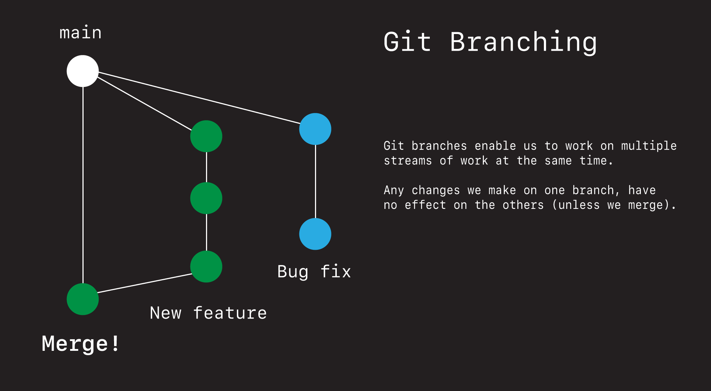
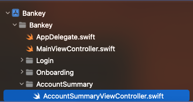

# Account Summary Header


## Setting up a git branch



- Review where we left off

```
> git status (nothing to commit)
> git log (tab bar last commit)
```

Currently we are on the `main` branch.

```
> git branch
```

To do our work on a separate branch we use the command:

```
> git checkout -b <branchname>
```

Let's create a new branch now by going:

```
> git checkout -b account-summary
```

If we look at this branch we will see it is the same as main.

```
> git log
```

Anything we do here will only affect this branch.

To get back to the main branch we can go:

```
> git checkout main
```

And if by accident we made a mistake. For example say we created a branch whose work we don't want to merge.

```
> git checkout -b opps
```

We can always delete it by going:

```
> git branch -D <branchname>
> git branch -D opps
```

To switch branches:

```
> git checkout <branchname>
> git checkout main
> git checkout account-summary
```

- Double check you are on the `account-summary` branch.
- This is where we are going to do our account work.
- Later on we will see how to merge this back to main.
- Let's get on with the show!

## Create ViewController

- Follow along with text - we will be cutting and pasting some code.

- Create directory `AccountSummary`



- Create file `AccountSummaryViewController` (via snippet)
- Hook up in `AppDelegate`
- Delete old one in `MainViewController`
- Instantiate and run.

Ask students to follow along in the show notes and to copy and paste in the following to start things off.

**AccountSummaryViewController**

```swift
import UIKit

class AccountSummaryViewController: UIViewController {
    
    let games = [
        "Pacman",
        "Space Invaders",
        "Space Patrol",
    ]
    
    var tableView = UITableView()
    
    override func viewDidLoad() {
        super.viewDidLoad()
        setup()
    }
}

extension AccountSummaryViewController {
    private func setup() {
        setupTableView()
    }
    
    private func setupTableView() {
        tableView.delegate = self
        tableView.dataSource = self
        
        tableView.translatesAutoresizingMaskIntoConstraints = false
        view.addSubview(tableView)
        
        NSLayoutConstraint.activate([
            tableView.topAnchor.constraint(equalTo: view.safeAreaLayoutGuide.topAnchor),
            tableView.leadingAnchor.constraint(equalTo: view.safeAreaLayoutGuide.leadingAnchor),
            tableView.trailingAnchor.constraint(equalTo: view.safeAreaLayoutGuide.trailingAnchor),
            tableView.bottomAnchor.constraint(equalTo: view.safeAreaLayoutGuide.bottomAnchor)
        ])
    }
}

extension AccountSummaryViewController: UITableViewDataSource {
    func tableView(_ tableView: UITableView, cellForRowAt indexPath: IndexPath) -> UITableViewCell {
        let cell = UITableViewCell()
        cell.textLabel?.text = games[indexPath.row]
        return cell
    }
    
    func tableView(_ tableView: UITableView, numberOfRowsInSection section: Int) -> Int {
        return games.count
    }
}

extension AccountSummaryViewController: UITableViewDelegate {
    func tableView(_ tableView: UITableView, didSelectRowAt indexPath: IndexPath) {
        
    }
}
```

Discussion:

- Explain how this is pretty much the simplest table view controller we can get.
- Go over how it works.


- Let's save our changes.

```
> git add .
> git commit -m "Add tableview"
```

Next let's add the header.

## Add Header View

- The simplest way to add a header to a `UITableView` with Auto Layout is to:
   - Create a class
   - Add it as a nib


- Discussion: 
   - [Interface Builder with Steve Jobs](https://youtu.be/dl0CbKYUFTY?t=62)
   - [What is a nib?](https://developer.apple.com/library/archive/documentation/General/Conceptual/DevPedia-CocoaCore/NibFile.html)
   - What are some of the pros and cons of using them.
      - Less code
      - Bit of a learning curve (need to load differently)
      - But you will see these used in industry (work knowing)

#### Create a class

- Create a folder in AccountSummary called `Header`
- Create a class `AccountSummaryHeaderView`

**AccountSummaryHeaderView**

```swift
import UIKit

class AccountSummaryHeaderView: UIView {

}
```

#### Create a nib

- Create a nib view named `AccountSummaryHeaderView`
- Set to height `144`
- Set `File's Owner` to `AccountSummaryHeaderView`
- Show how to bring up the assistant.
- Control drag `view` from nib into file and call `contentView`.
- Then load the nib and pin to the edges by copying and pasing code like this.

> If Xcode won't connect your IBOutlet - restart Xcode.
 
**AccountSummaryHeaderView**

```swift
import UIKit

class AccountSummaryHeaderView: UIView {
    
    @IBOutlet var contentView: UIView!
    
    override init(frame: CGRect) {
        super.init(frame: frame)
        commonInit()
    }
    
    required init?(coder aDecoder: NSCoder) {
        super.init(coder: aDecoder)
        commonInit()
    }
    
    override var intrinsicContentSize: CGSize {
        return CGSize(width: UIView.noIntrinsicMetric, height: 144)
    }
    
    private func commonInit() {
        let bundle = Bundle(for: AccountSummaryHeaderView.self)
        bundle.loadNibNamed("AccountSummaryHeaderView", owner: self, options: nil)
        addSubview(contentView)
        contentView.backgroundColor = appColor
        
        contentView.translatesAutoresizingMaskIntoConstraints = false
        contentView.topAnchor.constraint(equalTo: self.topAnchor).isActive = true
        contentView.leadingAnchor.constraint(equalTo: self.leadingAnchor).isActive = true
        contentView.trailingAnchor.constraint(equalTo: self.trailingAnchor).isActive = true
        contentView.bottomAnchor.constraint(equalTo: self.bottomAnchor).isActive = true
    }
}
```

- Explain how nibs get loaded via the `Bundle`.
- How we add `contentView` to subview.
- Pin to edges uses Auto Layout.
- Now add it to the table.

```swift
setupTableHeaderView()

private func setupTableHeaderView() {
    let header = AccountSummaryHeaderView(frame: .zero)
    
    var size = header.systemLayoutSizeFitting(UIView.layoutFittingCompressedSize)
    size.width = UIScreen.main.bounds.width
    header.frame.size = size
    
    tableView.tableHeaderView = header
}        
```


- Let's save our changes.

```
> git add .
> git commit -m "Add tableview header"
```

### Styling the header

- Now because we have a nib, we can do all our auto layout in there.
- Challenge - how should we do it?

Let's look at a couple of different ways we could do this layout, while learning some tricks for working with Auto Layout.

1. Just accept the defaults.
2. Layout everything manually by hand.
 - Demo how to check for ambiguity.

3. Using stack views.
 - Why are stackviews great?
 - Show how even though things look great, we can still have ambiguity.
 - Demo Reveal.

4. Using stack views like a pro.
 - Embed the labels in a stack.
 - Embed the image in a stack.
 - Pin to the edges with `16pts`.
 - Make the trailing and bottom optional.

Here is the layout we've created.


- Explain some of the magic going on here and why this layout works.
- Explain some of the affordances Xcode does on our behalf and how it resolves ambiguity for us.
- Take a detour and explain at a high-level what CHCR is and how the sun and the horizontal stack know how to space themselves.

Review the following takeaways:

1. Start by just getting it to work.
2. StackViews are handy for minimzing constraits.
3. Beware that Xcode occasionally works magic for us.
4. You can sometimes remove ambiguity by making certain constraints optional.
5. There are always multiple ways to lay things out. So if one way doesn't work, try another.

Save your work.

```
> git add .
> git commit -m "Style header view"
```

Next let's design and layout the cell for our table view.

### Links that help

- [What are nibs?](https://developer.apple.com/library/archive/documentation/General/Conceptual/DevPedia-CocoaCore/NibFile.html)
