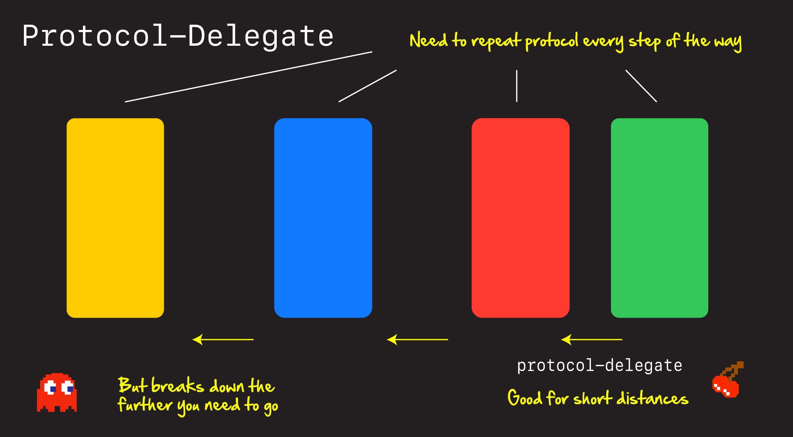
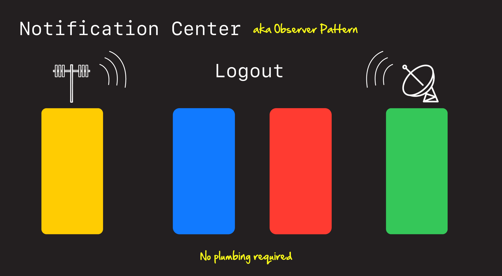
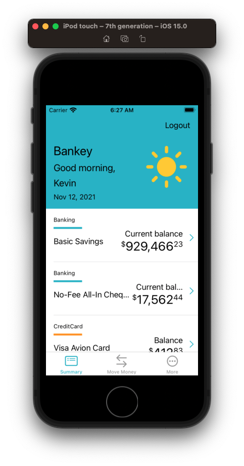
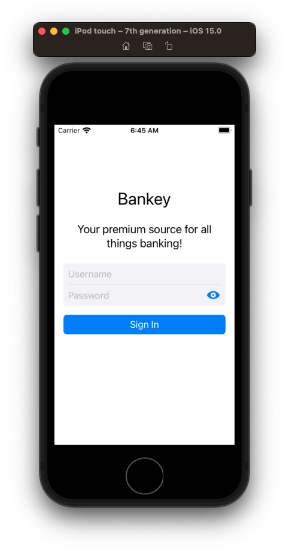
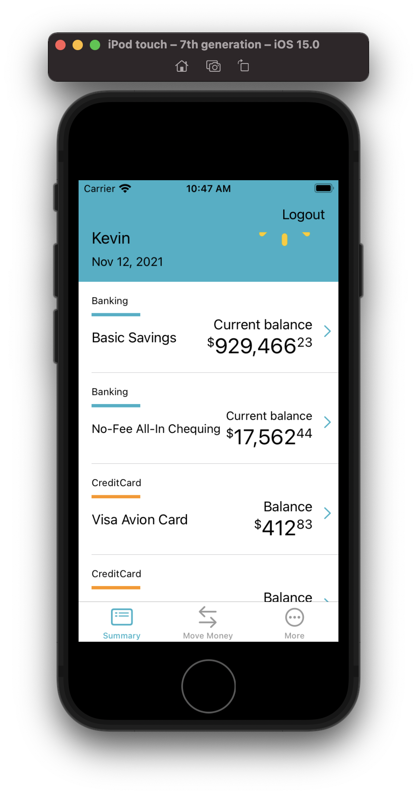

# NotificationCenter





Sometimes you need to send messages far and wide in your app. And `NoficiationCenter` is a way to do that. In this section we are going to use `NotificationCenter` to help us with logout.

Let's start by adding a logout button to our `AccountSummaryViewController` screen, and see why sending that message back to our `AppDelegate` is harder than it looks.

## Adding a logout button

First let's add the logout button to our `AccountSummaryViewController`.

**AccountSummaryViewController**

```swift
lazy var logoutBarButtonItem: UIBarButtonItem = {
    let barButtonItem = UIBarButtonItem(title: "Logout", style: .plain, target: self, action: #selector(logoutTapped))
    barButtonItem.tintColor = .label
    return barButtonItem
}()

extension AccountSummaryViewController {
    private func setup() {
        setupNavigationBar()

    func setupNavigationBar() {
        navigationItem.rightBarButtonItem = logoutBarButtonItem
    }
}

// MARK: Actions
extension AccountSummaryViewController {
    @objc func logoutTapped(sender: UIButton) {
        
    }
}
```

If we run this logout button should now appear.

Discussion:

- Note how `label` is a color
- Explain `lazy var` - a different way of initializing controls



If we click on the button, it won't do anything. That's because we haven't yet hooked it up to our protocol-delegate.

Now this leads to an interesting question. How do we send logout as a message back to the `AppDelegate`?

If we look at our view hierarchy we can see we've got a pretty long way to go if we wanted to use `protocol-delegate`.


AppDelegate > MainViewController > AccountSummaryViewController

Better option here would be another communication pattern - `NotificationCenter`.


## Hooking up Notification Center

First let's add a new class in `Utils` to strongly type our notification names.

**NSNotificationName** 

```swift
extension Notification.Name {
     static let logout = Notification.Name("Logout")
}
```

Then let's register for this event in our `AppDelegate`.

**AppDelegate**

```swift
loginViewController.delegate = self
onboardingViewController.delegate = self
    
registerForNotifications()

private func registerForNotifications() {
    NotificationCenter.default.addObserver(self, selector: #selector(didLogout), name: .logout, object: nil)
}

@objc func didLogout() {
```

Now that we are registered, we just need to fire the event when the user logs out.

**AccountSummaryViewController**

```swift
extension AccountSummaryViewController {
    @objc func logoutTapped(sender: UIButton) {
        NotificationCenter.default.post(name: .logout, object: nil)
    }
}
```

OK lets's test. 🎉

Discuss Pros / Cons of NotificationCenter.

- With great power comes great responsibility.

### Showing the password

Add an eye to show password. Create a new extension.

**UITextField+SecureToggle**

```swift
import Foundation
import UIKit

let passwordToggleButton = UIButton(type: .custom)

extension UITextField {
    
    func enablePasswordToggle(){
        passwordToggleButton.setImage(UIImage(systemName: "eye.fill"), for: .normal)
        passwordToggleButton.setImage(UIImage(systemName: "eye.slash.fill"), for: .selected)
        passwordToggleButton.addTarget(self, action: #selector(togglePasswordView), for: .touchUpInside)
        rightView = passwordToggleButton
        rightViewMode = .always
    }
    
    @objc func togglePasswordView(_ sender: Any) {
        isSecureTextEntry.toggle()
        passwordToggleButton.isSelected.toggle()
    }
}
```

Call in `LoginView`.

**LoginView**

```swift
passwordTextField.delegate = self
passwordTextField.enablePasswordToggle()
```



### Fix the label spacing

Notice how our label is getting truncated. Let's have a conversation with our UX folks and fix.


**AccountSummaryCell**

```swift
nameLabel.translatesAutoresizingMaskIntoConstraints = false
nameLabel.font = UIFont.preferredFont(forTextStyle: .body)
nameLabel.adjustsFontSizeToFitWidth = true
nameLabel.text = "Account name"

balanceLabel.translatesAutoresizingMaskIntoConstraints = false
balanceLabel.font = UIFont.preferredFont(forTextStyle: .body)
balanceLabel.textAlignment = .right
balanceLabel.adjustsFontSizeToFitWidth = true
balanceLabel.text = "Some balance"
```



### Save your work incrementally

```
> git add .
> git commit -m "feat: Add logout button"
```

### Links that help

- [Apple NotificationCenter Documentation](https://developer.apple.com/documentation/foundation/notificationcenter)

