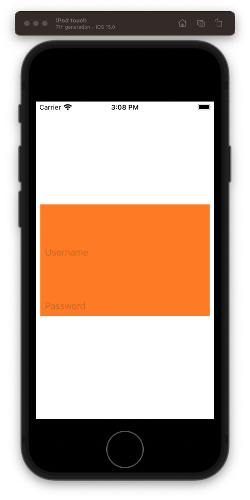

# Bankey

A canonical banking app for iOS developers.

## Login

### Create the UI

- Create a new project `Bankey`
- Remove story boards
  - Code snippets
- Rename `ViewController` to `LoginViewController`
 - Use built in Xcode refactoring  
- Create a `LoginView`
   - Create a `Files` directory
   - Create a `Login` directory

### Plain UIView
Create `LoginView` use snippet

- explain what's going on with `UIVIew`
- Start with just empty `UIView` orange background


**Loginview**

```swift
import Foundation
import UIKit

class LoginView: UIView {
    
    override init(frame: CGRect) {
        super.init(frame: frame)
        
        style()
        layout()
    }
    
    required init?(coder: NSCoder) {
        fatalError("init(coder:) has not been implemented")
    }
    
    override var intrinsicContentSize: CGSize {
        return CGSize(width: 200, height: 200)
    }
}

extension LoginView {
    
    func style() {
        translatesAutoresizingMaskIntoConstraints = false
        backgroundColor = .orange
    }
    
    func layout() {
        
    }
}
```

**LoginViewController**

```swift
//
//  ViewController.swift
//  Test1
//
//  Created by jrasmusson on 2021-09-24.
//

import UIKit

class LoginViewController: UIViewController {

    let loginView = LoginView()
    
    override func viewDidLoad() {
        super.viewDidLoad()
        style()
        layout()
    }
}

extension LoginViewController {
    private func style() {
        loginView.translatesAutoresizingMaskIntoConstraints = false
        
    }
    
    private func layout() {
        view.addSubview(loginView)
        
        NSLayoutConstraint.activate([
            loginView.centerYAnchor.constraint(equalTo: view.centerYAnchor),
            loginView.leadingAnchor.constraint(equalToSystemSpacingAfter: view.leadingAnchor, multiplier: 1),
            view.trailingAnchor.constraint(equalToSystemSpacingAfter: loginView.trailingAnchor, multiplier: 1)
        ])
    }
}
```

### Adding a textfield

Add single `textfield` and delegate

- Comment on how nice it is to access anchors directly compared to view controller

**LoginView**

```swift
class LoginView: UIView {
    
    let usernameTextField = UITextField()
```

```swift
extension LoginView {
    
    func style() {        
        usernameTextField.translatesAutoresizingMaskIntoConstraints = false
        usernameTextField.placeholder = "Username"
        usernameTextField.delegate = self
    }
    
    func layout() {
        addSubview(usernameTextField)
        
        NSLayoutConstraint.activate([
            usernameTextField.topAnchor.constraint(equalToSystemSpacingBelow: topAnchor, multiplier: 1),
            usernameTextField.leadingAnchor.constraint(equalToSystemSpacingAfter: leadingAnchor, multiplier: 1),
            trailingAnchor.constraint(equalToSystemSpacingAfter: usernameTextField.trailingAnchor, multiplier: 1)
        ])
    }
}
```

And the text field delegate.

```swift
// MARK: - UITextFieldDelegate
extension LoginView: UITextFieldDelegate {
    
    func textFieldShouldReturn(_ textField: UITextField) -> Bool {
        usernameTextField.endEditing(true)
        return true
    }
    
    func textFieldShouldEndEditing(_ textField: UITextField) -> Bool {
        if textField.text != "" {
            return true
        } else {
            return false
        }
    }
    
    func textFieldDidEndEditing(_ textField: UITextField) {
    }
}
```


### Embedding in a stack view

Not bad. But these elements would fit nicely in a `UIStackView`. Let's try that.

```swift
class LoginView: UIView {
    
    let stackView = UIStackView()
```

```swift
extension LoginView {
    
    func style() {        
        stackView.translatesAutoresizingMaskIntoConstraints = false
        stackView.axis = .vertical
        stackView.spacing = 8
    }

    func layout() {
        stackView.addArrangedSubview(usernameTextField)
        addSubview(stackView)
        
        // StackView
        NSLayoutConstraint.activate([
            stackView.topAnchor.constraint(equalToSystemSpacingBelow: topAnchor, multiplier: 1),
            stackView.leadingAnchor.constraint(equalToSystemSpacingAfter: leadingAnchor, multiplier: 1),
            trailingAnchor.constraint(equalToSystemSpacingAfter: stackView.trailingAnchor, multiplier: 1),
            bottomAnchor.constraint(equalToSystemSpacingBelow: stackView.bottomAnchor, multiplier: 1)
        ])
    }
```


### Challenge: Add password field

Get students to add `passwordTextField` to view embedded in stackview just like `usernameTextField`.

```swift
let passwordTextField = UITextField()

passwordTextField.translatesAutoresizingMaskIntoConstraints = false
passwordTextField.placeholder = "Password"
passwordTextField.isSecureTextEntry = true
passwordTextField.delegate = self

stackView.addArrangedSubview(passwordTextField)
```



## Getting rid of intrinsic content size

Now that we have our elements embedded in a stack view, and each has their own intrinsic content size, our view itself doesn't need to override. Can delete.

Explain what intrinisc content size is, and how it works. To learn more about it and autolayout in general consider taking my [Auto Layout Course](https://www.udemy.com/course/level-up-in-swift/?referralCode=BBCF1340150A86E7F6C4).

 


	- Add divider
		- Show other way constraint can be added `isActive`
	- Round corners
	
	
```swift
//
//  LoginView.swift
//  Bankey
//
//  Created by jrasmusson on 2021-09-23.
//

import Foundation
import UIKit

class LoginView: UIView {
    
    let stackView = UIStackView()
    let usernameTextField = UITextField()
    let passwordTextField = UITextField()
    let dividerView = UIView()
    
    override init(frame: CGRect) {
        super.init(frame: frame)
        style()
        layout()
    }
    
    required init?(coder: NSCoder) {
        fatalError("init(coder:) has not been implemented")
    }
    
    override var intrinsicContentSize: CGSize {
        return CGSize(width: UIView.noIntrinsicMetric, height: UIView.noIntrinsicMetric)
    }
}

extension LoginView {
    
    private func style() {
        translatesAutoresizingMaskIntoConstraints = false
        
        stackView.translatesAutoresizingMaskIntoConstraints = false
        stackView.axis = .vertical
        stackView.spacing = 8
        
        usernameTextField.translatesAutoresizingMaskIntoConstraints = false
        usernameTextField.placeholder = "Username"
        usernameTextField.delegate = self

        dividerView.translatesAutoresizingMaskIntoConstraints = false
        dividerView.backgroundColor = .secondarySystemFill

        passwordTextField.translatesAutoresizingMaskIntoConstraints = false
        passwordTextField.placeholder = "Password"
        passwordTextField.delegate = self
                
        layer.cornerRadius = 5
        clipsToBounds = true
    }
    
    private func layout() {
        stackView.addArrangedSubview(usernameTextField)
        stackView.addArrangedSubview(dividerView)
        stackView.addArrangedSubview(passwordTextField)

        addSubview(stackView)
        
        // StackView
        NSLayoutConstraint.activate([
            stackView.topAnchor.constraint(equalToSystemSpacingBelow: topAnchor, multiplier: 1),
            stackView.leadingAnchor.constraint(equalToSystemSpacingAfter: leadingAnchor, multiplier: 1),
            trailingAnchor.constraint(equalToSystemSpacingAfter: stackView.trailingAnchor, multiplier: 1),
            bottomAnchor.constraint(equalToSystemSpacingBelow: stackView.bottomAnchor, multiplier: 1)
        ])
        
        dividerView.heightAnchor.constraint(equalToConstant: 1).isActive = true
    }
}

// MARK: - UITextFieldDelegate

extension LoginView: UITextFieldDelegate {
    
    func textFieldShouldReturn(_ textField: UITextField) -> Bool {
        usernameTextField.endEditing(true)
        passwordTextField.endEditing(true)
        return true
    }
    
    func textFieldShouldEndEditing(_ textField: UITextField) -> Bool {
        if textField.text != "" {
            return true
        } else {
            return false
        }
    }
    
    func textFieldDidEndEditing(_ textField: UITextField) {
        if let username = usernameTextField.text {
            print(username)
        }
    }
}
```

Switch to `LoginViewController`.

- add `signInButton`

```swift
//
//  ViewController.swift
//  Bankey
//
//  Created by jrasmusson on 2021-09-23.
//

import UIKit

class LoginViewController: UIViewController {

    let loginView = LoginView()
    let signInButton = UIButton(type: .system)
    
    override func viewDidLoad() {
        super.viewDidLoad()
        style()
        layout()
    }
}

extension LoginViewController {
    
    private func style() {
        view.backgroundColor = .secondarySystemFill
        
        loginView.translatesAutoresizingMaskIntoConstraints = false
        loginView.backgroundColor = .systemBackground

        signInButton.translatesAutoresizingMaskIntoConstraints = false
        signInButton.configuration = .filled()
        signInButton.setTitle("Sign In", for: [])
    }
    
    private func layout() {
        view.addSubview(loginView)
        view.addSubview(signInButton)
        
        // Login
        NSLayoutConstraint.activate([
            loginView.leadingAnchor.constraint(equalToSystemSpacingAfter: view.leadingAnchor, multiplier: 2),
            view.trailingAnchor.constraint(equalToSystemSpacingAfter: loginView.trailingAnchor, multiplier: 2),
            view.centerYAnchor.constraint(equalTo: loginView.centerYAnchor),
        ])
        
        // Button
        NSLayoutConstraint.activate([
            signInButton.topAnchor.constraint(equalToSystemSpacingBelow: loginView.bottomAnchor, multiplier: 2),
            signInButton.leadingAnchor.constraint(equalTo: loginView.leadingAnchor),
            signInButton.trailingAnchor.constraint(equalTo: loginView.trailingAnchor),
        ])
    }
}
```


### Handle login

Add the error message

```swift
    let errorMessageLabel = UILabel()
    
    var username: String? {
        return loginView.usernameTextField.text
    }

    var password: String? {
        return loginView.passwordTextField.text
    }
```

```swift
    private func style() {
        signInButton.configuration?.imagePadding = 8 // for indicator spacing
        signInButton.addTarget(self, action: #selector(signInTapped), for: .primaryActionTriggered)
        
        errorMessageLabel.translatesAutoresizingMaskIntoConstraints = false
        errorMessageLabel.textAlignment = .center
        errorMessageLabel.textColor = .systemRed
        errorMessageLabel.numberOfLines = 0
        errorMessageLabel.isHidden = true
    }
```

```swift
    private func layout() {
        view.addSubview(errorMessageLabel)
```

```swift
    private func layout() {
        
        // Error message
        NSLayoutConstraint.activate([
            errorMessageLabel.topAnchor.constraint(equalToSystemSpacingBelow: signInButton.bottomAnchor, multiplier: 2),
            errorMessageLabel.leadingAnchor.constraint(equalTo: loginView.leadingAnchor),
            errorMessageLabel.trailingAnchor.constraint(equalTo: loginView.trailingAnchor)
        ])
    }
```

```swift
// MARK: Actions
extension LoginViewController {
    @objc func signInTapped(sender: UIButton) {
        errorMessageLabel.isHidden = true
        login()
    }
    
    private func login() {
        guard let username = username, let password = password else {
            assertionFailure("Username / password should never be nil")
            return
        }

        if username.isEmpty || password.isEmpty {
            configureView(withMessage: "Username / password cannot be blank")
            return
        }
        
        if username == "Kevin" && password == "Welcome" {
            print("Welcome!")
            signInButton.configuration?.showsActivityIndicator = true
        } else {
            configureView(withMessage: "Incorrect username / password")
        }
    }
    
    private func configureView(withMessage message: String) {
        errorMessageLabel.isHidden = false
        errorMessageLabel.text = message
    }
}
```

- Discuss `assertionFailure`.
- Discuss activity indicator

### Adding titles

- Excersise for reader
- Setup variables `titleLabel` `subtitleLabel`.

**LoginViewController**

```swift
    let titleLabel = UILabel()
    let subtitleLabel = UILabel()

titleLabel.translatesAutoresizingMaskIntoConstraints = false
titleLabel.textAlignment = .center
titleLabel.font = UIFont.preferredFont(forTextStyle: .largeTitle)
titleLabel.adjustsFontForContentSizeCategory = true

subtitleLabel.translatesAutoresizingMaskIntoConstraints = false
subtitleLabel.textAlignment = .center
subtitleLabel.font = UIFont.preferredFont(forTextStyle: .title1)
subtitleLabel.adjustsFontForContentSizeCategory = true
```

```swift
private func layout() {
    view.addSubview(titleLabel)
    view.addSubview(subtitleLabel)

    // Title
    NSLayoutConstraint.activate([
        subtitleLabel.topAnchor.constraint(equalToSystemSpacingBelow: titleLabel.bottomAnchor, multiplier: 3),
        titleLabel.centerXAnchor.constraint(equalTo: view.centerXAnchor)
    ])
    
    // Subtitle
    NSLayoutConstraint.activate([
        loginView.topAnchor.constraint(equalToSystemSpacingBelow: subtitleLabel.bottomAnchor, multiplier: 3),
        subtitleLabel.leadingAnchor.constraint(equalTo: loginView.leadingAnchor),
        subtitleLabel.trailingAnchor.constraint(equalTo: loginView.trailingAnchor)
    ])
}
```

- Let them try. Show what you want.

### Discussion

This is a bit tricker than it looks because we want the labels to group nicely with the `loginView` in the middel.

So instead of pinning to the top, we pin relative to the `loginView` in the middle. Starting with the subtitle.

Also show them what they get for free sticking to `DynamicFont`. Like and dark mode. Control+Shift+A to toggle.


## Full Source

**LoginViewController**

```swift
//
//  ViewController.swift
//  Bankey
//
//  Created by jrasmusson on 2021-09-23.
//

import UIKit

class LoginViewController: UIViewController {

    let titleLabel = UILabel()
    let subtitleLabel = UILabel()
    
    let loginView = LoginView()
    let signInButton = UIButton(type: .system)
    let errorMessageLabel = UILabel()
    
    var username: String? {
        return loginView.usernameTextField.text
    }

    var password: String? {
        return loginView.passwordTextField.text
    }

    override func viewDidLoad() {
        super.viewDidLoad()
        style()
        layout()
    }
}

extension LoginViewController {
    
    private func style() {
        view.backgroundColor = .systemBackground
        
        titleLabel.translatesAutoresizingMaskIntoConstraints = false
        titleLabel.textAlignment = .center
        titleLabel.font = UIFont.preferredFont(forTextStyle: .largeTitle)
        titleLabel.adjustsFontForContentSizeCategory = true
        titleLabel.text = "Bankey"

        subtitleLabel.translatesAutoresizingMaskIntoConstraints = false
        subtitleLabel.textAlignment = .center
        subtitleLabel.font = UIFont.preferredFont(forTextStyle: .title3)
        subtitleLabel.adjustsFontForContentSizeCategory = true
        subtitleLabel.numberOfLines = 0
        subtitleLabel.text = "Your premium source for all things banking!"

        loginView.translatesAutoresizingMaskIntoConstraints = false
        loginView.backgroundColor = .secondarySystemBackground

        signInButton.translatesAutoresizingMaskIntoConstraints = false
        signInButton.configuration = .filled()
        signInButton.configuration?.imagePadding = 8 // for indicator spacing
        signInButton.setTitle("Sign In", for: [])
        signInButton.addTarget(self, action: #selector(signInTapped), for: .primaryActionTriggered)
        
        errorMessageLabel.translatesAutoresizingMaskIntoConstraints = false
        errorMessageLabel.textAlignment = .center
        errorMessageLabel.textColor = .systemRed
        errorMessageLabel.numberOfLines = 0
        errorMessageLabel.isHidden = true
    }
    
    private func layout() {
        view.addSubview(titleLabel)
        view.addSubview(subtitleLabel)
        view.addSubview(loginView)
        view.addSubview(signInButton)
        view.addSubview(errorMessageLabel)

        // Title
        NSLayoutConstraint.activate([
            subtitleLabel.topAnchor.constraint(equalToSystemSpacingBelow: titleLabel.bottomAnchor, multiplier: 3),
            titleLabel.centerXAnchor.constraint(equalTo: view.centerXAnchor)
        ])
        
        // Subtitle
        NSLayoutConstraint.activate([
            loginView.topAnchor.constraint(equalToSystemSpacingBelow: subtitleLabel.bottomAnchor, multiplier: 3),
            subtitleLabel.leadingAnchor.constraint(equalTo: loginView.leadingAnchor),
            subtitleLabel.trailingAnchor.constraint(equalTo: loginView.trailingAnchor)
        ])
        
        // Login
        NSLayoutConstraint.activate([
            loginView.leadingAnchor.constraint(equalToSystemSpacingAfter: view.leadingAnchor, multiplier: 2),
            view.trailingAnchor.constraint(equalToSystemSpacingAfter: loginView.trailingAnchor, multiplier: 2),
            view.centerYAnchor.constraint(equalTo: loginView.centerYAnchor),
        ])
        
        // Button
        NSLayoutConstraint.activate([
            signInButton.topAnchor.constraint(equalToSystemSpacingBelow: loginView.bottomAnchor, multiplier: 2),
            signInButton.leadingAnchor.constraint(equalTo: loginView.leadingAnchor),
            signInButton.trailingAnchor.constraint(equalTo: loginView.trailingAnchor),
        ])
        
        // Error message
        NSLayoutConstraint.activate([
            errorMessageLabel.topAnchor.constraint(equalToSystemSpacingBelow: signInButton.bottomAnchor, multiplier: 2),
            errorMessageLabel.leadingAnchor.constraint(equalTo: loginView.leadingAnchor),
            errorMessageLabel.trailingAnchor.constraint(equalTo: loginView.trailingAnchor)
        ])
    }
}

// MARK: Actions
extension LoginViewController {
    @objc func signInTapped(sender: UIButton) {
        errorMessageLabel.isHidden = true
        login()
    }
    
    private func login() {
        guard let username = username, let password = password else {
            assertionFailure("Username / password should never be nil")
            return
        }

        if username.isEmpty || password.isEmpty {
            configureView(withMessage: "Username / password cannot be blank")
            return
        }
        
        if username == "Kevin" && password == "Welcome" {
            print("Welcome!")
            signInButton.configuration?.showsActivityIndicator = true
        } else {
            configureView(withMessage: "Incorrect username / password")
        }
    }
    
    private func configureView(withMessage message: String) {
        errorMessageLabel.isHidden = false
        errorMessageLabel.text = message
    }
}
```

**LoginView**

```swift
//
//  LoginView.swift
//  Bankey
//
//  Created by jrasmusson on 2021-09-23.
//

import Foundation
import UIKit

class LoginView: UIView {
    
    let stackView = UIStackView()
    let usernameTextField = UITextField()
    let passwordTextField = UITextField()
    let dividerView = UIView()
    
    override init(frame: CGRect) {
        super.init(frame: frame)
        style()
        layout()
    }
    
    required init?(coder: NSCoder) {
        fatalError("init(coder:) has not been implemented")
    }
    
    override var intrinsicContentSize: CGSize {
        return CGSize(width: UIView.noIntrinsicMetric, height: UIView.noIntrinsicMetric)
    }
}

extension LoginView {
    
    private func style() {
        translatesAutoresizingMaskIntoConstraints = false
        
        stackView.translatesAutoresizingMaskIntoConstraints = false
        stackView.axis = .vertical
        stackView.spacing = 8
        
        usernameTextField.translatesAutoresizingMaskIntoConstraints = false
        usernameTextField.placeholder = "Username"
        usernameTextField.delegate = self

        dividerView.translatesAutoresizingMaskIntoConstraints = false
        dividerView.backgroundColor = .secondarySystemFill

        passwordTextField.translatesAutoresizingMaskIntoConstraints = false
        passwordTextField.placeholder = "Password"
        passwordTextField.isSecureTextEntry = true
        passwordTextField.delegate = self
                
        layer.cornerRadius = 5
        clipsToBounds = true
    }
    
    private func layout() {
        stackView.addArrangedSubview(usernameTextField)
        stackView.addArrangedSubview(dividerView)
        stackView.addArrangedSubview(passwordTextField)

        addSubview(stackView)
        
        // StackView
        NSLayoutConstraint.activate([
            stackView.topAnchor.constraint(equalToSystemSpacingBelow: topAnchor, multiplier: 1),
            stackView.leadingAnchor.constraint(equalToSystemSpacingAfter: leadingAnchor, multiplier: 1),
            trailingAnchor.constraint(equalToSystemSpacingAfter: stackView.trailingAnchor, multiplier: 1),
            bottomAnchor.constraint(equalToSystemSpacingBelow: stackView.bottomAnchor, multiplier: 1)
        ])
        
        dividerView.heightAnchor.constraint(equalToConstant: 1).isActive = true
    }
}

// MARK: - UITextFieldDelegate

extension LoginView: UITextFieldDelegate {
    
    func textFieldShouldReturn(_ textField: UITextField) -> Bool {
        usernameTextField.endEditing(true)
        passwordTextField.endEditing(true)
        return true
    }
    
    func textFieldShouldEndEditing(_ textField: UITextField) -> Bool {
        if textField.text != "" {
            return true
        } else {
            return false
        }
    }
    
    func textFieldDidEndEditing(_ textField: UITextField) {
        if let username = usernameTextField.text {
            print(username)
        }
    }
}
```


