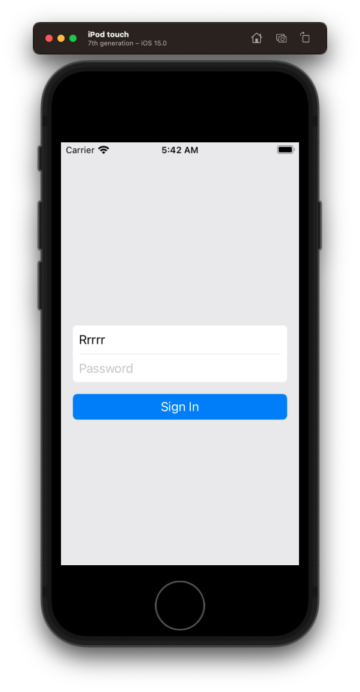

# Bankey

A canonical banking app for iOS developers.

## Login

### Create the UI

- Create a new project
- Remove story boards
- Rename `ViewController` to `LoginViewController`
- Create a `LoginView`
	- Start with just empty `UIView` orange background
	- Add single `textfield` and delegate
	- Then embed within `stackView`
	- Add password field
	- Add divider
		- Show other way constraint can be added `isActive`
	- Round corners
	
	
```swift
//
//  LoginView.swift
//  Bankey
//
//  Created by jrasmusson on 2021-09-23.
//

import Foundation
import UIKit

class LoginView: UIView {
    
    let stackView = UIStackView()
    let usernameTextField = UITextField()
    let passwordTextField = UITextField()
    let dividerView = UIView()
    
    override init(frame: CGRect) {
        super.init(frame: frame)
        style()
        layout()
    }
    
    required init?(coder: NSCoder) {
        fatalError("init(coder:) has not been implemented")
    }
    
    override var intrinsicContentSize: CGSize {
        return CGSize(width: UIView.noIntrinsicMetric, height: UIView.noIntrinsicMetric)
    }
}

extension LoginView {
    
    private func style() {
        translatesAutoresizingMaskIntoConstraints = false
        
        stackView.translatesAutoresizingMaskIntoConstraints = false
        stackView.axis = .vertical
        stackView.spacing = 8
        
        usernameTextField.translatesAutoresizingMaskIntoConstraints = false
        usernameTextField.placeholder = "Username"
        usernameTextField.delegate = self

        dividerView.translatesAutoresizingMaskIntoConstraints = false
        dividerView.backgroundColor = .secondarySystemFill

        passwordTextField.translatesAutoresizingMaskIntoConstraints = false
        passwordTextField.placeholder = "Password"
        passwordTextField.delegate = self
                
        layer.cornerRadius = 5
        clipsToBounds = true
    }
    
    private func layout() {
        stackView.addArrangedSubview(usernameTextField)
        stackView.addArrangedSubview(dividerView)
        stackView.addArrangedSubview(passwordTextField)

        addSubview(stackView)
        
        // StackView
        NSLayoutConstraint.activate([
            stackView.topAnchor.constraint(equalToSystemSpacingBelow: topAnchor, multiplier: 1),
            stackView.leadingAnchor.constraint(equalToSystemSpacingAfter: leadingAnchor, multiplier: 1),
            trailingAnchor.constraint(equalToSystemSpacingAfter: stackView.trailingAnchor, multiplier: 1),
            bottomAnchor.constraint(equalToSystemSpacingBelow: stackView.bottomAnchor, multiplier: 1)
        ])
        
        dividerView.heightAnchor.constraint(equalToConstant: 1).isActive = true
    }
}

// MARK: - UITextFieldDelegate

extension LoginView: UITextFieldDelegate {
    
    func textFieldShouldReturn(_ textField: UITextField) -> Bool {
        usernameTextField.endEditing(true)
        passwordTextField.endEditing(true)
        return true
    }
    
    func textFieldShouldEndEditing(_ textField: UITextField) -> Bool {
        if textField.text != "" {
            return true
        } else {
            return false
        }
    }
    
    func textFieldDidEndEditing(_ textField: UITextField) {
        if let username = usernameTextField.text {
            print(username)
        }
    }
}
```

Switch to `LoginViewController`.

- add `signInButton`

```swift
//
//  ViewController.swift
//  Bankey
//
//  Created by jrasmusson on 2021-09-23.
//

import UIKit

class LoginViewController: UIViewController {

    let loginView = LoginView()
    let signInButton = UIButton(type: .system)
    
    override func viewDidLoad() {
        super.viewDidLoad()
        style()
        layout()
    }
}

extension LoginViewController {
    
    private func style() {
        view.backgroundColor = .secondarySystemFill
        
        loginView.translatesAutoresizingMaskIntoConstraints = false
        loginView.backgroundColor = .white

        signInButton.translatesAutoresizingMaskIntoConstraints = false
        signInButton.configuration = .filled()
        signInButton.setTitle("Sign In", for: [])
    }
    
    private func layout() {
        view.addSubview(loginView)
        view.addSubview(signInButton)
        
        // Login
        NSLayoutConstraint.activate([
            loginView.leadingAnchor.constraint(equalToSystemSpacingAfter: view.leadingAnchor, multiplier: 2),
            view.trailingAnchor.constraint(equalToSystemSpacingAfter: loginView.trailingAnchor, multiplier: 2),
            view.centerYAnchor.constraint(equalTo: loginView.centerYAnchor),
        ])
        
        // Button
        NSLayoutConstraint.activate([
            signInButton.topAnchor.constraint(equalToSystemSpacingBelow: loginView.bottomAnchor, multiplier: 2),
            signInButton.leadingAnchor.constraint(equalTo: loginView.leadingAnchor),
            signInButton.trailingAnchor.constraint(equalTo: loginView.trailingAnchor),
        ])
    }
}
```



### Handle login

Add the error message

```swift
    let errorMessageLabel = UILabel()
    
    var username: String? {
        return loginView.usernameTextField.text
    }

    var password: String? {
        return loginView.passwordTextField.text
    }
```

```swift
    private func style() {
        signInButton.configuration?.imagePadding = 8 // for indicator spacing
        signInButton.addTarget(self, action: #selector(signInTapped), for: .primaryActionTriggered)
        
        errorMessageLabel.translatesAutoresizingMaskIntoConstraints = false
        errorMessageLabel.textAlignment = .center
        errorMessageLabel.textColor = .red
        errorMessageLabel.numberOfLines = 0
        errorMessageLabel.isHidden = true
    }
```

```swift
    private func layout() {
        view.addSubview(errorMessageLabel)
```

```swift
    private func layout() {
        
        // Error message
        NSLayoutConstraint.activate([
            errorMessageLabel.topAnchor.constraint(equalToSystemSpacingBelow: signInButton.bottomAnchor, multiplier: 2),
            errorMessageLabel.leadingAnchor.constraint(equalTo: loginView.leadingAnchor),
            errorMessageLabel.trailingAnchor.constraint(equalTo: loginView.trailingAnchor)
        ])
    }
```

```swift
// MARK: Actions
extension LoginViewController {
    @objc func signInTapped(sender: UIButton) {
        errorMessageLabel.isHidden = true
        login()
    }
    
    private func login() {
        guard let username = username, let password = password else {
            assertionFailure("Username / password should never be nil")
            return
        }

        if username.isEmpty || password.isEmpty {
            configureView(withMessage: "Username / password cannot be blank")
            return
        }
        
        if username == "Kevin" && password == "Welcome" {
            print("Welcome!")
            signInButton.configuration?.showsActivityIndicator = true
        } else {
            configureView(withMessage: "Incorrect username / password")
        }
    }
    
    private func configureView(withMessage message: String) {
        errorMessageLabel.isHidden = false
        errorMessageLabel.text = message
    }
}
```

- Discuss `assertionFailure`.
- Discuss activity indicator

### Adding a gradient