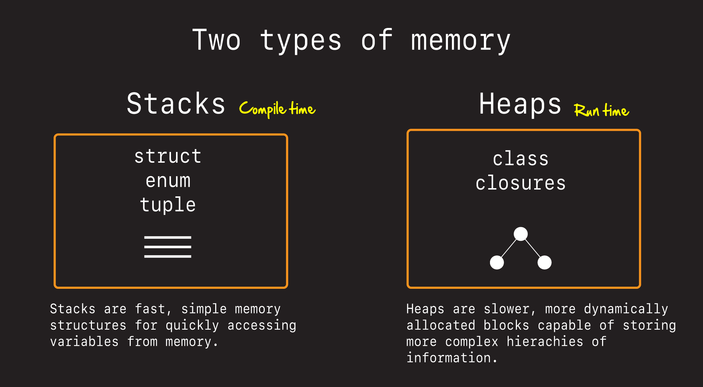
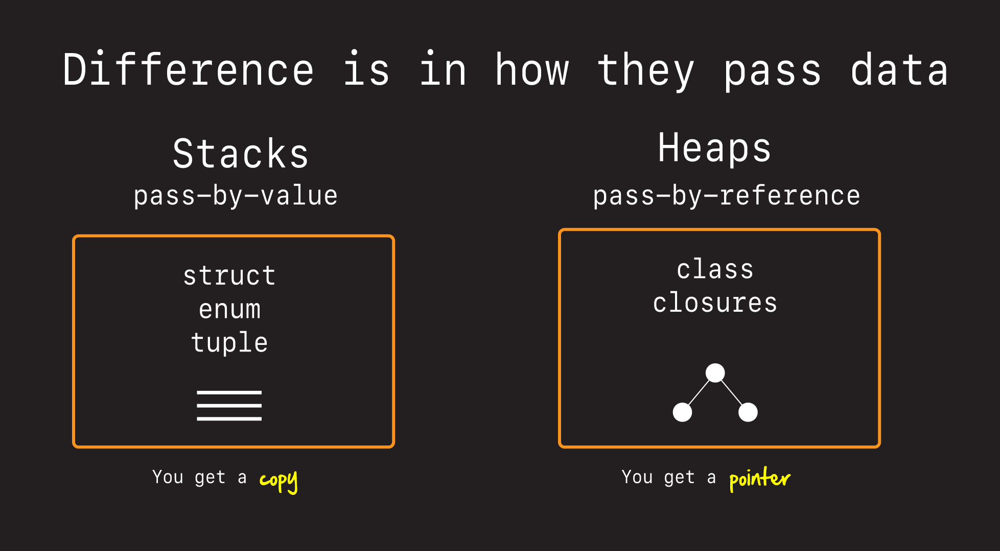
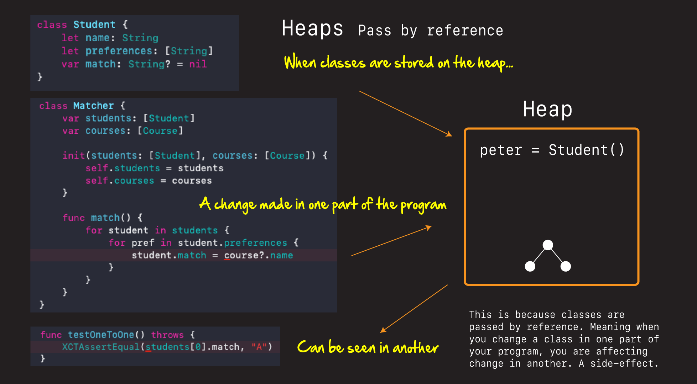
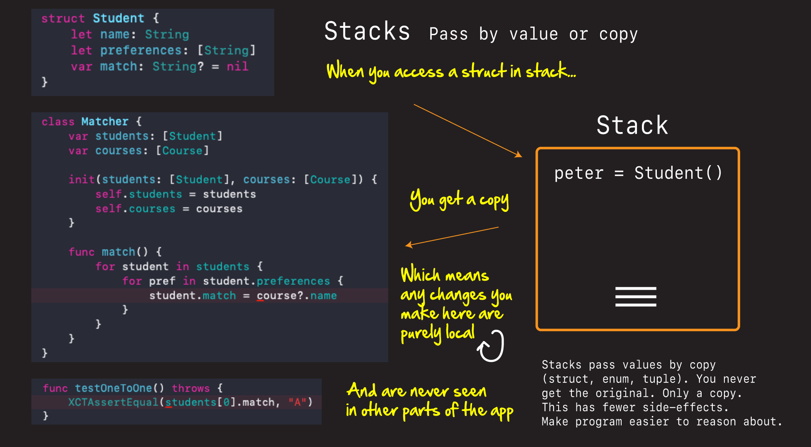

# Stack Vs Heap

Besides being an excellent interview question, knowing the difference between a stack and a heap will make you a better programmer.

Let's now look at:

- what stacks and heaps are
- why they are important, and then see
- how they affect us when we are programming

## Two types of memory



Swift uses two types of memory when accessing elements of it's programs: stacks and heaps.

*Stacks* are fast, light-weight data structures where data and variables are simply thrown onto one contigous block or memory, and then equally quickly pulled off. `structs`, `enums`, and `tuples` are stored on the stack. And they are how Swift achieves much of it's speed.

*Heaps* are a more complex form of data model where hierarchical data can dynamically be assigned and stored. `classes` along with `closures` are stored on the heap. And heaps are how complex object graphs are stored.

## What's the diff?



The big difference between stacks and heaps are that things stored on the stack are *passed-by-value* while things stored on the heap are *passed-by-reference*.

Passed-by-value means when you pop something off the stack, what you are getting is a copy of the thing on the stack. You are not getting access to the real thing.

This can be confusing if you are coming from another Object-Oriented language like Java or C++ where things are passed-by-reference. Meaning when you get something off the heap, what you are really getting is a pointer, or a reference to that object. A change here will affect the value of that object instance everywhere else.


## Why does this matter

This matters in Swift because if you are used to writing algorithms one way using classes, and switch over and try to write the same algorithm using structs (because you were told to favor structs over classes when writing Swift) you will be confused by the results.

Here, for example is a simple algorithm that matches students to courses by preference. It passes in students, as an array of classes, and then checks the state of student after to see if it has acheived the correct result.



**MatcherClass**

```swift
import XCTest

@testable import MatcherClass

class Student {
    let name: String
    let preferences: [String]
    var match: String? = nil
    
    init(name: String, preferences: [String], match: String? = nil, matched: Bool = false) {
        self.name = name
        self.preferences = preferences
        self.match = match
    }
}

class Course {
    let name: String
    var capacity: Int
    var hasCapacity: Bool {
        return capacity != 0
    }
    
    init(name: String, capacity: Int) {
        self.name = name
        self.capacity = capacity
    }
}

class Matcher {
    var students: [Student]
    var courses: [Course]

    init(students: [Student], courses: [Course]) {
        self.students = students
        self.courses = courses
    }
    
    func match() {
        for student in students {
            for pref in student.preferences {
                let course = courses.first { $0.name == pref }
                // 🕹 reference - change made here happens everywhere
                if course!.hasCapacity {
                    student.match = course?.name
                    course?.capacity -= 1
                    break
                }
            }
        }
    }
}

class MatcherTest: XCTestCase {
    var matcher: Matcher!
    
    override func setUp() {
        super.setUp()
    }
    
    func testOneToOne() throws {
        let peter = Student(name: "Peter", preferences: ["A", "B", "C"])
        let paul = Student(name: "Paul", preferences: ["A", "B", "C"])
        let mary = Student(name: "Mary", preferences: ["A", "B", "C"])
        
        let students = [peter, paul, mary]

        let courseA = Course(name: "A", capacity: 1)
        let courseB = Course(name: "B", capacity: 1)
        let courseC = Course(name: "C", capacity: 1)
        
        let courses = [courseA, courseB, courseC]

        let matcher = Matcher(students: students, courses: courses)
        matcher.match()
        
        // No return value necessary - can test on original object
        XCTAssertEqual(students[0].match, "A")
        XCTAssertEqual(students[1].match, "B")
        XCTAssertEqual(students[2].match, "C")
    }
}
```

This algorithm works because `Student` is a *class* and in Swift classes are passed-by-reference on the heap. Meaning a change to student in the algorithm is also seen in the function that called it.

Do the same thing now only with `Student` as a *struct* and you get completely different behavior.



**MatcherStruct**

```swift
import XCTest

@testable import MatcherStruct

/*
 With struct or more functional based solutions, values are copied. No references are passed.
 
 So when you call a function, that function makes a copy of the argument you passed in.
 Any changes to it will have no effect on the original.
 
 This is more performant because structs are cheap and stored on the stack.
 
 Also it is considered safer, and there can be no side-effects. Everything is local.
 This is why you see SwiftUI leaning so heavily on structs.
 More functional style of programming.
 
 */

struct Student {
    let name: String
    let preferences: [String]
    var match: String? = nil
}

struct Course {
    let name: String
    var capacity: Int
    var hasCapacity: Bool {
        return capacity != 0
    }
}

struct Matcher {
    // These are copies
    var students: [Student]
    var courses: [Course]
    
    mutating func match() -> [Student] { // mutating

        // Need to collect results
        var results = [Student]()

        for var student in students {
            for pref in student.preferences {
                print("student: \(student) preference: \(pref)")
                // all changes made here are local
                var course = courses.first { $0.name == pref }
                // and when you get a course like this, it is a copy too! No reference.
                // need to struct this more functionally (stuck here)
                if course!.hasCapacity {
                    print("match!")
                    student.match = course?.name
                    course?.capacity -= 1
                    results.append(student)
                    print("course: \(course?.name) capacity: \(course?.capacity)")
                    break
                }
            }
        }
        
        // must return a copy of the new results
        return results
    }
}

class MatcherTest: XCTestCase {
    var matcher: Matcher!
    
    override func setUp() {
        super.setUp()
    }
    
    func testOneToOne() throws {
        let peter = Student(name: "Peter", preferences: ["A", "B", "C"])
        let paul = Student(name: "Paul", preferences: ["A", "B", "C"])
        let mary = Student(name: "Mary", preferences: ["A", "B", "C"])
        
        let students = [peter, paul, mary]

        let courseA = Course(name: "A", capacity: 1)
        let courseB = Course(name: "B", capacity: 1)
        let courseC = Course(name: "C", capacity: 1)
        
        let courses = [courseA, courseB, courseC]

        var matcher = Matcher(students: students, courses: courses)
        let results = matcher.match()
        
        // Test the returned copy - not the originals
        XCTAssertEqual(results[0].match, "A")
        XCTAssertEqual(results[1].match, "B")
        XCTAssertEqual(results[2].match, "C")
    }
}
```

Here the same algorithm fails because here `Student` is a *struct* and structs are passed on the stack. Meaning you don't get a pointer to `Student` in the algorithm. You get a copy of student instead. Meaning changes made to student in the algorithm stay local. They do not ripple out.

## So which is better?

It's not so much about one being better than the other. Swift needs both because Swift straddles two different worlds:

- Object-Orected (OO) and 
- Functional programming

Much of iOS (UIKit) is built around the notion of `class`. `UIViewController`, `UITableView` - all these things are classes. So to build modern iOS apps today we need classes and heaps. And we need to understand how references to objects and classes work with that.

But there is another side of Swift, the functional side, that favors less passing around reference, and is more about writing programs in the style of functions. Writing Swift code as functions means caring less about state. State and state mutation has side-effects. Meaning when we change the state of something in one part of our program, that can sometimes have an adverse effect on another.

This is why you are seeing *SwiftUI* tilt more towards functions and state driven views (all views in SwiftUI are structs), and away from class based implementations that we are more used to in UIKit.

## What this means for you

The key takeaway for you here is this:

- Know that when you are working with `structs` you are passing around copies of objects. That's it.
- And when you are working with `classes`, you are getting a copy of a pointer to that object's reference. Meaning any change you make to that class, will be seen and felt elsewhere.
- Structs are on the stack.
- Classes are on the heap.

And once you wrap your head around that distinction, knowing where and when to use a `class` vs a `struct` becomes a lot easier.


## In Summary

Knowing the difference between stacks and heaps will help you make better sense of the Swift programming world. Now that you know:

- classes are passed by reference on the heap. and
- structs are passed as copies of the stack

You will be able to walk comfortably in both worlds. One isn't necessarily better than the other. Even SwiftUI still uses classes because it does have to store app state somewhere.

But knowing the differences and where and when to use each will not only enable you to answer this question in an interview, it will make you a better programmer.

🕹🚀🎉🌈

##Links that help

- [Understanding Swift Performance WWDC - 2016](https://developer.apple.com/videos/play/wwdc2016/416/)
- [Value and reference Types](https://developer.apple.com/swift/blog/?id=10)
- [Is Swift pass by value or pass by reference](https://stackoverflow.com/questions/27364117/is-swift-pass-by-value-or-pass-by-reference)
