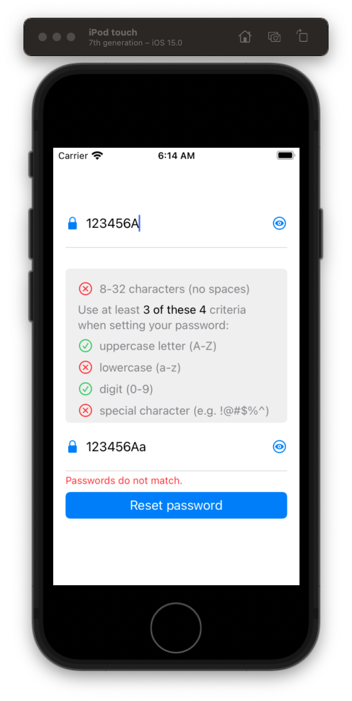

# Password Reset

## How best to tackle

When working on a story like this there are three questions that are good to ask?

1. What's the layout?
2. Are there any complex interactions?
3. Is there anything here I don't know how to do?

Layout is usually pretty straight forward. We just need to sit down, play with auto layout and do it.

Interactions can be a bit trickier. Here we need to build the layout, and then add the interactions our customers are looking for getting feedback as we go to make sure we are getting it right.

For things I don't know how to do, here I would create side projects, experiment and play until I figure things out, and then bring that back to the real project and then work my learnings in to there.

It's not a one step process. It's highly iterative. But it works and it gives me the flexibility to learn as we go.

So let's start with layout. Tackle that first control and the top. And just start building this screen one element at a time.

