# Creating the PasswordTextField

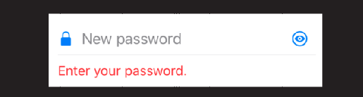

## New project

- Create a new UIKit project called `Password`

### Save your work 💾

Good stuff! Let's save this work.

```
> git add .
> git commit -m "feat: create new password project"
```

## Challenge 🕹

- How would you lay this out?
- Draw out the auto layout constraints needed to implement this design.
- Don't worry about the interactions - we'll cover that later. 

Good luck!

## A Solution ✅

Lots of ways we could lay this out (show on iPad).

One way would be like this.

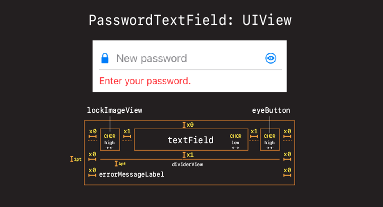

- Stack view Would probably work
- But instead went with customer view for full control over layout

## Creating the view

- Everything in UIKit is a view
- So when it comes to creating a custom control like this, a good place to start is with a brand new view.

Create a new view called `PasswordTextField`

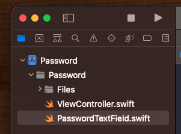

And let's start off with something like this.

**PasswordTextField**

```swift
import UIKit

class PasswordTextField: UIView {
    
    override init(frame: CGRect) {
        super.init(frame: frame)
        
        style()
        layout()
    }
    
    required init?(coder: NSCoder) {
        fatalError("init(coder:) has not been implemented")
    }
    
    override var intrinsicContentSize: CGSize {
        return CGSize(width: 200, height: 200)
    }
}

extension PasswordTextField {
    
    func style() {
        translatesAutoresizingMaskIntoConstraints = false
        backgroundColor = .systemOrange
    }
    
    func layout() {
        
    }
}
```

Simple view. Just going to be a 200x200 square for now. But let's add it to our view controller, just to create our canvas, and start building our password control from there.


**ViewController**

```swift
import UIKit

class ViewController: UIViewController {
    
    let newPasswordTextField = PasswordTextField()
    
    override func viewDidLoad() {
        super.viewDidLoad()
        style()
        layout()
    }
}

extension ViewController {
    func style() {
        newPasswordTextField.translatesAutoresizingMaskIntoConstraints = false
    }
    
    func layout() {
        view.addSubview(newPasswordTextField)
        
        NSLayoutConstraint.activate([
            newPasswordTextField.centerXAnchor.constraint(equalTo: view.centerXAnchor),
            newPasswordTextField.centerYAnchor.constraint(equalTo: view.centerYAnchor),
        ])
    }
}
```

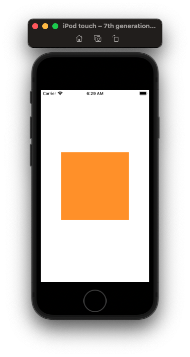

OK. Now we are ready to think about how to transform this orange box into a cool looking password text field.

Let's look at a couple of options on how we could layout this design.


### Adding the lockImageView

**PasswordTextField**

```swift
class PasswordTextField: UIView {
    
    let lockImageView = UIImageView(image: UIImage(systemName: "lock.fill"))

    func style() {        
        lockImageView.translatesAutoresizingMaskIntoConstraints = false

    func layout() {
        addSubview(lockImageView)

        // lock
        NSLayoutConstraint.activate([
            lockImageView.topAnchor.constraint(equalTo: topAnchor),
            lockImageView.leadingAnchor.constraint(equalTo: leadingAnchor),
        ])
```

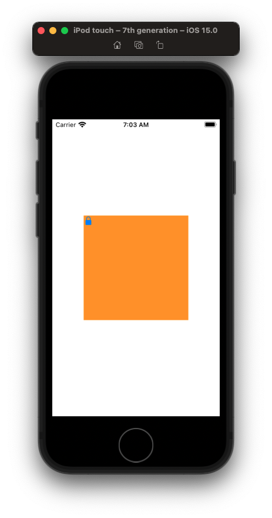

OK - not a bad start. Let's next work in the text field.

### Adding the textField

The text field is the crux of this view. It should really be the center, and these images and buttons should center off it. Let's pin it to the top, and then adjust our image view so it aligns along the y-axis in the middle.

**PasswordTextField**

```swift
let textField = UITextField()
let placeHolderText: String = "New password"

textField.translatesAutoresizingMaskIntoConstraints = false
textField.isSecureTextEntry = false // true
textField.placeholder = placeHolderText
textField.delegate = self
textField.keyboardType = .asciiCapable
textField.attributedPlaceholder = NSAttributedString(string:placeHolderText,
                                                     attributes: [NSAttributedString.Key.foregroundColor: UIColor.secondaryLabel])

addSubview(textField)

// lock
NSLayoutConstraint.activate([
    lockImageView.centerYAnchor.constraint(equalTo: textField.centerYAnchor),
    lockImageView.leadingAnchor.constraint(equalTo: leadingAnchor),
])
    
// textfield
NSLayoutConstraint.activate([
    textField.topAnchor.constraint(equalTo: topAnchor),
    textField.leadingAnchor.constraint(equalToSystemSpacingAfter: lockImageView.trailingAnchor, multiplier: 1),
])
```

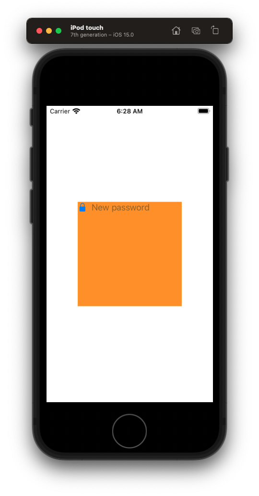

OK not bad. Let's make one more little adjustment. Let's make this text field a little more reusable by passing in that `placeHolder` text.

**PasswordTextField**

```swift
let placeHolderText: String
    
init(placeHolderText: String) {
    self.placeHolderText = placeHolderText
    
    super.init(frame: .zero)
    
    style()
    layout()
}
```

**ViewController**

```swift
class ViewController: UIViewController { 
    let newPasswordTextField = PasswordTextField(placeHolderText: "New password")
```

- Discussion. Talk about the initialization of variables in constructors.

### Challenge 🕹 Adding the eye button

See if you can add a plain button to the right of the text field.

Call it

`let eyeButton = UIButton(type: .custom)`

Don't worry about adding images or giving it a target action or anything. Just practice your auto layout, and see if you can place a button spaced just off the wall just like our `lockImageView`, centered along the y-axis to the `textField`.

### Solution ✅

```swift
let eyeButton = UIButton(type: .custom)

eyeButton.translatesAutoresizingMaskIntoConstraints = false
eyeButton.setImage(UIImage(systemName: "eye.circle"), for: .normal)
eyeButton.setImage(UIImage(systemName: "eye.slash.circle"), for: .selected)
eyeButton.addTarget(self, action: #selector(togglePasswordView), for: .touchUpInside)

addSubview(eyeButton)

// eye
NSLayoutConstraint.activate([
    eyeButton.centerYAnchor.constraint(equalTo: textField.centerYAnchor),
    eyeButton.leadingAnchor.constraint(equalToSystemSpacingAfter: textField.trailingAnchor, multiplier: 1),
    eyeButton.trailingAnchor.constraint(equalTo: trailingAnchor)
])

// MARK: - Actions
extension PasswordTextField {
    @objc func togglePasswordView(_ sender: Any) {
        textField.isSecureTextEntry.toggle()
        eyeButton.isSelected.toggle()
    }
}
```

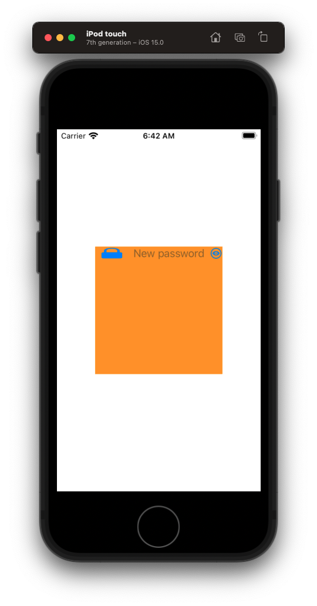

### Fixing the CHCR

OK not bad. Got some image compression going on here. If you were working with a junior developer and they asked you what was going on here what would you say?

- Explain CHCR.
- Explain what is going on here.
- Share the solution.

```swift
// CHCR
lockImageView.setContentHuggingPriority(UILayoutPriority.defaultHigh, for: .horizontal)
textField.setContentHuggingPriority(UILayoutPriority.defaultLow, for: .horizontal)
eyeButton.setContentHuggingPriority(UILayoutPriority.defaultHigh, for: .horizontal)
```

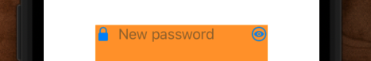

### Challenge 🕹 Adding the divider

See if you can add this `dividerView` as a `UIView`.

Make it:

- `1pt` height
- Flush `leading` and `trailing` to edge of view
- `8pts` (1x) underneath `textField`
-  `backgroundColor = separator`


### Solution ✅

**PasswordTextField**

```swift
let dividerView = UIView()

dividerView.translatesAutoresizingMaskIntoConstraints = false
dividerView.backgroundColor = .separator

addSubview(dividerView)

// divider
NSLayoutConstraint.activate([
    dividerView.leadingAnchor.constraint(equalTo: leadingAnchor),
    dividerView.trailingAnchor.constraint(equalTo: trailingAnchor),
    dividerView.heightAnchor.constraint(equalToConstant: 1),
    dividerView.topAnchor.constraint(equalToSystemSpacingBelow: textField.bottomAnchor, multiplier: 1)
])

override var intrinsicContentSize: CGSize {
    return CGSize(width: 200, height: 50)
}
```

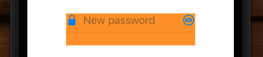

### Choosing the right color 🌈

Explain how you want to use semantically defined colors over system colors when styling your elements and controls.

See [this](https://github.com/jrasmusson/ios-starter-kit/blob/master/basics/Color/README.md) color guide.

### Challenge 🕹 Adding the error label

See if you can add the `errorLabel`:

- `4pts` beneath the `dividerView`
- Flush `leading` and `trailing` edges
- Preferred font `footnote`
- `textColor` = `systemRed`

### Solution ✅

**PasswordTextField**

```swift
let errorLabel = UILabel()

errorLabel.translatesAutoresizingMaskIntoConstraints = false
errorLabel.textColor = .systemRed
errorLabel.font = .preferredFont(forTextStyle: .footnote)
errorLabel.text = "Enter your password"
errorLabel.isHidden = false

addSubview(errorLabel)

// error
NSLayoutConstraint.activate([
    errorLabel.topAnchor.constraint(equalTo: dividerView.bottomAnchor, constant: 4),
    errorLabel.leadingAnchor.constraint(equalTo: leadingAnchor),
    errorLabel.trailingAnchor.constraint(equalTo: trailingAnchor),
])
```

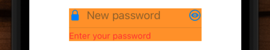

## Dealing with long text

What if our error label text gets really long? How should we handle that?

There are three options or dealing with long text on a label.

1. Trucate.
2. Adjust font size to fit width.
3. Go multiline.

To see each of these in action let's set some more explicit width constraints on our text field.

**ViewController**

```swift
NSLayoutConstraint.activate([
    newPasswordTextField.leadingAnchor.constraint(equalToSystemSpacingAfter: view.leadingAnchor, multiplier: 1),
    view.trailingAnchor.constraint(equalToSystemSpacingAfter: newPasswordTextField.trailingAnchor, multiplier: 1),
    newPasswordTextField.centerYAnchor.constraint(equalTo: view.centerYAnchor),
])
```

And then give our `errorLabel` some long text.

**PasswordTextField**

```swift
//        backgroundColor = .systemOrange
errorLabel.text = "Enter your password and again and again and again and again and again"
```

### Trucate

Truncate is what we get by default if the text in our label exceeds the allowed width.

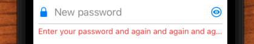

This is the option you go with if there simply isn't enough space to fit all the text. Spotify for example does this on their home page when there isn't enough space to fit all the artist and  title imformation for a given song.

### Adjust font size to fit width

Adjust font size to fit width is for when we want the text to reduce itself in size to fit into the allocated space.

We can specify a minimum amount we'd like the font to reduce by setting a `minimumScaleFactor` of `80%`. Meaning the font will reduce its in size `80%` but no more. 

```swift
errorLabel.adjustsFontSizeToFitWidth = true
errorLabel.minimumScaleFactor = 0.8
```

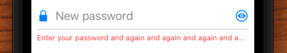

If we want the entire body of text into the allocated space regardless of size we can set the scale factor to `0`.

```swift
errorLabel.adjustsFontSizeToFitWidth = true
errorLabel.minimumScaleFactor = 0.0
```

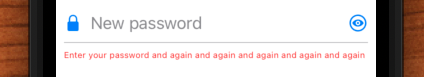

Pretty small. This option isn't ideal because it can make text very hard to read. Instead a better option is to often go multiline.

### Going multiline

We can make a label multiline like this:

```swift
errorLabel.numberOfLines = 0
errorLabel.lineBreakMode = .byWordWrapping
```

And add a little more height to accomodate the extra line like this:

```swift
override var intrinsicContentSize: CGSize {
    return CGSize(width: UIView.noIntrinsicMetric, height: 60)
}
```

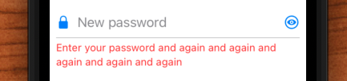

Multiline is nice because it keep the text ledgible and easy to read. To doesn't try to cram everything and generally leads to a nicer overall app experience.

The option you choose will depend on the context your label is being displayed in.

- Let the app truncate if you don't have room.
- Reduce the font size a little if you really don't have any more space.
- But go multline if you can as it keeps your app accessible and easy to read.

Let's go with the multine solution here for now and set our label text back to this:

```swift
errorLabel.text = "Your password must meet the requirements below"
```

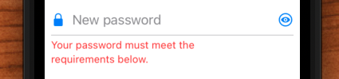

### Why are two words wrapped onto the next line?

You may be wondering why the words `requirements below` were both wrapped to a new line when the word `requirements` would have obviously fit on the line above.

You aren't imagining things. Apple does this by design. To prevent orphaned words from appearing along on their own line, Apple will sometimes group words together onto a new line.

[UILabel wrong word wrap in iOS 11](https://stackoverflow.com/questions/46200027/uilabel-wrong-word-wrap-in-ios-11)


## Embedding in a stack view

OK this is looking pretty good. But looking at our final design, I can see that this text field, along with the status view and the other text field, or pretty evenly spaced.

So let's head over to the `ViewController` and see if you can embed this in a stack view.

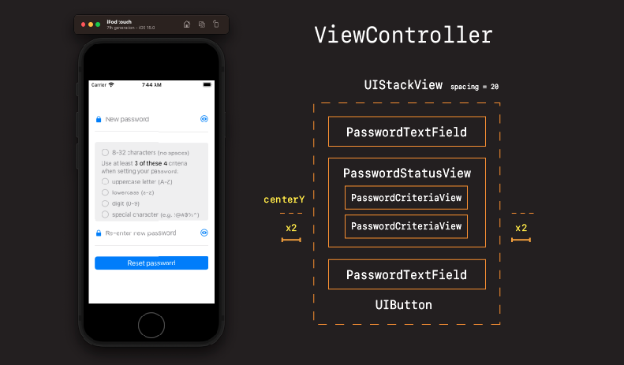

## Challenge 🕹 Adding the stack view

See if you can add our `newPasswordTextField` to a stack view in our view controller.

In the `ViewController` create a stack view:

`let stackView = UIStackView()`

- `vertical` axis
- `spacing` = `20`
- `centerY` layout
- `leading` and `trailing` of `16pts` or x2

And add our `newPasswordTextField` to it. Good luck!

## Solution ✅

**ViewController**

```swift
class ViewController: UIViewController {
    let stackView = UIStackView()
    let newPasswordTextField = PasswordTextField(placeHolderText: "New password")

extension ViewController {
    private func style() {
        stackView.translatesAutoresizingMaskIntoConstraints = false
        stackView.axis = .vertical
        stackView.spacing = 20

private func layout() {
    stackView.addArrangedSubview(newPasswordTextField)
    
    view.addSubview(stackView)
    
    NSLayoutConstraint.activate([
        stackView.centerYAnchor.constraint(equalTo: view.centerYAnchor),
        stackView.leadingAnchor.constraint(equalToSystemSpacingAfter: view.leadingAnchor, multiplier: 2),
        view.trailingAnchor.constraint(equalToSystemSpacingAfter: stackView.trailingAnchor, multiplier: 2)
    ])
}
```

Let's also remove our background color.

**PasswordTextField**

```swift
extension PasswordTextField {    
    func style() {
        translatesAutoresizingMaskIntoConstraints = false
//        backgroundColor = .systemOrange
```

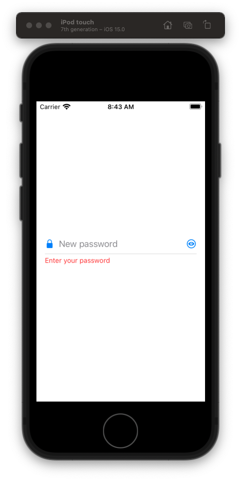

### Save your work 💾

Good stuff! Let's save this work.

```
> git add .
> git commit -m "feat: add layout for password text field"
```


### Summary

What we learned

- Custom views
- Auto layout pinning tips
- Semantic colors

Next...

### Links that help

- [Colors](https://github.com/jrasmusson/ios-starter-kit/blob/master/basics/Color/README.md)

