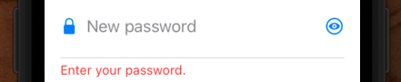

# Creating the PasswordTextField



## Challenge 🕹

- How would you lay this out?
- Grab a piece of paper and see if you can't draw out
 - The elements needed
 - Auto layout constraints needed to layout and align
 - Along with anything else you feel you may need to build this custom component

Don't worry about the interactions - we'll cover that later. Good luck!

## New project

- Create a new UIKit project called `Password`

## Creating the view

- Everything in UIKit is a view
- So when it comes to creating a custom control like this, a good place to start is with a brand new view.

Create a new view called `PasswordTextField`


And let's start off with something like this.

**PasswordTextField**

```swift
import UIKit

class PasswordTextField: UIView {
    
    override init(frame: CGRect) {
        super.init(frame: frame)
        
        style()
        layout()
    }
    
    required init?(coder: NSCoder) {
        fatalError("init(coder:) has not been implemented")
    }
    
    override var intrinsicContentSize: CGSize {
        return CGSize(width: 200, height: 200)
    }
}

extension PasswordTextField {
    
    func style() {
        translatesAutoresizingMaskIntoConstraints = false
        backgroundColor = .systemOrange
    }
    
    func layout() {
        
    }
}
```

Simple view. Just going to be a 200x200 square for now. But let's add it to our view controller, just to create our canvas, and start building our password control from there.


**ViewController**

```swift
import UIKit

class ViewController: UIViewController {
    
    let newPasswordTextField = PasswordTextField()
    
    override func viewDidLoad() {
        super.viewDidLoad()
        style()
        layout()
    }
}

extension ViewController {
    func style() {
        newPasswordTextField.translatesAutoresizingMaskIntoConstraints = false
    }
    
    func layout() {
        view.addSubview(newPasswordTextField)
        
        NSLayoutConstraint.activate([
            newPasswordTextField.centerXAnchor.constraint(equalTo: view.centerXAnchor),
            newPasswordTextField.centerYAnchor.constraint(equalTo: view.centerYAnchor),
        ])
    }
}
```


OK. Now we are ready to think about how to transform this orange box into a cool looking password text field.

Let's look at a couple of options on how we could layout this design.


## Laying out the elements

Grab your piece of paper where you did you initial design earlier, and reference it as we go through some different design options here (note to self - pull out iPad and draw).

- first go over the elements
- then discuss text field with left and right images/buttons
- divider
- error label

Think it would be easiest if we layed it out like this.


Now don't worry if your hand drawn images doesn't look exactly like this. I got here after some iterations and tweaking.

But I choose this layout because I felt I needed a lot of control over where every elements was placed. Let's lay it out.

### lockImageView

**PasswordTextField**

```swift
class PasswordTextField: UIView {
    
    let lockImageView = UIImageView(image: UIImage(systemName: "lock.fill"))

    func style() {        
        lockImageView.translatesAutoresizingMaskIntoConstraints = false

    func layout() {
        addSubview(lockImageView)

        // lock
        NSLayoutConstraint.activate([
            lockImageView.topAnchor.constraint(equalTo: topAnchor),
            lockImageView.leadingAnchor.constraint(equalTo: leadingAnchor),
        ])
```


OK - not a bad start. Let's next work in the text field.

### textField

The text field is the crux of this view. It should really be the cneter, and these images and buttons should center off it. Let's pin it to the top, and then adjust our image view so it aligns along the y-axis in the middle.

U R HERE


