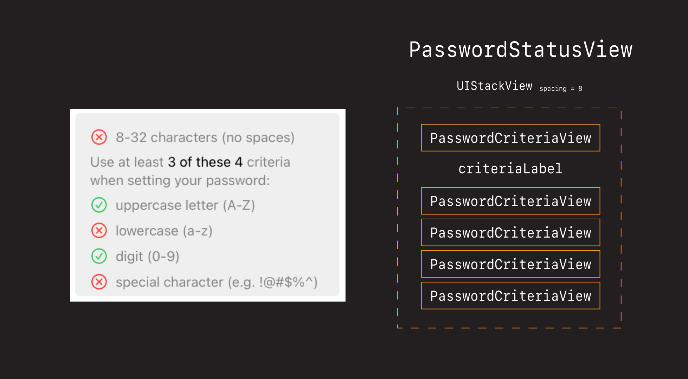

# PasswordStatusView

OK now that we've got our `PasswordCriteriaView` built,
lets use that to continue building our `PasswordStatusView`.



## Create the PasswordStatusView

- Create `PasswordStatusView` file
- Stub out the view

**PasswordStatusView**

```swift
import Foundation
import UIKit

class PasswordStatusView: UIView {
    
    override init(frame: CGRect) {
        super.init(frame: frame)
        
        style()
        layout()
    }
    
    required init?(coder: NSCoder) {
        fatalError("init(coder:) has not been implemented")
    }
    
    override var intrinsicContentSize: CGSize {
        return CGSize(width: 200, height: 200)
    }
}

extension PasswordStatusView {
    
    func style() {
        translatesAutoresizingMaskIntoConstraints = false
        backgroundColor = .systemOrange
    }
    
    func layout() {
        
    }
}
```

- Add to view controller

**ViewController**

```swift
let criteriaView = PasswordCriteriaView(text: "uppercase letter (A-Z)") // delete

let statusView = PasswordStatusView()
stackView.addArrangedSubview(statusView)
```


### Challengen 🕹 Add the stack view

Just like we did before, let's start by adding a stack view to our `PasswordStatusView`. 

- Define `let stackView = UIStackView()`
- Make it axis `verticial`
- Give it a spacing of `8 pts`

 

