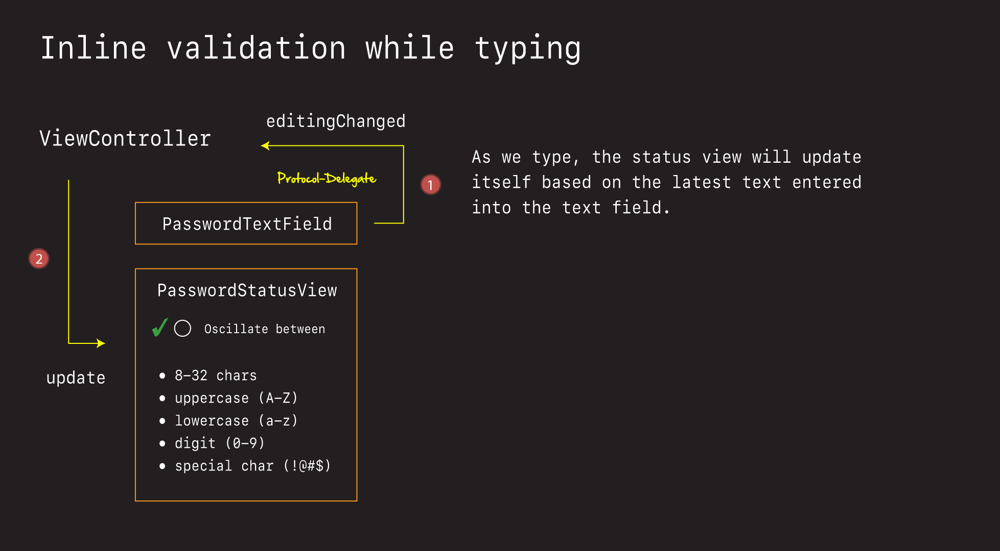
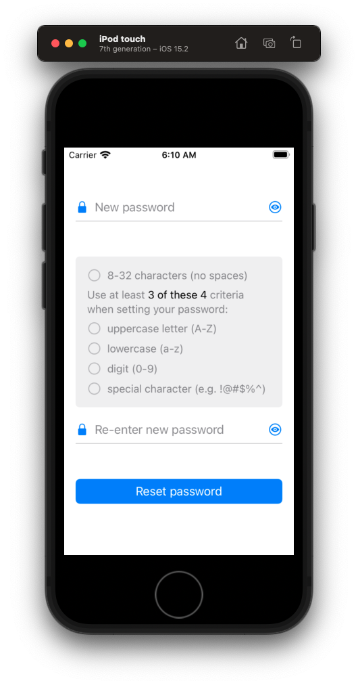
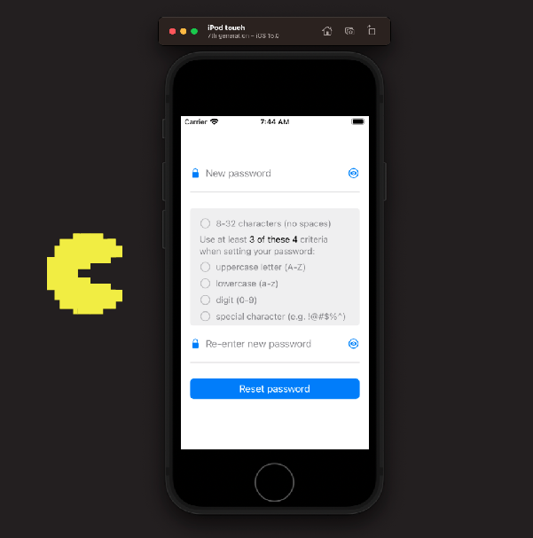
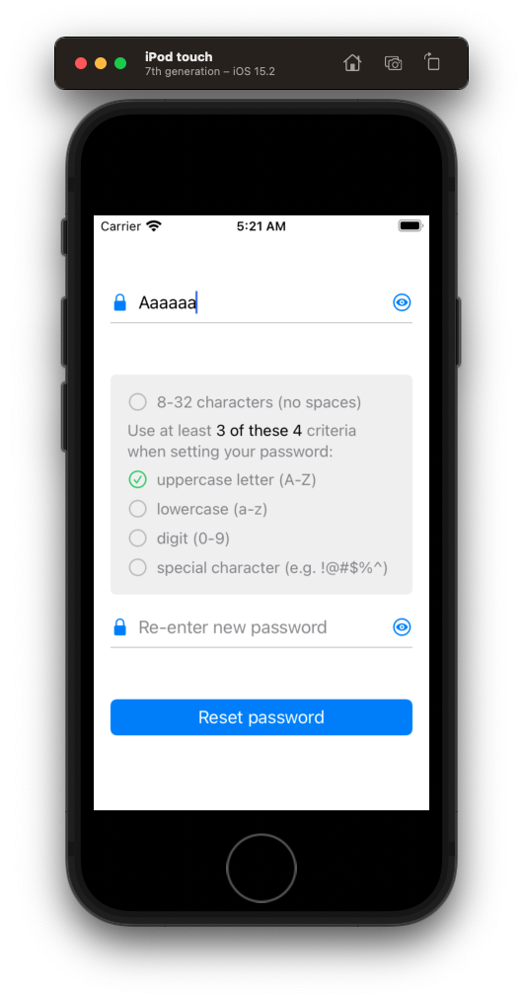
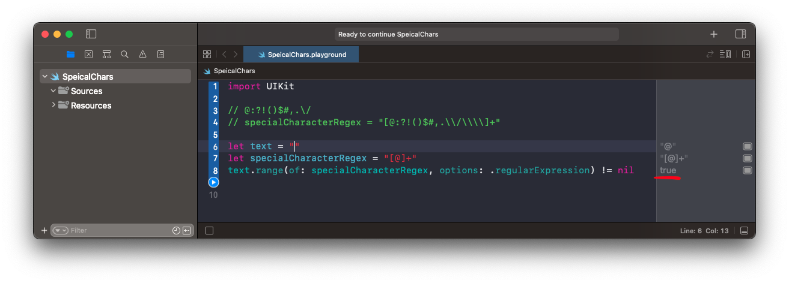
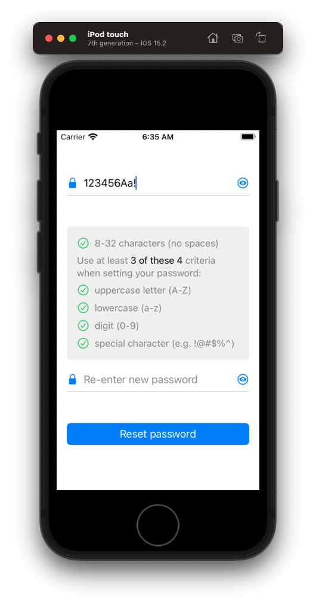

# Password Inline Interactions


There are two sets of interactions occurring in our password validation view:

1. Inline 
2. Loss of focus

The inline validation is what occurs as the user is typing. This update the individual criteria in the status view as they are typing, and gives them real-time feedback on which criteria they password pass while updating the view.

Loss of focus validation is what occurs when the text field losses focus, and the user wants to do they password validation check on the rules as a group.

Before we can tackle these problems, we are going to need a solid understanding of:

- how `UITextField` works
- something called `responder chain`

Let's review those now.

## Meet the UITextField

Goal here is to fold:

1. Get your more familiar with `UITexField`
2. Give you tools to problem solve.

Tackling a control like this is trickier than it sounds. There are a lot of interactions in there that we are doing to need to deal with. 

That's why I am going to show you my number one technique for building components like this. And that is first getting a thorough understanding how the underlying control, upon which our entire solution is going to work - the `UITextField`.

So what we are going to do first, is we are going to play with the `UITextField`, see what it does, and familiarize ourself with some of the nuances of how it works. We'll do this in a sandbox where we can play.

Then, once we're comfortable with how the `UITextField` works, we'll bring that knowledge back to the app, and incorporate our insights and finding there.

But let's start, by getting you some practice in creating your own sandbox.

## Challenge 🕹 Create a text field sandbox

1. Create new project (with or without storyboards).
2. Add a text field centered in the middle to the `ViewController`.
3. Register yourself as the text field's delegate.
4. Print out the contents of whatever the user types in the textfield.

Give that a go. Come back. And we'll do it together.

## Solution ✅

If you are unfamilar with controls your are going to be using as part of your solution, creating sandboxes where you can play with `UIKit` control like text fields and others is invaluable.

If you really want to go pro, you can even take this one step further, and add your sand box to your own personal git repos, and remind yourself how a particular control works by simply looking it up.

You can see my repos for the `UITextField` [here](https://github.com/jrasmusson/ios-starter-kit/blob/master/basics/UITextField/UITextField.md).

Let's now go over the various delegate methods, and see how each works.

**ViewController**

```swift
import UIKit

class ViewController: UIViewController {

    let textField = UITextField()

    override func viewDidLoad() {
        super.viewDidLoad()
        style()
        layout()
    }
}

extension ViewController {
    private func style() {
        textField.translatesAutoresizingMaskIntoConstraints = false
        textField.placeholder = "New password"
        textField.backgroundColor = .systemGray6
        textField.delegate = self

        // extra interaction
        textField.addTarget(self, action: #selector(textFieldEditingChanged), for: .editingChanged)
    }

    private func layout() {
        view.addSubview(textField)

        NSLayoutConstraint.activate([
            textField.centerYAnchor.constraint(equalTo: view.centerYAnchor),
            textField.leadingAnchor.constraint(equalToSystemSpacingAfter: view.leadingAnchor, multiplier: 2),
            view.trailingAnchor.constraint(equalToSystemSpacingAfter: textField.trailingAnchor, multiplier: 2)
        ])
    }
}

// MARK: - UITextFieldDelegate
extension ViewController: UITextFieldDelegate {

    // return NO to disallow editing.
    func textFieldShouldBeginEditing(_ textField: UITextField) -> Bool {
        return true
    }

    // became first responder
    func textFieldDidBeginEditing(_ textField: UITextField) {
    }

    // return YES to allow editing to stop and to resign first responder status.
    // return NO to disallow the editing session to end
    func textFieldShouldEndEditing(_ textField: UITextField) -> Bool {
        return true
    }

    // if implemented, called in place of textFieldDidEndEditing: ?
    func textFieldDidEndEditing(_ textField: UITextField) {
    }

    // detect - keypress
    // return NO to not change text
    func textField(_ textField: UITextField, shouldChangeCharactersIn range: NSRange, replacementString string: String) -> Bool {
        let word = textField.text ?? ""
        let char = string
        print("Default - shouldChangeCharactersIn: \(word) \(char)")
        return true
    }

    // called when 'clear' button pressed. return NO to ignore (no notifications)
    func textFieldShouldClear(_ textField: UITextField) -> Bool {
        return true
    }

    // called when 'return' key pressed. return NO to ignore.
    func textFieldShouldReturn(_ textField: UITextField) -> Bool {
        textField.endEditing(true) // resign first responder
        return true
    }
}

// MARK: - Extra Actions
extension ViewController {
    @objc func textFieldEditingChanged(_ sender: UITextField) {
        print("Extra - textFieldEditingChanged: \(sender.text)")
    }
}
```

## What is the first responder?

First responder is the designation UIKit gives a control who is first in line to receive a UIKit or Cocoa touch event.

When we use `UITextField`, and the user taps on the text field bringing up the keyboard, that text field becomes the first responder. It is going to respond to any touch events on the screen first, and get dibs on what happens before anyone else.

When we dismiss the keyboard, we give up the first responder designation. We are basically saying we are no longer first in line, anyone can receive events now. We resign the keyboard.

That's what first responder is.

But I would like to go just a little bit deepers and explain to you how first responder works. For that we need to understand something called the responder chain.

## What is the responder chain

- [Responder Chain](https://github.com/jrasmusson/ios-starter-kit/blob/master/advanced/Responder-Chain.md)

### Sandbox complete 🏝

OK. We are in a good spot here. Thanks to our playing in the sandbox we now:

- Understand how `UITextField` works
- Know what `firstResponder` means
- Have a deeper understanding of Cocoa touch and the `responder chain`, and
- We already know `protocol-delegate` works

We have everything we need to solve our first interaction problem. Let's now head over to the arcade and put some of this new found knowledge to work.

## How the inline interaction works

As the user types, we'll communicate back to our view controller using a protocol-delegate, passing the back the text as they type it in on the keyboard.



This will then result in an update call being made to the status view, in which each individual criteria will update itself.

Let's set it up!

## Receiving the just-in-time text

First let's hide the error label that we were permanently displaying on the text field. We'll show it later when an error occurs.

**PasswordTextField**

```swift
errorLabel.isHidden = true
```



Then let's register ourselves as the text field's delegate.


**PasswordTextField**

```swift
textField.delegate = self

// MARK: - UITextFieldDelegate
extension PasswordTextField: UITextFieldDelegate {

}
```

Being the delegate for the text field means implementating the `UITextFieldDelegate` protocol. We don't actually have to do anything to implement this protocol. Other than implement the interface.

Next let's capture the text as the user types by registering a target action on the text field itself.

**PasswordTextField**

```swift
// extra interaction
textField.addTarget(self, action: #selector(textFieldEditingChanged), for: .editingChanged)

@objc func textFieldEditingChanged(_ sender: UITextField) {
    print("foo - \(sender.text)")
}
```

Remember this is the extra interaction we are adding because the text field protocol-delegate doesn't quite give us what we want. But this target action does.

If we run this now, we should see the how word being printed out as we type.


Now that we have the text field hooked up. Let's add our own protocol-delegate for communicating this important information back to our view controller.


## Talking back to the view controller

We can pass the text, as the user types, back to the view controller via the protocol-delegate.


All we need to do is:

- define our protocol
- declare the delegate, and then
- fire the event as the user types

**PasswordTextField**

```swift
protocol PasswordTextFieldDelegate: AnyObject {
    func editingChanged(_ sender: PasswordTextField)
}

weak var delegate: PasswordTextFieldDelegate?

extension PasswordTextField {
    @objc func textFieldEditingChanged(_ sender: UITextField) {
        delegate?.editingChanged(self) // add
    }
}
```

And then register ourselves for this callback in our view controller.

**ViewController**

```swift
newPasswordTextField.delegate = self

// MARK: PasswordTextFieldDelegate
extension ViewController: PasswordTextFieldDelegate {
    func editingChanged(_ sender: PasswordTextField) {
        if sender === newPasswordTextField {
            // statusView.updateDisplay(sender.textField.text ?? "")
        }
    }
}
```

Eventually we are going to update our status view from here - passing in the text so the status view can figure out how to update itself.

But we can't do that yet. So let's go set that up now.

## Updating the status view



Updating the status view means checking the criteria of the password being passed it, and seeing which criteria are met.

We have five critera we want out passwords to meet.

- 8-32 characters no spaces
- at least one uppercase letter (A-Z)
- at least one lowercase letter (a-z)
- at least one digit (0-9)
- at least one special character (e.g. !@#$%^)

Let's take them one at a time. Starting with the length of 8-32 characters.

### Length Criteria

We can make the length criteria easy to check, by putting this logic into a dedicated structure that is going to do nothing but checkout our password criteria. Let's call it `PasswordCriteria`.

- Create a new file called `PasswordCritiera`.

**PasswordCriteria**

```swift
struct PasswordCriteria {
    static func lengthCriteriaMet(_ text: String) -> Bool {
        text.count >= 8 && text.count <= 32
    }
}
```

Putting this logic here, and not in the view itself, makes this logic more testable. Which will aid us later when adding unit tests.

But this actually isn't enough to meet that first criteria. We also need to check and see that there are not spaces, and that both of these criteria are met. Let's add two more criteria and use that to satisfy that first condition.

**PasswordCriteria**

```swift
static func noSpaceCriteriaMet(_ text: String) -> Bool {
    text.rangeOfCharacter(from: NSCharacterSet.whitespaces) == nil
}
    
static func lengthAndNoSpaceMet(_ text: String) -> Bool {
    lengthCriteriaMet(text) && noSpaceCriteriaMet(text)
}
```

Now with these three static functions, we are in a position to determine whether that 8-32 no space criteria is met. But before we apply that logic, let's talk about one strange interaction our UX designers asked us to implement. The Reset.

### The reset

As the user is typing, our UX designers want the password criteria contorl to toggle between:

- ✅ and ⚪️

But not the ❌. 

Demo.

They only want the ❌ to appear when the text field loses focus, and there on after when they go back and type in the text field.

To handle this UX nuance/capability, we need a way of tracking when the status view would be reset. So to do that, we'll create this variable.

**PasswordStatusView**

```swift
// Used to determine if we reset criteria back to empty state (⚪️).
private var shouldResetCriteria: Bool = true
```

And use it to determine when the text field has lost focus, and when it should reset.

We set it to true initially, because initally when the user starts typing in the control, we always want it to reset (only show ✅ and ⚪️).

But later on, when the text field has lost focus, we will set it to false.

```swift
shouldResetCriteria = false
```

And that's when it should start showing the ❌ too. But for now we are only going to flip between ✅ and ⚪️. Will tackle making ❌ appear later when we lose focus.

So with that explaination, let's how update our view based on the length and space criteria of our password.

**PasswordStatusView**

```swift
let lengthCriteriaView = PasswordCriteriaView(text: "8-32 characters (no spaces)")
...
private var shouldResetCriteria: Bool = true

// MARK: Actions
extension PasswordStatusView {
    func updateDisplay(_ text: String) {
        let lengthAndNoSpaceMet = PasswordCriteria.lengthAndNoSpaceMet(text)

        if shouldResetCriteria {
            // Inline validation (✅ or ⚪️)
            lengthAndNoSpaceMet
                ? lengthCriteriaView.isCriteriaMet = true
                : lengthCriteriaView.reset()
        }
    }
}
```

And then comment in the call from our view controller to update the status view state.

**ViewController**

```swift
// MARK: PasswordTextFieldDelegate
extension ViewController: PasswordTextFieldDelegate {
    func editingChanged(_ sender: PasswordTextField) {
        if sender === newPasswordTextField {
            statusView.updateDisplay(sender.textField.text ?? "")
        }
    }
}
```


🎉 Voila! Great stuff. Let's do it again for uppercase.

### Upper case criteria

We can check to see whether any of the letters contain uppercase letters using `regex`.

**PasswordCriteria**

```swift
static func uppercaseMet(_ text: String) -> Bool {
    text.range(of: "[A-Z]+", options: .regularExpression) != nil
}
```

[Regex](https://en.wikipedia.org/wiki/Regular_expression) is pattern matching tool for seaching for pattern of characters in text.

You define the pattern regex expression you'd like to match (i.e. `[A-Z]+` for any uppercase characters). Run it against the text you'd like to parse. And voila - regex will tell you if there is a match.

Just like before, we can then add this check to our view.

**PasswordStatusView**

```swift
let uppercaseMet = PasswordCriteria.uppercaseMet(text)

uppercaseMet
    ? uppercaseCriteriaView.isCriteriaMet = true
    : uppercaseCriteriaView.reset()
```

If we run then, we just now see our uppercase check in play.



### Challenge 🕹 Adding lowercase and digit check

OK. Doing the same thing we did for uppercase, see if you can add the lower case and digit checks.

Add two functions to `PasswordCriteria`:

```swift
static func lowercaseMet(_ text: String) -> Bool {
    text.range(of: "ANY LOWERCASE REGEX", options: .regularExpression) != nil
}

static func digitMet(_ text: String) -> Bool {
    text.range(of: "ANY DIGIT REGEX", options: .regularExpression) != nil
}
```

Given them each their respective regex expressions:

- lowercase: `[a-z]+`
- digit: `[0-9]+`

Any then leverage these in `PasswordStatusView` following the same pattern as before with `lengthAndNoSpaceMet` and `uppercaseMet`.

Good luck!

### Solution ✅

**PasswordCriteria**

```swift
static func lowercaseMet(_ text: String) -> Bool {
    text.range(of: "[a-z]+", options: .regularExpression) != nil
}

static func digitMet(_ text: String) -> Bool {
    text.range(of: "[0-9]+", options: .regularExpression) != nil
}
```

**PasswordStatusView**

```swift
let lowercaseMet = PasswordCriteria.lowercaseMet(text)
let digitMet = PasswordCriteria.digitMet(text)

lowercaseMet
    ? lowerCaseCriteriaView.isCriteriaMet = true
    : lowerCaseCriteriaView.reset()

digitMet
    ? digitCriteriaView.isCriteriaMet = true
    : digitCriteriaView.reset()
```

If we run this now, we should now see a lowercase and digit check.


### Checking for special characters

### Challenge 🕹

To debug this I found it handy to create a Swift playground, and do some manually testing in there. Let's do that now.

- Create a new Swift playground
- Save on desk top
- Copy in the following code

**Playground**

```swift
// @:?!()$#,./\
let text = "@"
let specialCharacterRegex = "[🕹]+"
text.range(of: specialCharacterRegex, options: .regularExpression) != nil
```

The way regex special characters work is we insert whatever special char we want to look for in these brackets:

- `[special chars here]+`

And then one at a time, we can test to see that they work by running the playground

- once with the special char



- once without


If we continue the pattern above these characters are fairly easy to add. For everyone one of these you got, give yourself a point 🕹.


See how many of these special characters you can get to work in the playground:

- `@:?!()$#,./\`

Keep adding the above characters one at a time to our regex expresssion

```swift
let specialCharacterRegex = "[@...]+" 
```

See how many you can get to pass. You get one point for every character you can add.

Good luck!

### Solution ✅

This one is tricky because:

1. We need to escape certain characters for Swift (i.e. `/`).
2. We need to special format the regex expression to search for the chars we want.


```swift
// @:?!()$#,./\
let text = "."
let specialCharacterRegex = "[@:?!()$#,./]+" // almost...
text.range(of: specialCharacterRegex, options: .regularExpression) != nil
```

It's the brackets that are tricky.

Swift has [special characters](https://docs.swift.org/swift-book/LanguageGuide/StringsAndCharacters.html#:~:text=The%20escaped%20special%20characters%20%5C0,and%20%5C'%20(single%20quotation%20mark)) in strings that we need to treat differently. 

For example you can't just enter a back slash into a Swift string. We need to escape it.

```swift
"\" // 💥 compile error
"\\" // ✅ escaped
```

So that's the first challenge we need to understand and overcome. We need to escape `\\ backslashes` when adding to String in Swift.

The second challenge is then doing the same thing back for regex. Regex has [certain characters](https://stackoverflow.com/questions/399078/what-special-characters-must-be-escaped-in-regular-expressions) that need to be escaped too.

For example to detect a back slash in regex we need to escape it like this:

```swift
let text = "\\"
let specialCharacterRegex = "[@:?!()$#,./\\\\]+"
text.range(of: specialCharacterRegex, options: .regularExpression) != nil
```

So bringing it all together we can now define a special character check like this:

**PasswordCriteria**

```swift
static func specialCharacterMet(_ text: String) -> Bool {
    // regex escaped @:?!()$#,.\/
    return text.range(of: "[@:?!()$#,./\\\\]+", options: .regularExpression) != nil
}
```

And check for it like this:

**PasswordStatusView**

```swift
let specialCharacterMet = PasswordCriteria.specialCharacterMet(text)
    
specialCharacterMet
    ? specialCharacterCriteriaView.isCriteriaMet = true
    : specialCharacterCriteriaView.reset()
```


And if we try all our special characters out, we should now be able to detect each and every case.



### Save your work 💾

```
> git add .
> git commit -m "feat: add inline interactions"
```

### Links that help

- [UITextField sandbox](https://github.com/jrasmusson/ios-starter-kit/blob/master/basics/UITextField/UITextField.md)
- [Responder chain](https://github.com/jrasmusson/ios-starter-kit/blob/master/advanced/Responder-Chain.md)
- [Responder chain video](https://www.youtube.com/watch?v=le7tzeqN908&t=101s&ab_channel=SwiftArcade)
- [Regex](https://en.wikipedia.org/wiki/Regular_expression)
- [Swift Strings and Characters](https://docs.swift.org/swift-book/LanguageGuide/StringsAndCharacters.html#:~:text=The%20escaped%20special%20characters%20%5C0,and%20%5C'%20(single%20quotation%20mark))