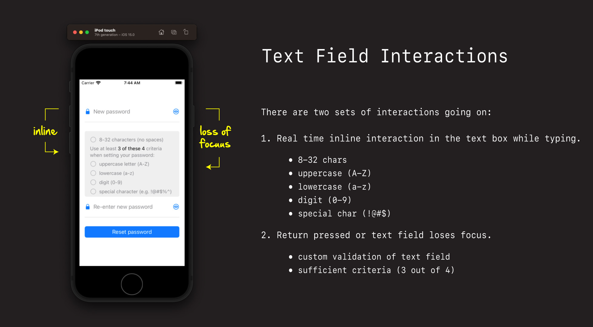

# Password Inline Interactions

There are two sets of interactions occurring in our password validation view:

1. Inline 
2. Loss of focus

The inline validation is what occurs as the user is typing. This update the individual criteria in the status view as they are typing, and gives them real-time feedback on which criteria they password pass while updating the view.

Loss of focus validation is what occurs when the text field losses focus, and the user wants to do they password validation check on the rules as a group.

This interaction not only updates the status view, it also updates the text field label. And let's the user know if there password passes three of four, or whether further changes are required.

To simplify the implementation, we are going to tackle these interactions one at a time.

First we are going to do the simpler inline validation, and update the status view as the user types there password in.

Once we have that working, we will come back and tackle the more complex group based validation, and update both the status view and the text field, upon the text field losing focus or the user hitting return.

## How the inline interaction works

As the user types, we'll communicate back to our view controller using a protocol-delegate, passing the back the text as they type it in on the keyboard.

This will then result in an update call being made to the status view, in which each individual criteria will update itself, and display either the reset circle image, or the green checkmark (not the red x).

In order to see how this works its really important to deeply understand how the `UITextField` work.

Let's now quickly review how `UITextField` works, understand the various callback functions, and decide which ones we'll need for our password interactions.

## A quick review of the UIText field

Demo and walk through thorough UIText field example.

- [UITextField](https://github.com/jrasmusson/ios-starter-kit/blob/master/basics/UITextField/UITextField.md)
- [Responder Chain](https://github.com/jrasmusson/ios-starter-kit/blob/master/advanced/Responder-Chain.md)

