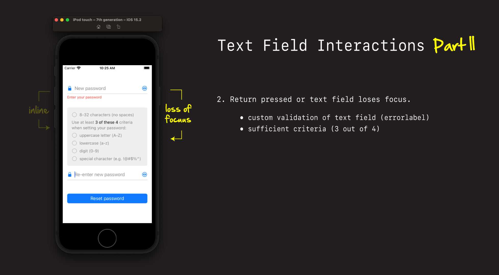
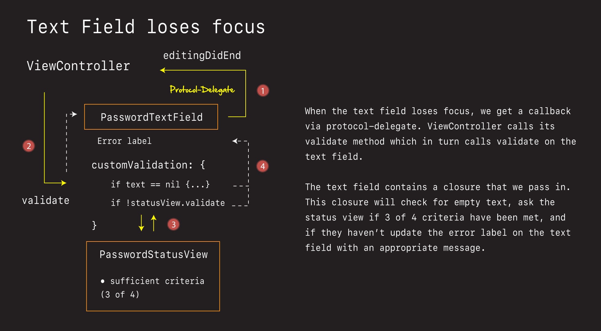
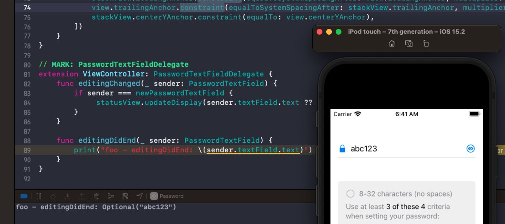
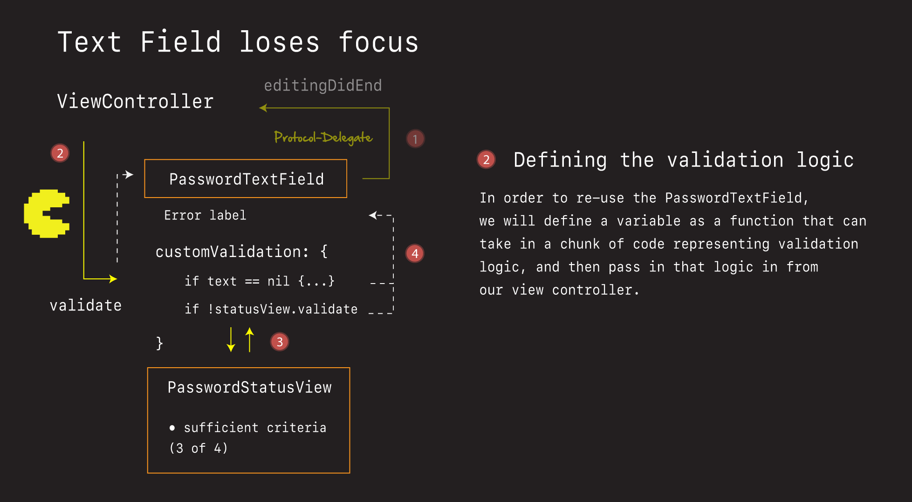
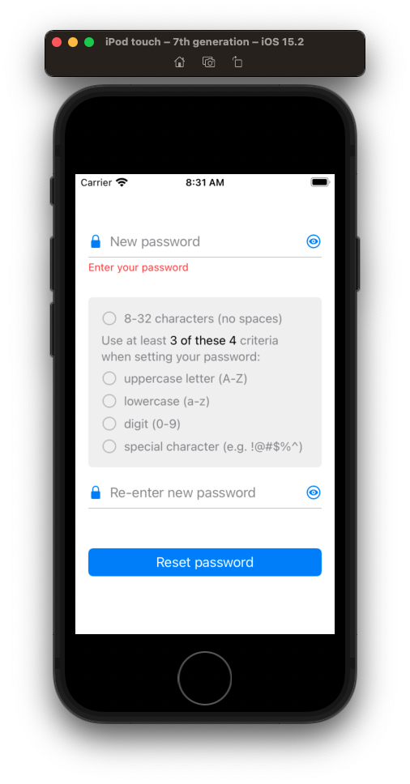
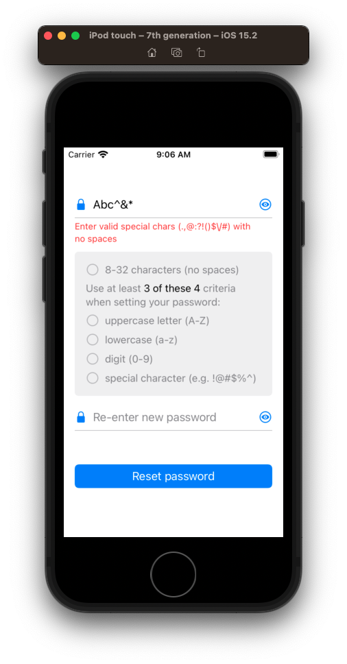
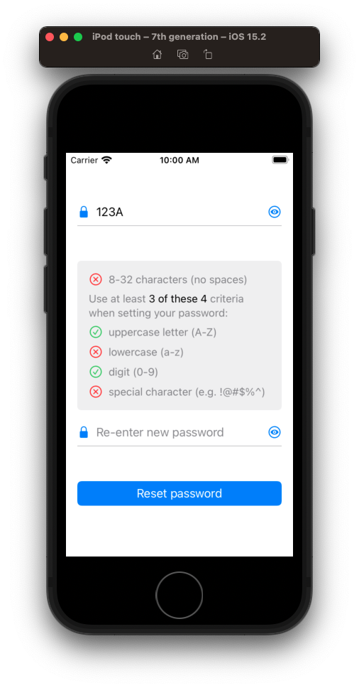
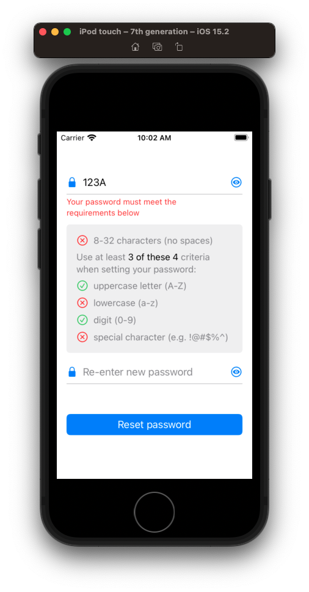
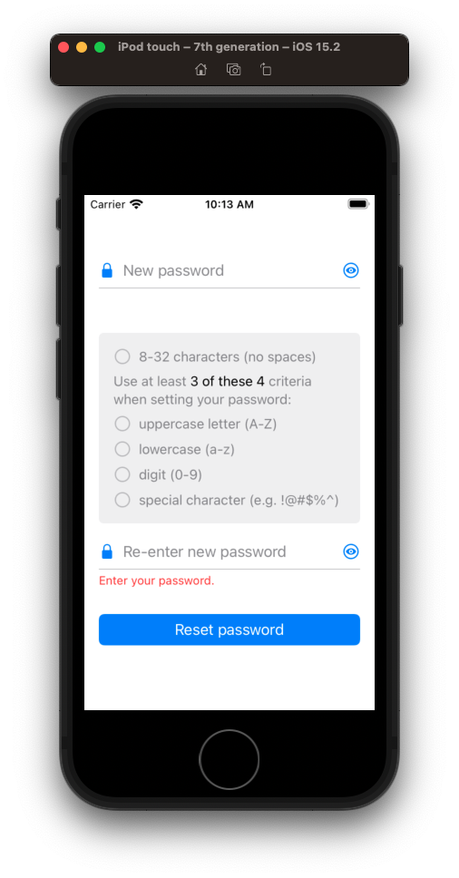

# Loss of focus Interaction

In this section we tackle the second set of interactions we need to account for when the user enters their password - loss of focus on the text field.



Here we want to:

- trigger additional custom validation on each text field (error label)
- check whether that 3 of 4 criteria have been met



## Detecting the loss of focus

Let's start by first detecting when the text field loses focus.

**PasswordTextField**

```swift
// MARK: - UITextFieldDelegate
extension PasswordTextField: UITextFieldDelegate {
    func textFieldDidEndEditing(_ textField: UITextField) {
        print("foo - textFieldDidEndEditing: \(textField.text)")
    }

    // Called when 'return' key pressed. Necessary for dismissing keyboard.
    func textFieldShouldReturn(_ textField: UITextField) -> Bool {
        print("foo - textFieldShouldReturn")
        textField.endEditing(true) // resign first responder
        return true
    }
}
```

These are the `UITextField` delegates we need to register for in order to detect when the text field loses focus.

We can test there are working by:

- running the app, entering text, and tapping on the other text field
- typing text in via the keyboard and pressing return

### Making the keyboard appear and disappear

- Show how to make the keyboard appear (`Shift + Command + K`)

## Dismissing the keyboard with a tap gesture 

It would be nice if our users could more easily dismiss the keyboard by tapping anywhere on the screen.

Let's add a gesture recognizer that resigns whatever is currently the first responder, and dismisses the keyboard with a single tap one the view.

**ViewController**

```swift
setup()
style()
layout()

private func setup() {
    setupDismissKeyboardGesture()
}

private func setupDismissKeyboardGesture() {
    let dismissKeyboardTap = UITapGestureRecognizer(target: self, action: #selector(viewTapped(_: )))
    view.addGestureRecognizer(dismissKeyboardTap)
}
    
@objc func viewTapped(_ recognizer: UITapGestureRecognizer) {
    view.endEditing(true) // resign first responder
}
```

Discussion:

- explain what gestures are
- explain how tap gesture works

## Communicating back via protocol-delegate

Let's know send our captured loss of focus text back via the protocol delegate.

### Challenge 🕹

Adds this function to our protocol delegate

**PasswordTextField**

```swift
protocol PasswordTextFieldDelegate: AnyObject {
    func editingChanged(_ sender: PasswordTextField)
    func editingDidEnd(_ sender: PasswordTextField) // add
}
```

Fire it here:

```swift
// MARK: - UITextFieldDelegate
extension PasswordTextField: UITextFieldDelegate {
    func textFieldDidEndEditing(_ textField: UITextField) {
        // fire it here
    }
}
```

and print out the text in our view controller:

**ViewController**

```swift
// MARK: PasswordTextFieldDelegate
extension ViewController: PasswordTextFieldDelegate {
   func editingDidEnd(_ sender: PasswordTextField) {
       // print
   }
}
```

Good luck!

### Solution ✅

Add the function.

**PasswordTextField**

```swift
protocol PasswordTextFieldDelegate: AnyObject {
    func editingChanged(_ sender: PasswordTextField)
    func editingDidEnd(_ sender: PasswordTextField) // add
}
```

Call the delegate when the editting ends. Delete old print statements.

**PasswordTextField**

```swift
// MARK: - UITextFieldDelegate
extension PasswordTextField: UITextFieldDelegate {
    func textFieldDidEndEditing(_ textField: UITextField) {
        delegate?.editingDidEnd(self)
    }

    // Called when 'return' key pressed. Necessary for dismissing keyboard.
    func textFieldShouldReturn(_ textField: UITextField) -> Bool {
        textField.endEditing(true) // resign first responder
        return true
    }
}
```

Implement and print result in the view controller.

**ViewController**

```swift
func editingDidEnd(_ sender: PasswordTextField) {
    print("foo - ViewController editingDidEnd: \(sender.textField.text)")
}
```



Good stuff. At this point we've detected the loss of focus and sent that text back to our view controller. 

## How the custom validation logic is going to work



Walk people through how this is going to work. 

Demo and explain how:

- this validation logic is about updating the error label and doing the 3 of 4 check
- each text field will have slightly different rules
- we are going to capture those rules in validation function
- that function will be defined as a variable
- and then pass in different functions depending on whether we are setting up the new password text field, or the confirm password text field

Now there may be some parts of this solution that are going to seem down right confusing - especially the part when it comes to definining and passing around variables as functions.

To prepare you, let's first review a few fundamentals about functions and the Swift language, and then come back and review the proposed solution.

##  📖 Swift fundamentals - Functions as types

Open up Swift function playground and walk students through:

- what Swift functions are
- how they work
- how they can be defined and passed around as variables

Then take them to the arcade and see if they can reach a new highscore.


## Defining an alias for our validation variable

Here is the `alias` of the message signature we are going to use to define the text validation for our password field

**PasswordTextField**

```swift
class PasswordTextField: UIView {

    /**
     A function one passes in to do custom validation on the text field.

     - Parameter: textValue: The value of text to validate
     - Returns: A Bool indicating whether text is valid, and if not a String containing an error message
     */
    typealias CustomValidation = (_ textValue: String?) -> (Bool, String)?
```

We will then represent this function as a variable.


**PasswordTextField**

```swift
let placeHolderText: String
var customValidation: CustomValidation? // add
weak var delegate: PasswordTextFieldDelegate?
```

And define a convenience computed variable to fetch the text field's text.

```swift
var text: String? {
    get { return textField.text }
    set { textField.text = newValue }
}
```

So now that we have this validation function variable defined, we need a way of calling it. This is where our `validate` function comes in. This is what we are going to call from our view controller.

**PasswordTextField**

```swift
// typealias CustomValidation = (_ textValue: String?) -> (Bool, String)?

// MARK: - Validation
extension PasswordTextField {
    func validate() -> Bool {
        if let customValidation = customValidation,
            let customValidationResult = customValidation(text),
            customValidationResult.0 == false {
            showError(customValidationResult.1)
            return false
        }
        clearError()
        return true
    }
    
    private func showError(_ errorMessage: String) {
        errorLabel.isHidden = false
        errorLabel.text = errorMessage
    }

    private func clearError() {
        errorLabel.isHidden = true
        errorLabel.text = ""
    }
}
```

- Explain the above code and the optional unwrapping.

With this defined we now just need to pass in, or define the rules for each text fields validation on the text.

## Adding validation rule for empty text

The view controller is where we are going to define the different validations rules for each text field.

For our new password text field we are going to check for:

- empty text
- valid characters
- 3 of 4 criteria met

For our confirm password text field we'll look for:

- empty text
- passwords not matching

So different rules for different text fields.

Let's take these one at a time, starting with empty text on the new password text field.

Because we are going to be doing some setup on these controls I'd first like to define an alias for the validation we are going to be setting, along with a method to help set that up.

**ViewController**

```swift
class ViewController: UIViewController {
    typealias CustomValidation = PasswordTextField.CustomValidation
```

And then in there I'd like to setup the new text field.

**ViewController**

```swift    
private func setup() {
    setupNewPassword()
    setupDismissKeyboardGesture()
}
```

Like this:

```swift
// typealias CustomValidation = (_ textValue: String?) -> (Bool, String)?

private func setupNewPassword() {
    let newPasswordValidation: CustomValidation = { text in
        
        // Empty text
        guard let text = text, !text.isEmpty else {
            self.statusView.reset()
            return (false, "Enter your password")
        }
        
        
        return (true, "")
    }
    
    newPasswordTextField.customValidation = newPasswordValidation
}
```

Here we check for empty text and return an error if empty text is detected, or true with no error message if it is not.

We can also reset the status view like this.

**PasswordStatusView**

```swift
func reset() {
    lengthCriteriaView.reset()
    uppercaseCriteriaView.reset()
    lowerCaseCriteriaView.reset()
    digitCriteriaView.reset()
    specialCharacterCriteriaView.reset()
}
```

With the heavy lifting done, we now just need to trigger this validation when the text field loses focus. Which we can do in our delegate callback here:

**ViewController**

```swift
// MARK: PasswordTextFieldDelegate
extension ViewController: PasswordTextFieldDelegate {
    func editingChanged(_ sender: PasswordTextField) { ... }
    
    func editingDidEnd(_ sender: PasswordTextField) {
        if sender === newPasswordTextField {
            _ = newPasswordTextField.validate()
        }
    }
}
```

If we run this now, we should be now see an error message when the user taps the new password text field, and then loses focus.




## Checking for invalid characters

Now that we have our validation block defined, we can validate whatever we want in there. 

For example, if we wanted to limit what characters someone could type or use for a password and then display an error message, we could do it like this.

**ViewController**

```swift
// Valid characters
let validChars = "abcdefghijklmnopqrstuvwxyzABCDEFGHIJKLMNOPQRSTUVWXYZ0123456789.,@:?!()$\\/#"
let invalidSet = CharacterSet(charactersIn: validChars).inverted
guard text.rangeOfCharacter(from: invalidSet) == nil else {
    self.statusView.reset()
    return (false, "Enter valid special chars (.,@:?!()$\\/#) with no spaces")
}
```

Here we are saying only these characters can be entered, and only with these special characters (which are the same characters we used in our regex for the special char status view check).



## Checking for 3 of 4 critera met

To check whether 3 of the 4 criteria have been met we are going to want to call update on our status view:

**ViewController**

```swift
private func setupNewPassword() {
    let newPasswordValidation: CustomValidation = { text in
        
        // Empty text
        
        // Valid characters
        
        // Criteria met
        self.statusView.updateDisplay(text)
        if !self.statusView.validate(text) {
            return (false, "Your password must meet the requirements below")
        }
        
        return (true, "")
    }
    
    newPasswordTextField.customValidation = newPasswordValidation
}
```

And then define a `validate` function there also to determine how many criteria have been met.


**PasswordStatusView**

```swift
func validate(_ text: String) -> Bool {
    let uppercaseMet = PasswordCriteria.uppercaseMet(text)
    let lowercaseMet = PasswordCriteria.lowercaseMet(text)
    let digitMet = PasswordCriteria.digitMet(text)
    let specialCharacterMet = PasswordCriteria.specialCharacterMet(text)

    // Ready Player1 🕹
    // Check for 3 of 4 criteria here...
    
    return false
}
```


### Challenge 🕹

Given the above validation code, think for a minute about how you would:

- Check to see if 3 of the 4 criteria have been met. 

Give the some thought. Imagine or pseudo code how you would do this in your mind. Then come back and I will show you an really elegant nice way without having to write a tonne of code.

Good luck!

### Solution ✅

The trick to checking things like this is to put the data into a state where you can check the state of each variable easily. So let's throw all of these criteria into an array.

```swift
let checkable = [uppercaseMet, lowercaseMet, digitMet, specialCharacterMet]
```

Then the question becomes - how can we check each element of the array to see which is `true` and which is `false`?

That we can do with `filter`:

```swift
let metCriteria = checkable.filter { $0 }
```

No that we know how many critera are met (the `count` of the array`), we can combine this with our space length check, and bring it all together like this:

**PasswordStatusView**

```swift
func validate(_ text: String) -> Bool {
    let uppercaseMet = PasswordCriteria.uppercaseMet(text)
    let lowercaseMet = PasswordCriteria.lowercaseMet(text)
    let digitMet = PasswordCriteria.digitMet(text)
    let specialCharacterMet = PasswordCriteria.specialCharacterMet(text)

    let checkable = [uppercaseMet, lowercaseMet, digitMet, specialCharacterMet]
    let metCriteria = checkable.filter { $0 }
    let lengthAndNoSpaceMet = PasswordCriteria.lengthAndNoSpaceMet(text)
    
    if lengthAndNoSpaceMet && metCriteria.count >= 3 {
        return true
    }

    return false
}
```

Really nice. Quite terse and readable.

If we run this now. And set a break point, we'll see it's working. But our red x's aren't showing up.

### Making the red X show up

There just one more little subtly. When the text field loses focus we want to trigger the red x validation also. To do that we add this line here.

**ViewController**

```swift
func editingDidEnd(_ sender: PasswordTextField) {
    if sender === newPasswordTextField {
        // as soon as we lose focus, make ❌ appear
        statusView.shouldResetCriteria = false // add
        
        _ = newPasswordTextField.validate()
    }
}
```

This line triggers the `statusView` to now toggle between ✅ and ❌ when updating the display. We only what this to occur when the text field loses focus. So we set to `false` here and it stays `false` for as long as this view is displayed.

Then to trigger the ❌ we add this logic in the status view here.

**PasswordStatusView**

```swift
// MARK: Actions
extension PasswordStatusView {
    func updateDisplay(_ text: String) {
    	 ...
        
        if shouldResetCriteria {
			...
        } else {
            // Focus lost (✅ or ❌)
            lengthCriteriaView.isCriteriaMet = lengthAndNoSpaceMet
            uppercaseCriteriaView.isCriteriaMet = uppercaseMet
            lowerCaseCriteriaView.isCriteriaMet = lowercaseMet
            digitCriteriaView.isCriteriaMet = digitMet
            specialCharacterCriteriaView.isCriteriaMet = specialCharacterMet
        }
    }
}
```



We can now use this in our view controller like this:




At this point our password text field is fully configured and done.

## Adding validation for the confirm password text field

Adding further validation for our confirm password text field is now easy. Here we want to check:

- empty text
- passwords not matching

Which we can do in a similar way by setting up a confirm password function and then configuring our validation in there.

**ViewController**

```swift
private func setup() {
    setupNewPassword()
    setupConfirmPassword() // add
    setupDismissKeyboardGesture()
}

private func setupConfirmPassword() {
    let confirmPasswordValidation: CustomValidation = { text in
        guard let text = text, !text.isEmpty else {
            return (false, "Enter your password.")
        }

        guard text == self.newPasswordTextField.text else {
            return (false, "Passwords do not match.")
        }

        return (true, "")
    }

    confirmPasswordTextField.customValidation = confirmPasswordValidation
    confirmPasswordTextField.delegate = self
}

func editingDidEnd(_ sender: PasswordTextField) {
    if sender === newPasswordTextField {
       ...
    } else if sender == confirmPasswordTextField {
        _ = confirmPasswordTextField.validate()
    }
}
```

And now our confirm password text field is configured too.




### 💾 Save your work

```
> git add -p
> git commit -m "feat: add loss of focus interactions"
```

