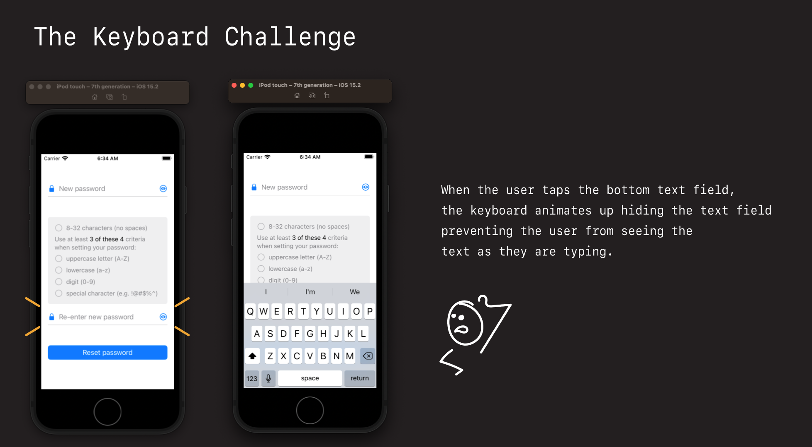
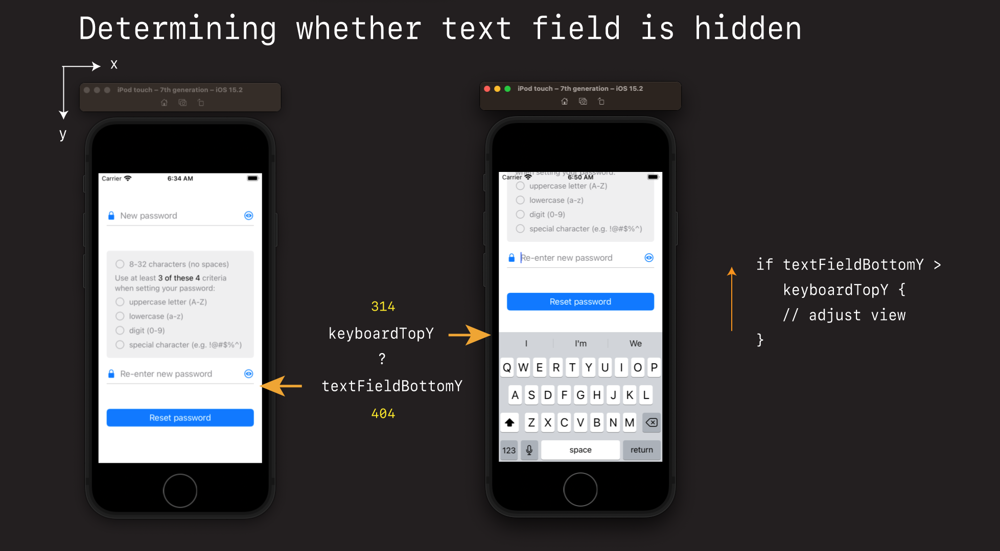
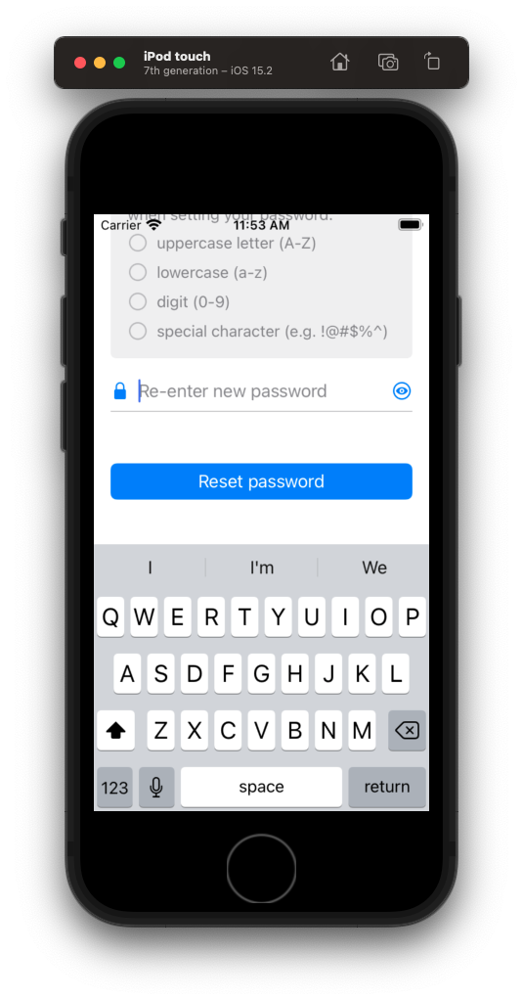

# ⌨️ Dealing with Keyboards

Keyboards are the #1 mechanism users use for entering text into smart phone device. Their appearance on the screen however can be a little problematic.

In this section we are going to look at:

- how to deal with keyboards
- how to detect their appearance
- how to update our display
- how to make their use feel natural and unobtrusive


## The challenge



The challenge with the keyboard is that once it appears on screen, it can hide the very elements we want to enter text for.

For example when the user taps the re-enter your password text field, the keyboard appears, and the user can no longer see what they are typing.

But to make matters worse, this only occurs for *some* elements. The top text field for example is perfectly OK. We don't need to make any adjustments here.

Apple describes desirable keyboard interactions like this.

- [HIG Keyboard guidance](https://developer.apple.com/design/human-interface-guidelines/ios/user-interaction/keyboards/)

The solution to this conundrum is to:

- detect when the keyboard is present
- update the view if any elements are hidden or blocked
- do it in such a way that things look good, and the view returns to a normal state when the keyboard is dismisssed


Let's start by detecting the presence of the keyboard.

## Detecting the keyboards presense

First thing we need to do is detect whether the keyboard is even present. And if it is, shift everything up.

**ViewController**

```swift
private func setup() {
    setupNewPassword()
    setupConfirmPassword()
    setupDismissKeyboardGesture()
    setupKeyboardHiding() // add
}

private func setupKeyboardHiding() {
    NotificationCenter.default.addObserver(self, selector: #selector(keyboardWillShow), name: UIResponder.keyboardWillShowNotification, object: nil)
    NotificationCenter.default.addObserver(self, selector: #selector(keyboardWillHide), name: UIResponder.keyboardWillHideNotification, object: nil)
}

// MARK: Keyboard
extension ViewController {
    @objc func keyboardWillShow(sender: NSNotification) {
        view.frame.origin.y = view.frame.origin.y - 200
    }

    @objc func keyboardWillHide(notification: NSNotification) {
        view.frame.origin.y = 0
    }
}
```

Detecting the presense of the keyboard is pretty easy. You simple register yourself as an observer for the keyboard appearing and disappearing via `NotificationCenter`.

And then if you want to ensure nothing is blocked or obfuscated, you simply bump the entire view up.


This method of dealing the keyboard is pretty crude. And while it works, I don't recommend it because

- it doesn't adjust to screen size or height
- it doesn't work with all layouts or views
- its just a little too crude for professional work

We can do better 🚀.

## Updating the view like a pro

What we are going to do instead is the following:


## Which element is hidden?

First thing we need to make all this work is we need to:

1. Figure out the keyboards height.
2. Figure out which element if the first responder.

The keyboard height we can get from the `sender.userInfo`. And the current first responder we can get from this extension:

**ViewController**

```swift
// MARK: Keyboard
extension ViewController {
    @objc func keyboardWillShow(sender: NSNotification) {
        guard let userInfo = sender.userInfo,
              let keyboardFrame = userInfo[UIResponder.keyboardFrameEndUserInfoKey] as? NSValue,
              let currentTextField = UIResponder.currentFirst() as? UITextField else { return }

        print("foo - userInfo: \(userInfo)")
        print("foo - keyboardFrame: \(keyboardFrame)")
        print("foo - currentTextField: \(currentTextField)")
    }
}
```

- Create a dir `Utils`
- Create a new file `UIResponder+Utils.swift`

**UIResponder+Utils**

```swift
extension UIResponder {

    private struct Static {
        static weak var responder: UIResponder?
    }

    /// Finds the current first responder
    /// - Returns: the current UIResponder if it exists
    static func currentFirst() -> UIResponder? {
        Static.responder = nil
        UIApplication.shared.sendAction(#selector(UIResponder._trap), to: nil, from: nil, for: nil)
        return Static.responder
    }

    @objc private func _trap() {
        Static.responder = self
    }
}
```

Discussion:

- Run the app. 
- Set a break point.
- Explain the first responder.


## Determining whether the text field is blocked

To determine whether the current text field is blocked we need to calculate:

- the top of the keyboard Y, and 
- the bottom of the text field Y

And see whether one is greater than the other.



We can get there relative Y positions like this:

**ViewController**

```swift
// check if the top of the keyboard is above the bottom of the currently focused textbox
let keyboardTopY = keyboardFrame.cgRectValue.origin.y
let convertedTextFieldFrame = view.convert(currentTextField.frame, from: currentTextField.superview)
let textFieldBottomY = convertedTextFieldFrame.origin.y + convertedTextFieldFrame.size.height

// if textField bottom is below keyboard bottom - bump the frame up
if textFieldBottomY > keyboardTopY {
    // adjust view up
}

print("foo - currentTextFieldFrame: \(currentTextField.frame)")
print("foo - convertedTextFieldFrame: \(convertedTextFieldFrame)")
```

In this case it is. If the bottom text field is tapped, it's Y value is greater than the keyboards Y value.

> Remember: The origin increasing downwards in iOS.

So if the bottom text field is tapped, that means it's view will be hidden. So we want to bump the view up. But by how much?

## How to convert from one coordinate system to another

One interesting conversion we need to make before we can compare Y coordinates, is we need to convert from the text fields coordinate system, to our current view's coordinate system.

You see the frame of the text field when it first comes back to use is relative to it's native view origin - `(0,0`.

But once we convert it. We get it relative to the view controllers view.


That is what this line here is doing here:

``` swift
let textFieldFrame = view.convert(currentTextField.frame, from: currentTextField.superview)
```

It is taking the frame of the `currentTextField` and converting it into the frame of the view's text field.


Same text field. Different coordinate system.

Once converted we can then use it in our view height adjustment calculations.


## Adjusting the view up

Instead of hardcoding the adjustment for the height, it's nicer if we take have the keyboard height and subtract it from the Y position of the hidden element.


**ViewController**

```swift
// if textField bottom is below keyboard bottom - bump the frame up
if textFieldBottomY > keyboardTopY {
    let textBoxY = convertedTextFieldFrame.origin.y
    let newFrameY = (textBoxY - keyboardTopY / 2) * -1
    view.frame.origin.y = newFrameY
}
```

Now when the keyboard appears, and just bumps the view controller up just enough to show the hidden text field, without looking too obtuse or obvious.



## Hooking up the reset button

When the reset button is pressed, we want to:

- give up the keyboard
- validate both text fields
- show an success alert if both passwords are valid and match

So first we'll comment in the button's target action.

**ViewController**

```swift
resetButton.addTarget(self, action: #selector(resetPasswordButtonTapped), for: .primaryActionTriggered)
```

And then we'll add an actions section like this:

**ViewController**

```swift
// MARK: Actions
extension ViewController {

    @objc func resetPasswordButtonTapped(sender: UIButton) {
        view.endEditing(true)

        let isValidNewPassword = newPasswordTextField.validate()
        let isValidConfirmPassword = confirmPasswordTextField.validate()

        if isValidNewPassword && isValidConfirmPassword {
            showAlert(title: "Success", message: "You have successfully changed your password.")
        }
    }

    private func showAlert(title: String, message: String) {
        let alert =  UIAlertController(title: "", message: "", preferredStyle: .alert)
        alert.addAction(UIAlertAction(title: "OK", style: .default, handler: nil))

        alert.title = title
        alert.message = message
        present(alert, animated: true, completion: nil)
    }
}
```

Now when we run the app, and enter in a valid password, a success alert will pop up looking like this.

## 💾 Save your work 

```
> git add .
> git commit -m "feat: handle view adjustments for keyboard"
```

### Links that help

[Human Interface Guidelines - Keyboards](https://developer.apple.com/design/human-interface-guidelines/ios/user-interaction/keyboards/)