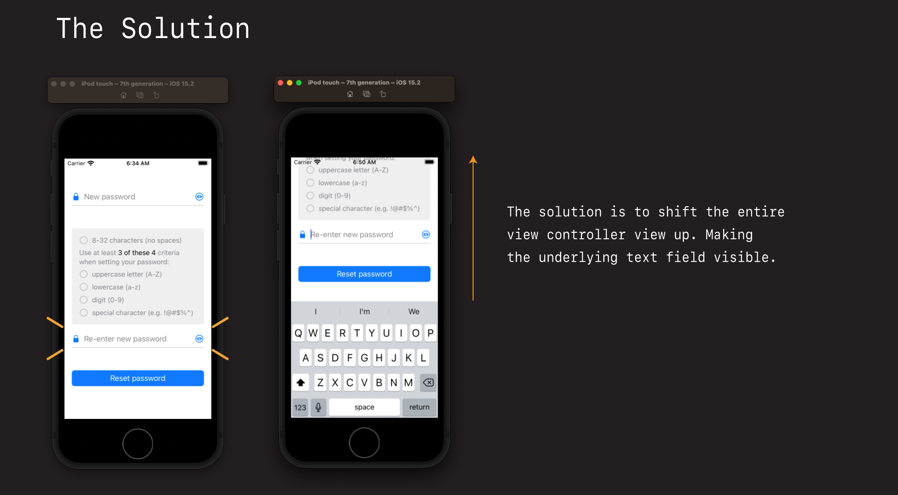

# ⌨️ Dealing with Keyboards

We've been a bit sloppy in how we've been testing app. As a way of convenience we've been entering text directly into the text field by tying directly on my keyboard.

This is great for prototyping. But it's not how our users will be using the app.

> To flip between computer and simulator key board entry type `Shift+Command+K`.

If we flip to showing the keyboard on the phone, and start entering text on our custom text field, watch what happens. Our text field is completely hidden by the display.

Let's now address that and done what is almost a right of passage for any professional iOS developer - learn how to adjust the display based on the appearance of the keyboard.

## The challenge

The challenge with the keyboard is that once it appears on screen, it can hide the very elements we want to enter text for.

For example when the user taps the re-enter your password text field, the keyboard appears, and the user can no longer see what they are typing.

But to make matters worse, this only occurs for *some* elements. The top text field for example is perfectly OK. We don't need to make any adjustments here.

The solution to this conundrum is to:

- detect which elements are affected
- shift the entire parent view up a certain amount if they are
- do it in such a way that things look good, and the view returns to a normal state when the keyboard is dismisssed

There are a few more details we will need to work out along the way. Like detecting the presence of the keyboard. And figuring out the position of the element that was tapped so we can determine whether or not it is obscurred (which means we will probably need the height of the keyboard).

But like all things in life, we will make our lives easier by breaking these problems down into smaller little bits, and tackling them one at a time.

This is a fantastic exercise to work through slowly, because by going through this you are going to learn a lot about how view frame and position themselves, along with a host of really cool technologies to aid us on our way.

But let's start with something simple. Let's just detect whether or not a user has tapped a text field element, and the keyboard is on display.

## Making the keyboard appear

Let's fire up the app, tap one of those text fields, and make the keyboard appear. This is what we want to detect.

If your keyboard doesn't appear don't panic. You may have it setup like I do where you can enter text directly from your keyboard (easier for development and debugging).

To toggle the presence of the onscreen keyboard in the simulator

## Detecting the presense of the keyboard

