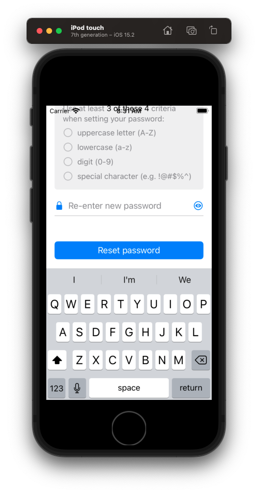

# ⌨️ Dealing with Keyboards

Keyboards are the #1 mechanism users use for entering text into smart phone device. Their appearance on the screen however can be a little problematic.

In this section we are going to look at:

- how to deal with keyboards
- how to detect their appearance
- how to update our display
- how to make their use feel natural and unobtrusive


## The challenge


The challenge with the keyboard is that once it appears on screen, it can hide the very elements we want to enter text for.

For example when the user taps the re-enter your password text field, the keyboard appears, and the user can no longer see what they are typing.

But to make matters worse, this only occurs for *some* elements. The top text field for example is perfectly OK. We don't need to make any adjustments here.

Apple describes desirable keyboard interactions like this.

- [HIG Keyboard guidance](https://developer.apple.com/design/human-interface-guidelines/ios/user-interaction/keyboards/)

The solution to this conundrum is to:

- detect when the keyboard is present
- update the view if any elements are hidden or blocked
- do it in such a way that things look good, and the view returns to a normal state when the keyboard is dismisssed


Let's start by detecting the presence of the keyboard.

## Detecting the keyboards presense

First thing we need to do is detect whether the keyboard is even present. And if it is, shift everything up.

**ViewController**

```swift
private func setup() {
    setupNewPassword()
    setupConfirmPassword()
    setupDismissKeyboardGesture()
    setupKeyboardHiding() // add
}

private func setupKeyboardHiding() {
    NotificationCenter.default.addObserver(self, selector: #selector(keyboardWillShow), name: UIResponder.keyboardWillShowNotification, object: nil)
    NotificationCenter.default.addObserver(self, selector: #selector(keyboardWillHide), name: UIResponder.keyboardWillHideNotification, object: nil)
}

// MARK: Keyboard
extension ViewController {
    @objc func keyboardWillShow(sender: NSNotification) {
        view.frame.origin.y = view.frame.origin.y - 200
    }

    @objc func keyboardWillHide(notification: NSNotification) {
        view.frame.origin.y = 0
    }
}
```

Detecting the presense of the keyboard is pretty easy. You simple register yourself as an observer for the keyboard appearing and disappearing via `NotificationCenter`.

And then if you want to ensure nothing is blocked or obfuscated, you simply bump the entire view up.



This method of dealing the keyboard is pretty crude. And while it works, I don't recommend it because

- it doesn't adjust to screen size or height
- it doesn't work with all layouts or views
- its just a little too crude for professional work

We can do better 🚀.

## Updating the view like a pro

What we are going to do instead is the following:


## How to determine which element was affected

First thing we need to 

## How to determine whether it is obstructed by the keyboards view

## Updating the view dynamically


### Links that help

[Human Interface Guidelines - Keyboards](https://developer.apple.com/design/human-interface-guidelines/ios/user-interaction/keyboards/)